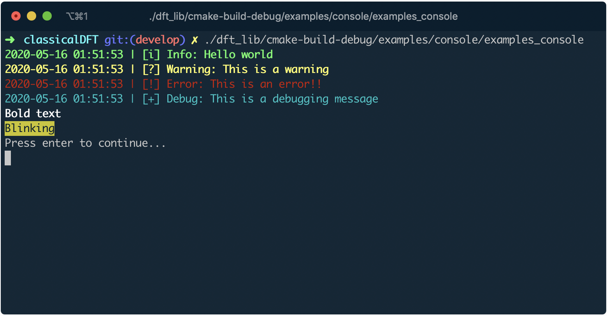

# Console utilities

## Overview

The `console` namespace provides lightweight helpers for terminal I/O:
logging at four severity levels (info, warning, error, debug), text formatting
(bold, blink), and basic flow control (`wait`, `pause`).

Each log message is timestamped and colour-coded (green for info, yellow for
warning, red for error, cyan for debug).

## Usage

```cpp
#include <classicaldft>

int main() {
  console::info("Hello world");
  console::warning("This is a warning");
  console::error("This is an error!!");
  console::debug("This is a debugging message");
  console::write_line(console::format::bold("Bold text"));
  console::write_line(console::format::blink("Blinking"));
  console::wait();
}
```

## Expected output



## Running

```bash
make run   # builds and runs inside Docker
```
