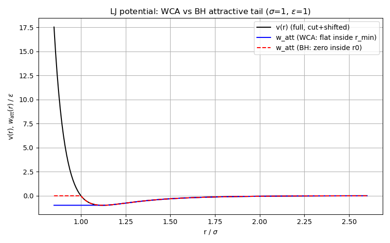
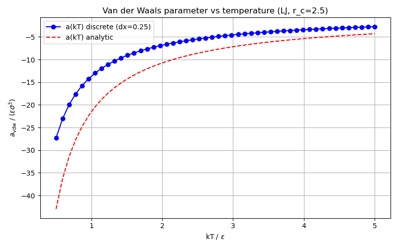
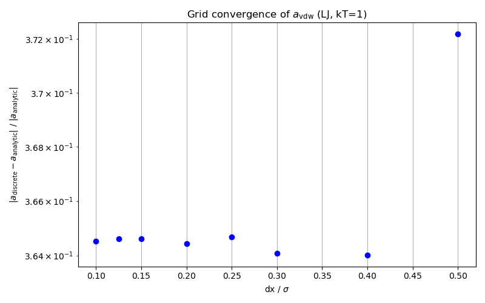
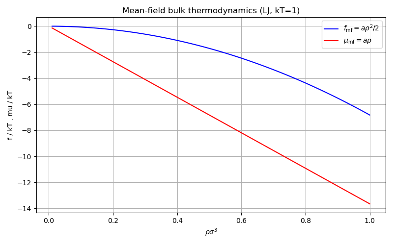
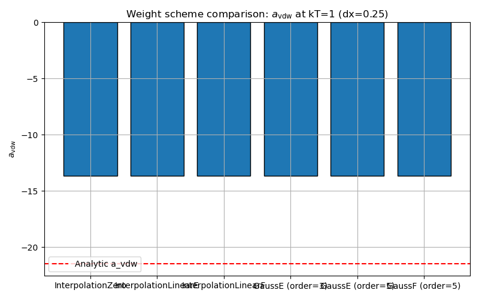
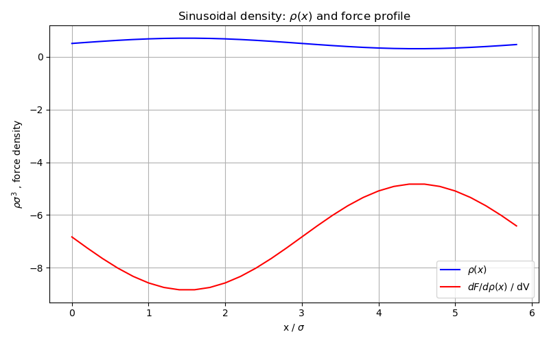

# Mean-field interaction

## Overview

Demonstrates the mean-field interaction class (`dft::interaction`)
that computes energy and forces via FFT convolution of the attractive part of a
pair potential.

| Feature | What this example shows |
|---------|------------------------|
| Potential decomposition | WCA vs BH splitting of $w_{\text{att}}(r)$ for the LJ potential |
| Van der Waals parameter | $a(kT) = \sum_\mathbf{R} w(\mathbf{R})\,dV$ vs temperature, compared to analytic integral |
| Grid convergence | Relative error in $a_{\text{vdw}}$ as $dx \to 0$ |
| Weight scheme comparison | `InterpolationZero`, `InterpolationLinearE/F`, `GaussE/F` with analytic reference |
| Bulk thermodynamics | $f_{\text{mf}}(\rho) = \tfrac{1}{2}\,a\,\rho^2$ and $\mu_{\text{mf}} = a\,\rho$ |
| Uniform density | `compute_free_energy()` and `compute_forces()` vs bulk prediction |
| Cross-species interaction | Two species with different LJ parameters, force on each species |
| BH perturbation | Effect of `set_bh_perturbation()` on $a_{\text{vdw}}$ |
| Non-uniform density | Sinusoidal $\rho(x)$, force profile from convolution |
| Energy-force consistency | Numerical derivative $\partial F/\partial \rho$ vs analytic force |

## Running

```bash
make run        # builds and runs inside Docker
make run-local  # builds and runs locally
```

## Plots

When built with `DFT_USE_MATPLOTLIB=ON` (default), six plots are saved to `exports/`:

| File | Content |
|------|---------|
| `interaction_potential_decomposition.png` | LJ potential $v(r)$ and attractive tails $w_{\text{att}}(r)$ for WCA and BH splitting |
| `interaction_avdw_vs_temperature.png` | Discrete $a_{\text{vdw}}(kT)$ vs analytic continuous integral |
| `interaction_grid_convergence.png` | Relative error in $a_{\text{vdw}}$ vs grid spacing $dx$ |
| `interaction_bulk_thermodynamics.png` | Mean-field $f(\rho)$ and $\mu(\rho)$ at $kT=1$ |
| `interaction_scheme_comparison.png` | Per-scheme $a_{\text{vdw}}$ as bar chart with analytic reference line |
| `interaction_sinusoidal_profile.png` | Density $\rho(x)$ and force profile |







