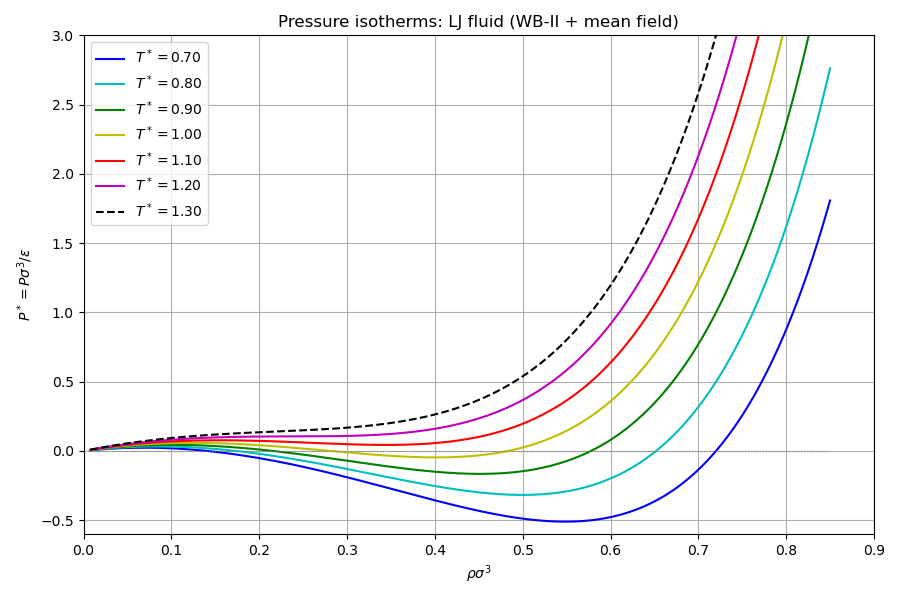
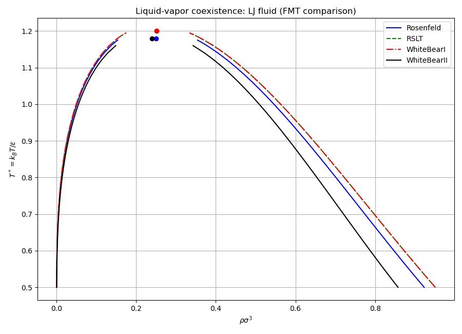
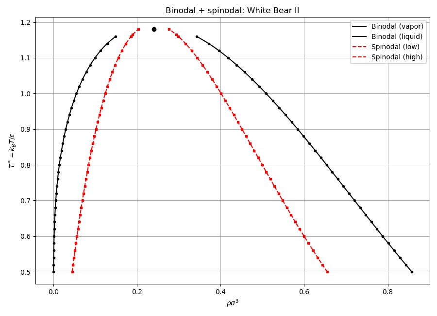
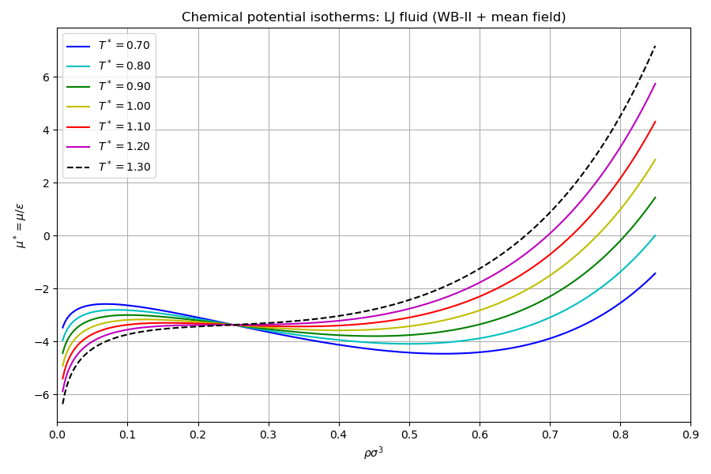

# Solver

## Overview

The `dft::Solver` class is the central orchestrator of a classical DFT
calculation. It owns species, interactions, and a hard-sphere (FMT)
functional, and provides:

- Free energy computation and functional derivatives
- Bulk thermodynamics (chemical potential, Helmholtz free energy, pressure)
- Coexistence and spinodal searches
- A `HessianOperator` interface for matrix-free second derivatives

This example builds a single-component Lennard-Jones fluid using
mean-field perturbation theory (WCA splitting) on top of four FMT
hard-sphere functionals, and computes the liquid-vapor phase diagram.

| Class | Role |
|-------|------|
| `Solver` | Core DFT orchestrator; owns species, interactions, FMT |
| `math::HessianOperator` | Abstract interface for Hessian-vector products |
| `functional::fmt::FMT` | Hard-sphere functional (Rosenfeld, RSLT, WB-I, WB-II) |
| `functional::interaction::Interaction` | Mean-field pair interaction via FFT convolution |

## Usage

```cpp
#include "dft.h"
using namespace dft;

// Create a LJ solver with White Bear II FMT
double dx = 0.5, kT = 1.0, diameter = 1.0;
arma::rowvec3 box = {6.0, 6.0, 6.0};
potentials::LennardJones lj(1.0, 1.0, 2.5);

Solver solver;
auto dens = density::Density(dx, box);
dens.values().fill(0.3);
auto sp = std::make_unique<functional::fmt::Species>(std::move(dens), diameter);
auto& sp_ref = *sp;
solver.add_species(std::move(sp));
solver.add_interaction(
    std::make_unique<functional::interaction::Interaction>(sp_ref, sp_ref, lj, kT));
solver.set_fmt(
    std::make_unique<functional::fmt::FMT>(functional::fmt::WhiteBearII{}));

// Bulk thermodynamics
double mu = solver.chemical_potential(0.3);
double P  = -solver.grand_potential_density(0.3);

// Coexistence
double rho_v = 0.0, rho_l = 0.0;
solver.find_coexistence(1.1, 0.005, rho_v, rho_l, 1e-8);
```

## Running

```bash
make run        # builds and runs inside Docker
make run-local  # builds and runs locally
```

## Plots

When built with `DFT_USE_MATPLOTLIB=ON` (default), plots are saved to `exports/`:

| File | Content |
|------|---------|
| `pressure_isotherms.png` | $P^*(\rho)$ isotherms showing van der Waals loops |
| `coexistence.png` | Binodal curves for all four FMT models |
| `binodal_spinodal.png` | Binodal + spinodal for White Bear II |
| `chemical_potential.png` | $\mu^*(\rho)$ isotherms showing S-shaped loops |





