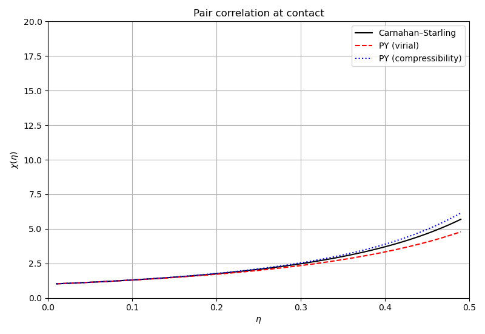
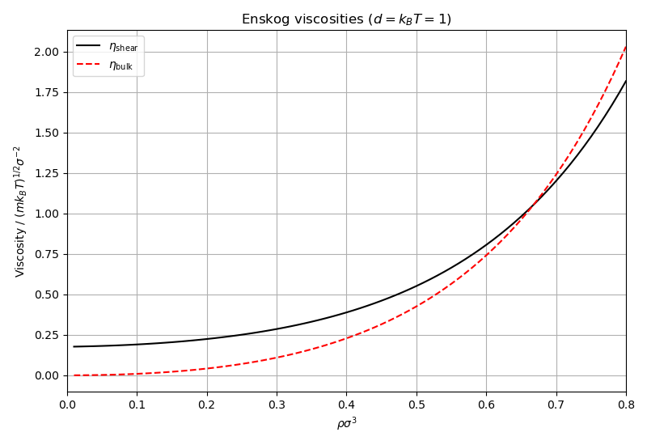
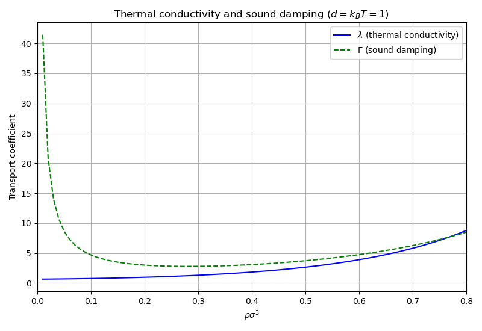
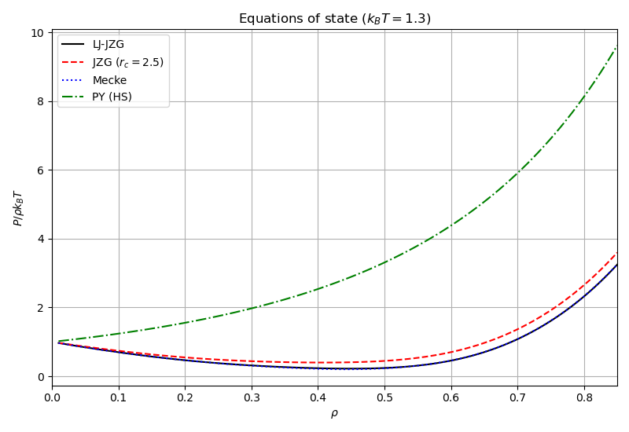

# Thermodynamics

## Overview

The `dft::thermodynamics` namespace provides hard-sphere fluid
models and equations of state for Lennard-Jones fluids.

| Class / namespace | Role |
|-------------------|------|
| `CarnahanStarling` | Carnahan-Starling hard-sphere model |
| `PercusYevick` | Percus-Yevick (virial / compressibility routes) |
| `transport` | Enskog transport coefficients (shear, bulk, thermal, sound damping) |
| `eos::IdealGas` | Ideal gas equation of state |
| `eos::PercusYevick` | Hard-sphere EOS via Percus-Yevick compressibility |
| `eos::LennardJonesJZG` | Johnson-Zollweg-Gubbins 32-parameter MBWR |
| `eos::LennardJonesMecke` | Mecke 32-term Lennard-Jones EOS |

## Usage

```cpp
#include <classicaldft>
using namespace dft::thermodynamics;

// Hard-sphere pressure via Carnahan-Starling
HardSphereModel cs = CarnahanStarling{};
double p = hs_pressure(cs, 0.3);  // P/(rho*kT) at eta=0.3

// Contact value (pair-correlation at contact)
double chi = contact_value(0.3);

// Enskog transport
double eta_s = transport::shear_viscosity(0.5, chi);

// Lennard-Jones EOS
eos::EosModel jzg = eos::LennardJonesJZG(1.3);  // kT = 1.3
double p_lj = eos::eos_pressure(jzg, 0.5);
```

## Running

```bash
make run        # builds and runs inside Docker
make run-local  # builds and runs locally
```

## Plots

When built with `DFT_USE_MATPLOTLIB=ON` (default), plots are saved to `exports/`:

| File | Content |
|------|---------|
| `hs_pressure.png` | Hard-sphere compressibility factor: CS vs PY (virial and compressibility) |
| `contact_value.png` | Pair correlation at contact $\chi(\eta)$ |
| `transport_viscosity.png` | Enskog shear and bulk viscosity vs density |
| `transport_thermal.png` | Thermal conductivity and sound damping vs density |
| `eos_comparison.png` | Equations of state: JZG, Mecke, PY at $k_BT = 1.3$ |






