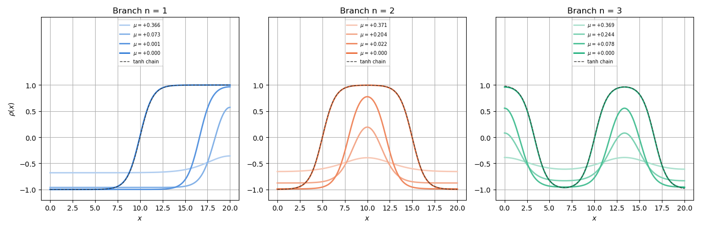

# Continuation: stationary states of the square-gradient model

This document traces the stationary states of the one-dimensional
square-gradient (Cahn-Hilliard) model with pseudo-arclength continuation.
The code in `main.cpp` performs four tasks: (1) it follows the uniform branch
through both of its folds, (2) it locates the folds and the bifurcation points
on that branch, (3) it steps off at the bifurcation points onto the branches
with $n = 1, 2, 3$ interfaces and follows each of them back to the uniform
branch, and (4) it traces the $n = 1$ branch again with the particle number
$N$ as the parameter. The closed-form results that the computation must
reproduce are collected in a verification table at the end.

The model has no DFT-specific ingredients, so every quantity along the curves
can be compared with an exact value. The same machinery (the
`Continuation` struct in `dft/algorithms/solvers/continuation.hpp`) is used by
the phase-diagram code to follow coexistence lines in temperature.

<p align="center">
  
</p>

---

## 1. The model

### The equation

On the interval $(0, L)$ with walls that impose no flux, the stationary states
at chemical potential $\mu$ satisfy

$$
-\kappa\,\rho''(x) + f_0'(\rho) - \mu = 0, \qquad \rho'(0) = \rho'(L) = 0,
$$

with the double-well bulk free energy density

$$
f_0(\rho) = \tfrac14\left(\rho^2 - 1\right)^2, \qquad
f_0'(\rho) = \rho^3 - \rho, \qquad
f_0''(\rho) = 3\rho^2 - 1.
$$

These are the critical points of the grand potential

$$
\Omega[\rho;\mu] = \int_0^L \left[f_0(\rho) + \frac{\kappa}{2}\,\rho'^2\right] dx - \mu N,
\qquad N = \int_0^L \rho\,dx .
$$

The two uniform minima $\rho = \pm 1$ coexist at $\mu_0 = 0$, and the spinodal
of $f_0$ is $|\rho| = 1/\sqrt3$.

### Discretisation

The interval is sampled at $K$ nodes $x_i = i h$, $h = L/(K-1)$. The second
derivative uses the three-point stencil, and the Neumann condition is imposed
by mirrored end nodes $y_{-1} = y_1$, $y_K = y_{K-2}$:

$$
(D_2 y)_0 = \frac{2(y_1 - y_0)}{h^2}, \qquad
(D_2 y)_i = \frac{y_{i-1} - 2 y_i + y_{i+1}}{h^2}, \qquad
(D_2 y)_{K-1} = \frac{2(y_{K-2} - y_{K-1})}{h^2}.
$$

The unknown is $y \in \mathbb{R}^K$, the parameter is $\lambda = \mu$, and the
discrete residual is

$$
F_i(y, \mu) = -\kappa\,(D_2 y)_i + y_i^3 - y_i - \mu .
$$

Along every branch the code records

$$
N = h \sum_i w_i\, y_i, \qquad
\Omega = h \sum_i w_i \left[f_0(y_i) - \mu\, y_i\right]
       + \frac{\kappa}{2h} \sum_{i=0}^{K-2} \left(y_{i+1} - y_i\right)^2,
$$

with trapezoid weights $w_0 = w_{K-1} = \tfrac12$ and $w_i = 1$ otherwise. The
gradient term is the sum of $(\kappa/2)\,y'^2$ over the $K - 1$ cells, with
$y'$ the forward difference. With this choice the discrete functional and the
discrete equation fit together exactly:

$$
\frac{\partial \Omega}{\partial y_i} = h\, w_i\, F_i(y, \mu),
$$

so the zeros of $F$ are the critical points of $\Omega$ and the discrete Hessian
is $h\,W H$, with $W = \mathrm{diag}(w_i)$ and $H = \partial F/\partial y$.

### The Hessian and the index

$H = -\kappa D_2 + \mathrm{diag}(3 y_i^2 - 1)$ is tridiagonal. Because of the
factor 2 in the end rows of $D_2$ it is not symmetric as a matrix, but it is
symmetric in the trapezoid inner product. The code diagonalises

$$
S = W^{1/2} H\, W^{-1/2},
$$

which is symmetric tridiagonal (`arma::eig_sym`), similar to $H$, and has the
same inertia as the Hessian $h\,W H$. The index

$$
n_- = \#\{\text{negative eigenvalues of } S\}
$$

counts the unstable directions of $\Omega$ at fixed $\mu$: $n_- = 0$ is a local
minimum, $n_- = 1$ a transition state, and so on.

The eigenvalues of $-D_2$ with mirrored ends are known in closed form,

$$
d_n = \frac{4}{h^2}\,\sin^2\!\left(\frac{n\pi h}{2L}\right), \qquad n = 0, \ldots, K - 1,
$$

with eigenvectors $\cos(n\pi x_i/L)$. They tend to the Neumann wavenumbers
$(n\pi/L)^2$ as $h \to 0$.

---

## 2. Pseudo-arclength continuation

A branch is a curve $s \mapsto (y(s), \mu(s))$ in $\mathbb{R}^{K+1}$ on which
$F(y, \mu) = 0$, parametrised by arclength $s$ rather than by $\mu$. Arclength
does not care whether $\mu$ increases or decreases, so the curve can be
followed through folds, where $\mu$ turns back.

### Tangent

Differentiating $F(y(s), \mu(s)) = 0$ gives

$$
\left[\,\partial_y F \;\middle|\; \partial_\mu F\,\right]
\begin{pmatrix} \dot y \\ \dot\mu \end{pmatrix} = 0,
\qquad \|\dot y\|^2 + \dot\mu^2 = 1 .
$$

The tangent $(\dot y, \dot\mu)$ is the null vector of the $K \times (K+1)$
extended Jacobian. The library forms that matrix by central differences, takes
the last right singular vector of its SVD, and orients it so that its dot
product with the previous tangent is positive. The extended Jacobian has
rank $K$ at a fold as well as at a regular point, so the tangent stays well
defined where $\partial_y F$ alone is singular.

### Predictor and corrector

From a point $(y_k, \mu_k)$ with tangent $(\dot y_k, \dot\mu_k)$ and step $\Delta s$:

1. **Predictor** (Euler step along the tangent):

$$
y^{(0)} = y_k + \Delta s\, \dot y_k, \qquad \mu^{(0)} = \mu_k + \Delta s\, \dot\mu_k .
$$

2. **Corrector**: Newton on the bordered system of $K + 1$ equations

$$
F(y, \mu) = 0, \qquad
\dot y_k \cdot (y - y_k) + \dot\mu_k\,(\mu - \mu_k) - \Delta s = 0 .
$$

The second equation confines the correction to the hyperplane through the
predicted point normal to the tangent. The bordered Jacobian is nonsingular at
simple folds, so Newton converges there as well.

3. **Adaptive step**: if Newton fails, $\Delta s$ is halved and the step is
retried; after a success it grows by a factor $1.2$, up to `max_step`. The
trace ends when a user-supplied stop condition returns true, or when
$\Delta s$ falls below `min_step`.

### Library call

```cpp
const algorithms::continuation::Continuation cont{
    .initial_step = 0.05,
    .max_step = 0.3,
    .min_step = 1e-6,
    .newton = {.max_iterations = 20, .tolerance = 1e-9},
};

algorithms::continuation::Residual R = [&](const arma::vec& y, double mu) {
  return -kappa * laplacian(y) + arma::pow(y, 3) - y - mu;
};

auto curve = cont.trace(start, R, [&](const CurvePoint& q) { return arma::mean(q.x) > 1.35; });
```

`start` is a `CurvePoint{x, lambda, dx_ds, dlambda_ds}` on the curve;
`cont.step(point, R, ds)` performs a single predictor-corrector step and returns
`std::nullopt` if Newton fails. `trace` returns the list of `CurvePoint`s. The
problem-specific code (residual, Jacobian, observables and event location) is in
`utils.hpp`.

---

## 3. What a branch contains

### Folds

At a fold $\dot\mu = 0$, so the tangent reduces to $(\dot y, 0)$ with
$\partial_y F\,\dot y = 0$: the Hessian is singular and $\dot y$ is its null
vector. On either side of the fold one eigenvalue changes sign, so $n_-$
changes by one. The code flags a fold wherever `dlambda_ds` changes sign
between consecutive points and then locates it by regula falsi (Illinois
variant) on the step length: the root of $\dot\mu$ along
$\Delta s \mapsto \mathrm{step}(y_k, \Delta s)$.

### Bifurcation points

A change of $n_-$ between consecutive points without a sign change of
$\dot\mu$ is a bifurcation point: an eigenvalue of $S$ crosses zero while the
branch passes straight through. The code locates the root of the eigenvalue
that changes sign (the $j$-th in ascending order, with $j$ the smaller of the
two counts) by the same regula falsi, and labels the crossing by the number of
sign changes of the critical eigenvector. A crossing with a uniform
eigenvector ($n = 0$) is the fold itself and is reported only once, as a fold.

### The index labels the arcs

Between events $n_-$ is constant, so each arc of a branch has a well defined
index. Stable arcs have $n_- = 0$; the arcs with $n_- = 1$ are the transition
states; higher indices are saddles of higher order.

### $d\Omega/d\mu = -N$

Along any branch,

$$
\frac{d\Omega}{ds} = \sum_i \frac{\partial\Omega}{\partial y_i}\,\dot y_i
                   + \frac{\partial\Omega}{\partial\mu}\,\dot\mu
                 = h \sum_i w_i F_i\,\dot y_i - N \dot\mu = -N \dot\mu,
$$

because $F = 0$ on the branch. So $d\Omega/d\mu = -N$ wherever $\dot\mu \ne 0$.
At a fold $\dot\mu$ and $\dot\Omega$ vanish together, and $\Omega(\mu)$ has a
cusp. The code checks the identity segment by segment with the trapezoid rule,
$\Delta\Omega_k + \tfrac12(N_k + N_{k+1})\,\Delta\mu_k \approx 0$.

---

## 4. The uniform branch

On uniform states $D_2 y = 0$, so the branch is $\rho^3 - \rho = \mu$ with
$N = L\rho$ and $\Omega = L\,[f_0(\rho) - \mu\rho]$. The folds sit at
$f_0''(\rho) = 0$:

$$
\rho_f = \pm \frac{1}{\sqrt3}, \qquad \mu_f = \mp \frac{2}{3\sqrt3} \approx \mp 0.3849 .
$$

On the uniform branch the eigenvalues of $S$ are
$\kappa d_n + 3\rho^2 - 1$, $n = 0, \ldots, K - 1$. The $n = 0$ eigenvalue
changes sign at the folds; each $n \ge 1$ eigenvalue changes sign at a
bifurcation point (Section 5).

The trace starts at $\rho = -1.35$ with the tangent pointing towards
increasing $\rho$ and stops at $\rho = 1.35$.

### The S-curve

$N$ against $\mu$. The stable arcs ($n_- = 0$) are solid and the unstable arc
between the folds is dashed. Between $\mu_f^-$ and $\mu_f^+$ three uniform
states coexist at every $\mu$.


### The swallowtail

$\Omega$ against $\mu$ for the same branch. The two stable arcs cross at
$\mu_0 = 0$, where $\rho = \pm 1$ have the same grand potential; the unstable
arc joins them at the folds. There the two arcs meet with the same slope
$d\Omega/d\mu = -N$ and $\Omega(\mu)$ has a cusp: $d^2\Omega/d\mu^2 = -dN/d\mu$
diverges at the fold.


On the uniform branch the gap between the middle state and the metastable one
is

$$
\Omega_{\rm mid} - \Omega_{\rm meta} = L\left(\omega_{\rm mid} - \omega_{\rm meta}\right),
\qquad \omega = f_0(\rho) - \mu\rho .
$$

It is extensive: it is the cost of converting the whole box at once through a
uniform state, not a nucleation barrier. At $\mu = 0$ it equals $L/4$, which is
5 at $L = 20$ and 10 at $L = 40$ (see the verification table).

---

## 5. Branches with $n$ interfaces

### Where they come from

The eigenvalue $\kappa d_n + 3\bar\rho^2 - 1$ of the uniform state crosses zero
when

$$
\kappa\, d_n = 1 - 3\bar\rho^2
\quad\xrightarrow{h \to 0}\quad
\kappa \left(\frac{n\pi}{L}\right)^2 = 1 - 3\bar\rho^2 .
$$

Each $n \ge 1$ with a real solution gives a pair of bifurcation points
$\pm\bar\rho_n$ on the unstable arc, and their number is

$$
n_{\max} = \left\lfloor \frac{L}{\pi} \sqrt{\frac{1 - 3\bar\rho^2}{\kappa}} \right\rfloor
\quad \text{at } \bar\rho = 0 .
$$

At $L = 20$, $\kappa = 1$ this gives $n_{\max} = 6$, and the uniform state
$\rho = 0$ has index $1 + n_{\max} = 7$.

These bifurcations are pitchforks. The reflection $x \mapsto L - x$ maps the
critical mode $\cos(n\pi x/L)$ to $(-1)^n$ times itself; for odd $n$ it acts as
$-1$ on the kernel, and the equivariant problem can only bifurcate
symmetrically. For even $n$ the same argument applies to the reflection of a
cell of length $L/n$, since the mode and the bifurcating states are copies of
the $n = 1$ problem on $(0, L/n)$ reflected into the box. Consistently, the
quadratic coefficient of the reduced equation is proportional to
$\int_0^L \cos^3(n\pi x/L)\,dx = 0$.

### Stepping off

At a pitchfork the bifurcating branch leaves with tangent $(v_n, 0)$, where
$v_n$ is the critical eigenvector (the right null vector of $H$, recovered as
$W^{-1/2}$ times the eigenvector of $S$). The code takes one ordinary
continuation step from the bifurcation point with this tangent,

```cpp
CurvePoint start{.x = bif.point.x, .lambda = bif.point.lambda, .dx_ds = bif.eigenvector, .dlambda_ds = 0.0};
auto first = cont.step(start, R, 0.3);
```

so the corrector solves $F = 0$ on the hyperplane $v_n \cdot (y - y_b) = 0.3$.
That excludes the uniform branch, and Newton lands on the bifurcating one. The
trace then continues until the amplitude falls back towards zero, which
happens at the mirror bifurcation point $+\bar\rho_n$: each branch connects the
pair $\pm\bar\rho_n$.

### Bifurcation diagram

Left: the amplitude $\|\rho - \bar\rho\|$ (trapezoid norm, $\bar\rho = N/L$)
against $\mu$, with the line style set by $n_-$. The uniform branch lies on the
axis with its twelve bifurcation points. Right: the gap
$\Omega - \Omega_{\rm meta}$ to the metastable uniform state for
$|\mu| < \mu_f$.


Three features of the diagram:

- **The index grows with $n$.** The branch with $n$ interfaces has $n_- = n$
  along its whole length. Each interface carries one soft translation mode;
  near $\mu = 0$ the interfaces feel each other and the walls only through
  exponentially small tails, and all $n$ of these modes are unstable.
- **The branches pass through $\mu = 0$ along a nearly flat family.** Near
  $\mu = 0$ the interface positions can be moved at an exponentially small
  cost: on the $n = 1$ branch $|\mu| < 3 \times 10^{-5}$ while $N$ runs from
  $-11$ to $+11$. The arclength parametrisation follows this segment
  without difficulty; a trace in $\mu$ could not.
- **The gap is finite.** At $\mu = 0$ the gap is $n\sigma$, the cost of $n$
  interfaces, independently of $L$ (the table checks $n = 1$ at $L = 20$ and
  $L = 40$). For $\mu \ne 0$ the states on these branches are localised
  interfaces or partial droplets against the walls, with tails that decay
  exponentially, so their gap converges to a finite limit as $L$ grows, while
  the uniform middle state costs $L(\omega_{\rm mid} - \omega_{\rm meta})$.
  The saddles that control the escape from the metastable state are on these
  branches, not on the uniform one.

### Profiles

Representative profiles along each branch, taken on the $\mu > 0$ half at
10%, 40%, 70% and 100% of the largest amplitude. Close to the bifurcation the
profile is the cosine mode; by $\mu = 0$ it is a chain of $n$ interfaces,
matched by $\prod_j \tanh\!\left((x - x_j)/\sqrt{2\kappa}\right)$ with
$x_j = (2j - 1)L/2n$ (dashed). On the $n = 1$ branch the second and third
profiles show the interface pushed towards the wall: these are the partial
droplets described above.



---

## 6. The same branch at fixed $N$

A critical point of $\Omega$ at chemical potential $\mu$ is a critical point of
the Helmholtz functional $F[\rho] = \Omega + \mu N$ at its own $N$, with
Lagrange multiplier $\mu$. So the same curve can be followed with $N$ as the
parameter. The unknown becomes $x = (y, \mu) \in \mathbb{R}^{K+1}$ and the
residual gains the mass constraint:

$$
R(x; N) = \begin{pmatrix} F(y, \mu) \\ h \sum_i w_i y_i - N \end{pmatrix} .
$$

The same `Continuation` object traces it; only the residual changes. The
figure shows $\mu$ against $N$. The pale band is the $n = 1$ branch traced in
$\mu$ (Section 5), the thin line the same branch traced in $N$ from the centred
interface at $N = 0$ towards both walls. They coincide.


What changes is the stability. At fixed $N$ only perturbations that conserve
mass are admissible, so the index is counted on the Hessian projected onto
$\sum_i w_i\,\delta y_i = 0$. Consequences, all visible in the figure:

- The folds of the uniform branch in $\mu$ are not folds in $N$ ($N = L\rho$
  is monotone), and the uniform branch is unstable at fixed $N$ only where the
  first non-uniform mode is soft, $|\bar\rho| < \bar\rho_1 = 0.5702$, slightly
  inside the spinodal $1/\sqrt3 = 0.5774$.
- The centred interface has $n_- = 1$ at fixed $\mu$ and $n_- = 0$ at fixed
  $N$: its unstable direction changes $N$, so the constraint removes it. The
  phase-separated state is the minimum of $F$ at fixed mass.
- The $n = 1$ branch has a fold in $N$ near $|N| \approx 16$. Beyond it the
  branch has $n_- = 1$ at fixed $N$ (dashed) and runs back to the bifurcation
  point: these states are the critical partial droplets of the canonical
  problem, between the metastable uniform state and the phase-separated one.

---

## 7. Verification

`check/main.cpp` traces the uniform branch and the $n = 1$ branch and compares
them with the closed forms below; it exits with a non-zero status if any row
fails. The same table is printed at the end of `main.cpp`. Reference values:
$L = 20$, $\kappa = 1$, $K = 201$ ($h = 0.1$).

| Quantity | Measured | Exact | Error | Tolerance |
|----------|----------|-------|-------|-----------|
| Uniform branch: $\max\lvert\rho^3 - \rho - \mu\rvert$, $\max\lvert y_i - \bar\rho\rvert$ | $6.2 \times 10^{-11}$ | $0$ | $6.2 \times 10^{-11}$ | $10^{-9}$ |
| Fold $\rho_f^-$ | $-0.5773502692$ | $-1/\sqrt3$ | $1.8 \times 10^{-11}$ | $10^{-8}$ |
| Fold $\mu_f^-$ | $+0.3849001795$ | $+2/(3\sqrt3)$ | $2.4 \times 10^{-14}$ | $10^{-8}$ |
| Fold $\rho_f^+$ | $+0.5773502692$ | $+1/\sqrt3$ | $1.2 \times 10^{-11}$ | $10^{-8}$ |
| Fold $\mu_f^+$ | $-0.3849001795$ | $-2/(3\sqrt3)$ | $2.3 \times 10^{-15}$ | $10^{-8}$ |
| $d\Omega/d\mu + N$, uniform (relative) | $4.5 \times 10^{-5}$ | $0$ | $4.5 \times 10^{-5}$ | $10^{-3}$ |
| $d\Omega/d\mu + N$, $n = 1$ (relative) | $1.7 \times 10^{-4}$ | $0$ | $1.7 \times 10^{-4}$ | $10^{-3}$ |
| Interface at $\mu = 0$: $\max\lvert y - \tanh((x - L/2)/\sqrt{2\kappa})\rvert$ | $2.8 \times 10^{-4}$ | $0$ | $2.8 \times 10^{-4}$ | $10^{-3}$ |
| $\sigma = \Omega_1 - \Omega_\pm$ at $\mu = 0$, $L = 20$ | $0.9426518$ | $2\sqrt2/3 = 0.9428090$ | $1.6 \times 10^{-4}$ | $10^{-3}$ |
| $\sigma = \Omega_1 - \Omega_\pm$ at $\mu = 0$, $L = 40$ | $0.9426518$ | $0.9428090$ | $1.6 \times 10^{-4}$ | $10^{-3}$ |
| $\Omega_{\rm mid} - \Omega_\pm$ at $\mu = 0$, $L = 20$ | $5$ | $L/4 = 5$ | $0$ | $10^{-12}$ |
| $\Omega_{\rm mid} - \Omega_\pm$ at $\mu = 0$, $L = 40$ | $10$ | $L/4 = 10$ | $0$ | $10^{-12}$ |
| $n_-$ of the interface, fixed $\mu$ | $1$ | $1$ | $0$ | exact |
| $n_-$ of the interface, fixed $N$ | $0$ | $0$ | $0$ | exact |
| $\bar\rho_1$ vs discrete $\kappa d_1 = 1 - 3\bar\rho^2$ | $0.5701831566$ | $0.5701831566$ | $1.7 \times 10^{-14}$ | $10^{-9}$ |
| $\bar\rho_1$ vs continuum $\kappa(\pi/L)^2 = 1 - 3\bar\rho^2$ | $0.5701831566$ | $0.5701830083$ | $1.5 \times 10^{-7}$ | $10^{-3}$ |
| $\bar\rho_2$ vs discrete | $0.5481216632$ | $0.5481216632$ | $3.7 \times 10^{-13}$ | $10^{-9}$ |
| $\bar\rho_2$ vs continuum | $0.5481216632$ | $0.5481191951$ | $2.5 \times 10^{-6}$ | $10^{-3}$ |
| $\bar\rho_3$ vs discrete | $0.5092396268$ | $0.5092396268$ | $1.4 \times 10^{-14}$ | $10^{-9}$ |
| $\bar\rho_3$ vs continuum | $0.5092396268$ | $0.5092261780$ | $1.3 \times 10^{-5}$ | $10^{-3}$ |
| $\bar\rho_4$ vs discrete | $0.4492013972$ | $0.4492013972$ | $2.2 \times 10^{-14}$ | $10^{-9}$ |
| $\bar\rho_4$ vs continuum | $0.4492013972$ | $0.4491532122$ | $4.8 \times 10^{-5}$ | $10^{-3}$ |
| $\bar\rho_5$ vs discrete | $0.3575223753$ | $0.3575223753$ | $9.9 \times 10^{-15}$ | $10^{-9}$ |
| $\bar\rho_5$ vs continuum | $0.3575223753$ | $0.3573745584$ | $1.5 \times 10^{-4}$ | $10^{-3}$ |
| $\bar\rho_6$ vs discrete | $0.1935569861$ | $0.1935569861$ | $3.3 \times 10^{-14}$ | $10^{-9}$ |
| $\bar\rho_6$ vs continuum | $0.1935569861$ | $0.1929901586$ | $5.7 \times 10^{-4}$ | $10^{-3}$ |
| Number of bifurcation points per side, $n_{\max}$ | $6$ | $6$ | $0$ | exact |
| $n_-$ of the uniform state $\rho = 0$ | $7$ | $1 + n_{\max} = 7$ | $0$ | exact |

Notes on the table:

- The folds and the bifurcation points are located by root finding on the
  step length, so they agree with the exact discrete values to near machine
  precision. The uniform branch is exact in the discretisation, so the folds
  also match the continuum values.
- The bifurcation points agree with the discrete eigenvalues of $D_2$ to
  $10^{-13}$. Their distance from the continuum formula is the discretisation
  error of $d_n$, $(n\pi/L)^2 - d_n \approx (n\pi/L)^4 h^2/12$, and grows with
  $n$ as expected.
- The surface tension and the tanh profile carry the $O(h^2)$ error of the
  three-point stencil. The value of $\sigma$ is the same at $L = 20$ and
  $L = 40$ to all printed digits, while the uniform gap doubles.
- The $d\Omega/d\mu = -N$ residual is the error of the trapezoid rule over each
  continuation step, relative to the largest $|\Delta\Omega|$ on the branch.
  The identity itself is exact on the discrete branch (Section 3).

---

## 8. Build and run

```bash
# Build and run the example: traces all branches, prints the table, writes the figures
make run-local

# Closed-form checks only (exit status 1 on failure)
make run-checks

# Run in Docker
make run
```

Results are written to `exports/`:

```
exports/
├── uniform.csv       # mu, N, Omega, amplitude, n_minus along the uniform branch
├── branch_n1.csv     # the same along the branch with n = 1 interface
├── branch_n2.csv
├── branch_n3.csv
├── s_curve.{png,pdf}
├── swallowtail.{png,pdf}
├── branches.{png,pdf}
├── profiles.{png,pdf}
└── canonical.{png,pdf}
```

## References

- Keller, H. B. "Numerical solution of bifurcation and nonlinear eigenvalue
  problems", in *Applications of Bifurcation Theory*, Academic Press (1977).
- Allgower, E. L., Georg, K. *Introduction to Numerical Continuation Methods*,
  SIAM Classics in Applied Mathematics **45** (2003).
- Cahn, J. W., Hilliard, J. E. "Free energy of a nonuniform system. I.
  Interfacial free energy", J. Chem. Phys. **28**, 258 (1958).
