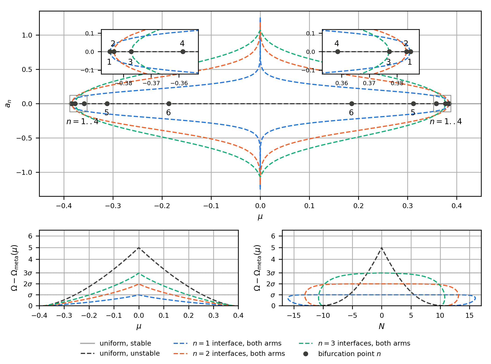
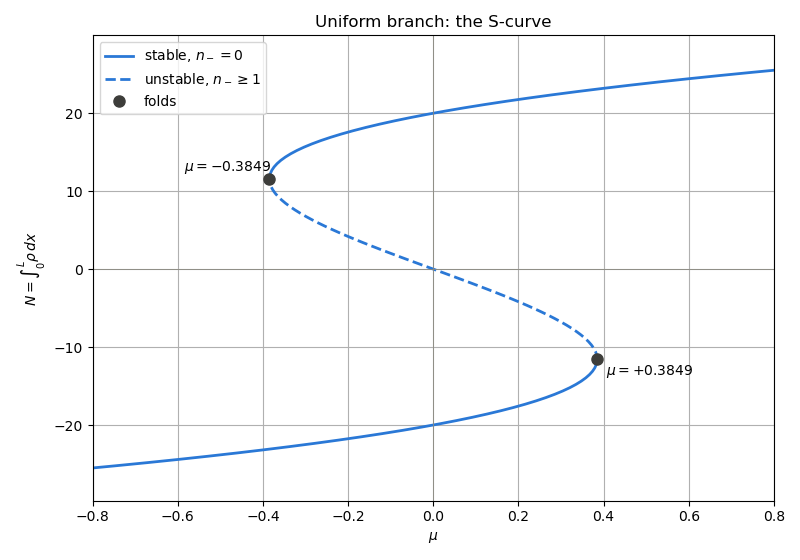
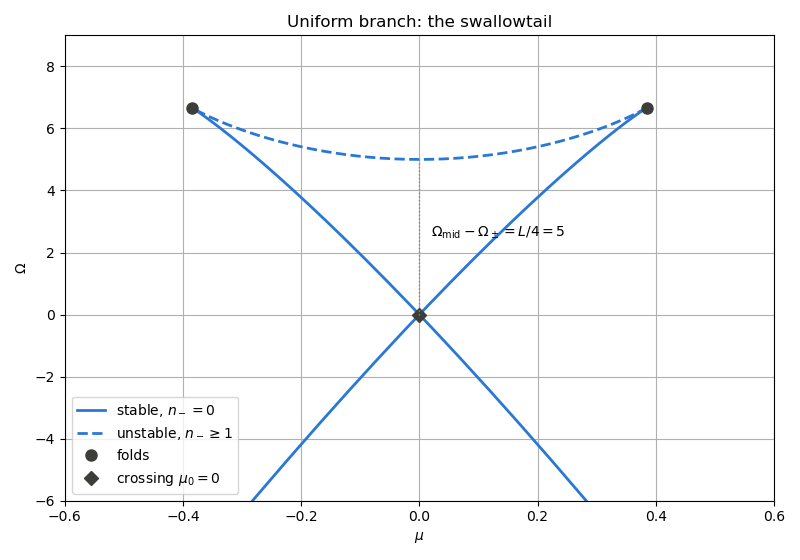
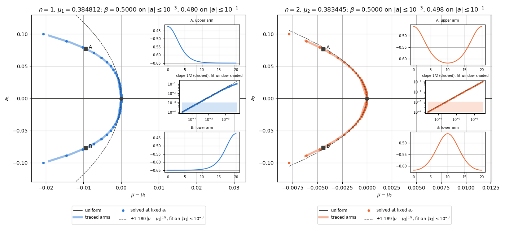
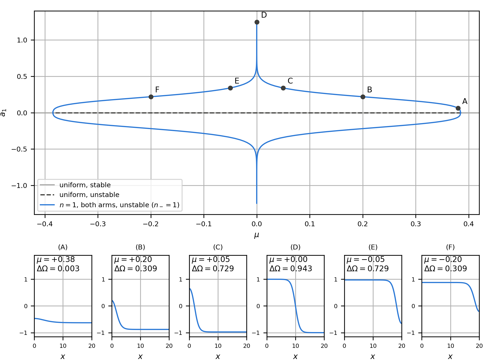
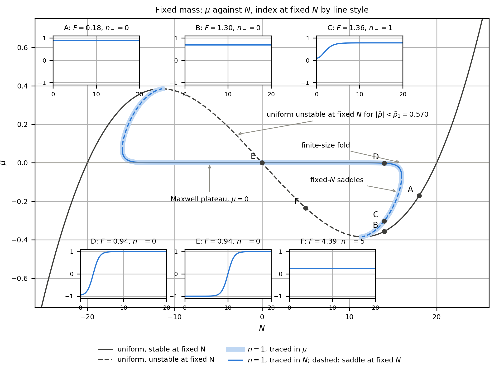
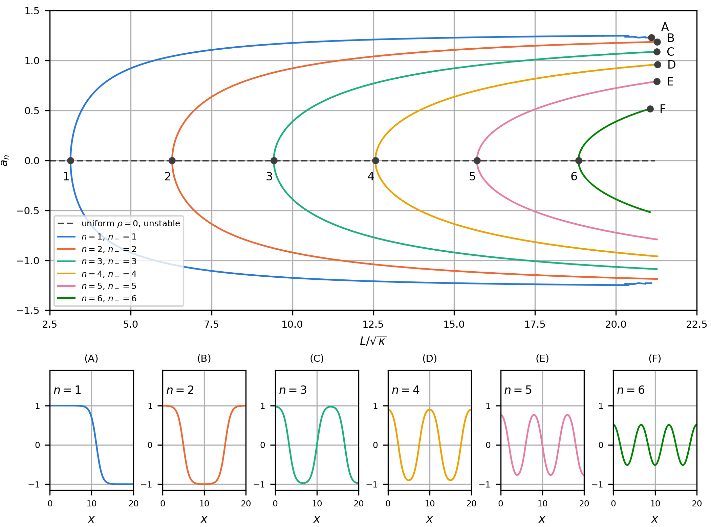
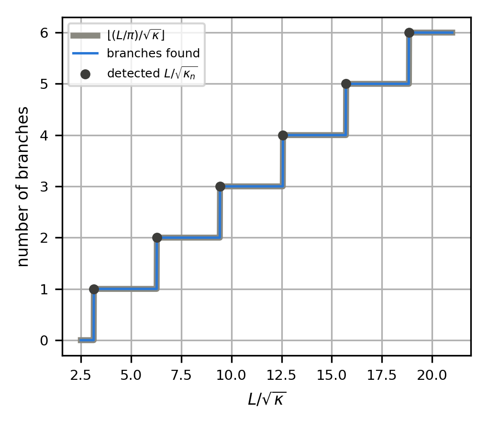
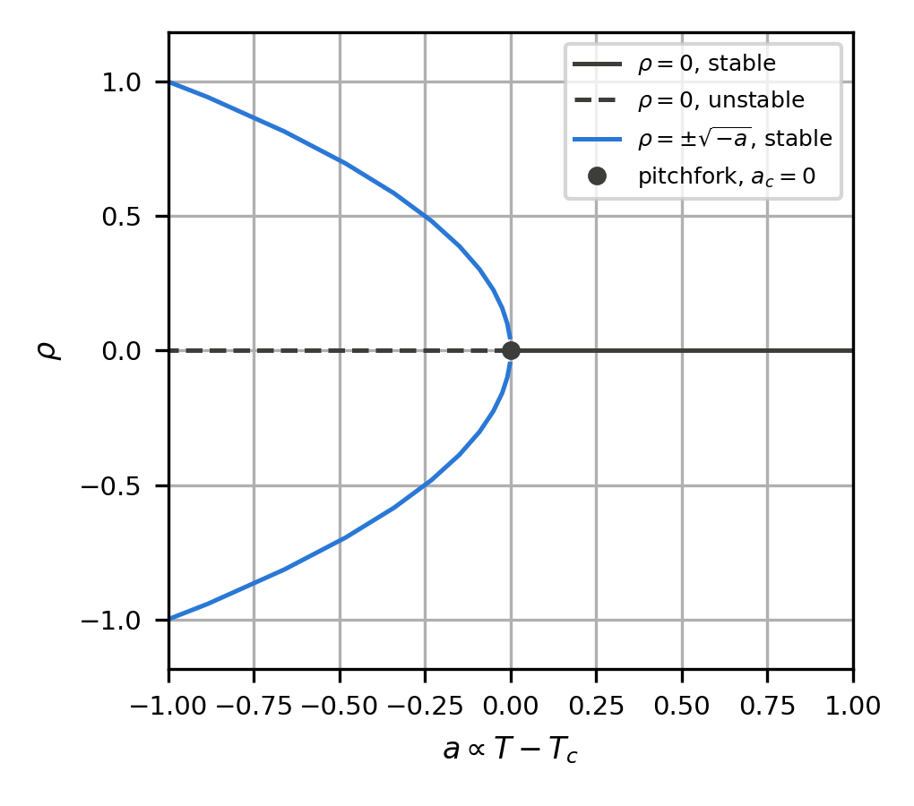

# Continuation: stationary states of the square-gradient model

This document traces the stationary states of the one-dimensional
square-gradient (Cahn-Hilliard) model with pseudo-arclength continuation.
The code follows the uniform branch through both of its folds, locates the
folds and the bifurcation points on it, steps off at every bifurcation point
onto both arms of the branches with $`n = 1, 2, 3`$ interfaces, samples the
pitchforks at prescribed amplitude, and traces the $`n = 1`$ branch again with
the order-parameter content $`N`$ as the parameter, up to its finite-size fold.
It then holds $`\mu = 0`$ fixed and continues in $`L/\sqrt\kappa`$, where the
Neumann modes go soft one after another and give nested pitchforks, and it
closes with the Landau pitchfork of a uniform order parameter. The closed-form
results that the computation must reproduce are collected in a verification
table at the end.

**Figure conventions.** Branches are solid where stable (locally or
globally) and dashed where unstable, in every figure. Profile panels are labelled by the letter of the marked state,
with the details written inside. Figures are one column ($`3.4 \times 3.0`$ in)
for single plots and two columns ($`7.0 \times 3.0`$ or $`7.0 \times 5.2`$ in)
for multipanel figures.

The model has no DFT-specific ingredients, so every quantity along the curves
can be compared with an exact value. The continuation machinery used here
(`Continuation` in `dft/algorithms/solvers/continuation.hpp`: `trace`,
`folds`, `crossings`, `switch_branch`, `constrained_point`) is general and is
also used by the phase-diagram code to follow coexistence lines in
temperature.

<p align="center">
  
</p>

---

## 1. The model

### The equation

On the interval $`(0, L)`$ with walls that impose no flux, the stationary states
at chemical potential $`\mu`$ satisfy

```math
-\kappa\,\rho''(x) + f_0'(\rho) - \mu = 0, \qquad \rho'(0) = \rho'(L) = 0,
```

with the double-well bulk free energy density

```math
f_0(\rho) = \tfrac14\left(\rho^2 - 1\right)^2, \qquad
f_0'(\rho) = \rho^3 - \rho, \qquad
f_0''(\rho) = 3\rho^2 - 1.
```

These are the critical points of the grand potential

```math
\Omega[\rho;\mu] = \int_0^L \left[f_0(\rho) + \frac{\kappa}{2}\,\rho'^2\right] dx - \mu N,
\qquad N = \int_0^L \rho\,dx .
```

The two uniform minima $`\rho = \pm 1`$ coexist at $`\mu_0 = 0`$, and the spinodal
of $`f_0`$ is $`|\rho| = 1/\sqrt3`$.

### What $`\rho`$ and $`N`$ measure

Here $`\rho`$ is an order parameter, not a number density: $`\rho = -1`$ is the
vapour, $`\rho = +1`$ the liquid, and $`\rho = 0`$ lies halfway between them. Read as a
density, $`\rho_{\rm phys} = \rho_c + \tfrac12 \Delta\rho\,\rho`$, with
$`\rho_c`$ the density midway between the coexisting phases and $`\Delta\rho`$
the width of the coexistence gap. $`N = \int \rho\,dx`$ is therefore not a particle number but
the excess over the half-and-half box: in a box that holds a liquid fraction
$`\phi`$ at coexistence, $`N \approx L(2\phi - 1)`$. $`N < 0`$ means more vapour than
liquid and $`N > 0`$ more liquid than vapour. On the $`n = 1`$ branch near
$`N \approx -16`$ the state is a thin liquid layer against a wall (the
one-dimensional droplet), and near $`N \approx +16`$ it is a thin vapour layer
(the one-dimensional bubble). The model is symmetric under
$`\rho \to -\rho`$, $`\mu \to -\mu`$, $`N \to -N`$, which maps the two onto each
other; every figure below has this mirror symmetry.

### Discretisation

The interval is sampled at $`K`$ nodes $`x_i = i h`$, $`h = L/(K-1)`$. The second
derivative uses the three-point stencil, and the Neumann condition is imposed
by mirrored end nodes $`y_{-1} = y_1`$, $`y_K = y_{K-2}`$:

```math
(D_2 y)_0 = \frac{2(y_1 - y_0)}{h^2}, \qquad
(D_2 y)_i = \frac{y_{i-1} - 2 y_i + y_{i+1}}{h^2}, \qquad
(D_2 y)_{K-1} = \frac{2(y_{K-2} - y_{K-1})}{h^2}.
```

The unknown is $`y \in \mathbb{R}^K`$, the parameter is $`\lambda = \mu`$, and the
discrete residual is

```math
F_i(y, \mu) = -\kappa\,(D_2 y)_i + y_i^3 - y_i - \mu .
```

Along every branch the code records

```math
N = h \sum_i w_i\, y_i, \qquad
\Omega = h \sum_i w_i \left[f_0(y_i) - \mu\, y_i\right]
       + \frac{\kappa}{2h} \sum_{i=0}^{K-2} \left(y_{i+1} - y_i\right)^2,
```

```math
a_n = \frac{2}{L}\, h \sum_i w_i \left(y_i - \bar\rho\right) \cos\frac{n\pi x_i}{L},
\qquad \bar\rho = N / L ,
```

with trapezoid weights $`w_0 = w_{K-1} = \tfrac12`$ and $`w_i = 1`$ otherwise. The
gradient term is the sum of $`(\kappa/2)\,y'^2`$ over the $`K - 1`$ cells, with
$`y'`$ the forward difference, so that the discrete functional and the discrete
equation fit together exactly:

```math
\frac{\partial \Omega}{\partial y_i} = h\, w_i\, F_i(y, \mu).
```

The zeros of $`F`$ are the critical points of $`\Omega`$, and the discrete Hessian
is $`h\,W H`$ with $`W = \mathrm{diag}(w_i)`$ and $`H = \partial F/\partial y`$. The
signed amplitude $`a_n`$ of the Neumann mode $`n`$ tells the two arms of a
pitchfork apart (Section 5).

### The Hessian and the index

$`H = -\kappa D_2 + \mathrm{diag}(3 y_i^2 - 1)`$ is tridiagonal. Because of the
factor 2 in the end rows of $`D_2`$ it is not symmetric as a matrix, but it is
symmetric in the trapezoid inner product. The code diagonalises

```math
S = W^{1/2} H\, W^{-1/2},
```

which is symmetric tridiagonal (`arma::eig_sym`), similar to $`H`$, and has the
same inertia as the Hessian $`h\,W H`$. The index

```math
n_- = \#\{\text{negative eigenvalues of } S\}
```

counts the unstable directions of $`\Omega`$ at fixed $`\mu`$. At fixed $`N`$ the
same count is taken on $`S`$ projected onto mass-conserving perturbations,
$`\sum_i w_i\,\delta y_i = 0`$.

The eigenvalues of $`-D_2`$ with mirrored ends are known in closed form,

```math
d_n = \frac{4}{h^2}\,\sin^2\!\left(\frac{n\pi h}{2L}\right), \qquad n = 0, \ldots, K - 1,
```

with eigenvectors $`\cos(n\pi x_i/L)`$. They tend to the Neumann wavenumbers
$`(n\pi/L)^2`$ as $`h \to 0`$.

---

## 2. Pseudo-arclength continuation

A branch is a curve $`s \mapsto (y(s), \mu(s))`$ in $`\mathbb{R}^{K+1}`$ on which
$`F(y, \mu) = 0`$, parametrised by arclength $`s`$ rather than by $`\mu`$, so that it
can be followed through folds, where $`\mu`$ turns back.

### Tangent

Differentiating $`F(y(s), \mu(s)) = 0`$ gives

```math
\left[\,\partial_y F \;\middle|\; \partial_\mu F\,\right]
\begin{pmatrix} \dot y \\ \dot\mu \end{pmatrix} = 0,
\qquad \|\dot y\|^2 + \dot\mu^2 = 1 .
```

The tangent $`(\dot y, \dot\mu)`$ is the null vector of the $`K \times (K+1)`$
extended Jacobian: the library forms it by central differences, takes the
last right singular vector of its SVD, and orients it along the previous
tangent. The extended Jacobian has rank $`K`$ at a fold as well as at a regular
point, so the tangent stays defined where $`\partial_y F`$ alone is singular.

### Predictor and corrector

From a point $`(y_k, \mu_k)`$ with tangent $`(\dot y_k, \dot\mu_k)`$ and step $`\Delta s`$:

1. **Predictor** (Euler step along the tangent):

```math
y^{(0)} = y_k + \Delta s\, \dot y_k, \qquad \mu^{(0)} = \mu_k + \Delta s\, \dot\mu_k .
```

2. **Corrector**: Newton on the bordered system of $`K + 1`$ equations

```math
F(y, \mu) = 0, \qquad
\dot y_k \cdot (y - y_k) + \dot\mu_k\,(\mu - \mu_k) - \Delta s = 0 ,
```

which confines the correction to the hyperplane through the predicted point
normal to the tangent. The bordered Jacobian is nonsingular at simple folds.

3. **Adaptive step**: if Newton fails, $`\Delta s`$ is halved and the step is
retried; after a success it grows by a factor $`1.2`$, up to `max_step`.

### Library calls

```cpp
const algorithms::continuation::Continuation continuation{
    .initial_step = 0.05,
    .max_step = 0.3,
    .min_step = 1e-6,
    .newton = {.max_iterations = 20, .tolerance = 1e-9},
};

// A branch, until a stop condition holds.
auto curve = continuation.trace(start, R, [](const CurvePoint& q) { return arma::mean(q.x) > 1.35; });

// Folds (zeros of dmu/ds) and zero crossings of the eigenvalues of S.
auto folds = continuation.folds(curve, R);
auto crossings = continuation.crossings(curve, R, [&](const CurvePoint& q) { return problem.spectrum(q.x); });

// First point on a bifurcating branch, along the critical eigenvector v.
auto first = continuation.switch_branch(bifurcation, R, v, 0.3);

// The point of a branch where a condition holds, here a_n(y) = a.
auto point = continuation.constrained_point(y, mu, R, [&](const arma::vec& v, double) {
  return problem.modal_amplitude(v, n) - a;
});
```

`folds` and `crossings` find the interval where a test function changes sign
and locate its root by regula falsi (Illinois variant) on the step length,
through `locate`. The problem-specific code is in three headers:
`model.hpp` (the discretised model and its closed forms), `branches.hpp` (the
traces, the events and the sampled states) and `verification.hpp` (the checks
behind the table in Section 7).

---

## 3. What a branch contains

### Folds

At a fold $`\dot\mu = 0`$, so the tangent reduces to $`(\dot y, 0)`$ with
$`\partial_y F\,\dot y = 0`$: the Hessian is singular and $`\dot y`$ is its null
vector. One eigenvalue changes sign across the fold, so $`n_-`$ changes by one.

### Bifurcation points

A change of $`n_-`$ between consecutive points without a sign change of $`\dot\mu`$
is a bifurcation point: an eigenvalue of $`S`$ crosses zero while the branch
passes straight through. `crossings` locates the root of the eigenvalue that
changes sign, and the code labels it by the number of sign changes of the
critical eigenvector. A crossing with a uniform eigenvector ($`n = 0`$) is the
fold itself and is reported only once, as a fold.

### The index labels the arcs

Between events $`n_-`$ is constant, so every arc of a branch has a well defined
index: stable arcs have $`n_- = 0`$, transition states $`n_- = 1`$, higher indices
are saddles of higher order.

### $`d\Omega/d\mu = -N`$

Along any branch,

```math
\frac{d\Omega}{ds} = \sum_i \frac{\partial\Omega}{\partial y_i}\,\dot y_i
                   + \frac{\partial\Omega}{\partial\mu}\,\dot\mu
                 = h \sum_i w_i F_i\,\dot y_i - N \dot\mu = -N \dot\mu,
```

because $`F = 0`$ on the branch. So $`d\Omega/d\mu = -N`$ wherever $`\dot\mu \ne 0`$.
At a fold the two arcs meet with the same slope and $`\Omega(\mu)`$ has a cusp:
$`d^2\Omega/d\mu^2 = -dN/d\mu`$ diverges there.

---

## 4. The uniform branch

On uniform states $`D_2 y = 0`$, so the branch is $`\rho^3 - \rho = \mu`$ with
$`N = L\rho`$ and $`\Omega = L\,[f_0(\rho) - \mu\rho]`$. The folds sit at
$`f_0''(\rho) = 0`$:

```math
\rho_f = \pm \frac{1}{\sqrt3}, \qquad \mu_f = \mp \frac{2}{3\sqrt3} \approx \mp 0.3849 .
```

On the uniform branch the eigenvalues of $`S`$ are $`\kappa d_n + 3\rho^2 - 1`$:
the $`n = 0`$ eigenvalue changes sign at the folds, and each $`n \ge 1`$ eigenvalue
at a bifurcation point (Section 5).

### Why the uniform branch folds instead of splitting

In the $`(\rho, T)`$ phase diagram the uniform state splits at the critical
point by a pitchfork. At fixed $`\mu`$ it does not: the symmetry
$`\rho \to -\rho`$ that would force a pitchfork maps $`\mu`$ to $`-\mu`$, so it is a
symmetry of the problem only at $`\mu = 0`$. Traced in $`\mu`$, the uniform branch
loses stability through two folds, at $`\pm\mu_f`$, which are the spinodals.
The pitchfork appears when $`\mu = 0`$ is held fixed and a temperature-like
parameter is varied instead (Section 7).

### The S-curve

$`N`$ against $`\mu`$. The stable arcs ($`n_- = 0`$) are solid and the unstable arc
between the folds is dashed. Between $`-\mu_f`$ and $`+\mu_f`$ three uniform
states coexist at every $`\mu`$.

<p align="center"></p>

### The swallowtail

$`\Omega`$ against $`\mu`$. The two stable uniform arcs cross at $`\mu_0 = 0`$, where
$`\rho = \pm 1`$ have the same grand potential; the unstable uniform arc (dashed)
joins them at the folds, where $`\Omega(\mu)`$ has cusps. Every state on the
dashed arc is uniform: its profile is flat (A). The interface branches of
Section 5 are separate curves, drawn in colour below the dashed arc and dashed
because they are unstable at fixed $`\mu`$; B, C and D mark their states at
$`\mu = 0`$, and the panels on the right show the profiles.



On the uniform branch the gap between the middle state and the metastable one
is

```math
\Omega_{\rm mid} - \Omega_{\rm meta} = L\left(\omega_{\rm mid} - \omega_{\rm meta}\right),
\qquad \omega = f_0(\rho) - \mu\rho .
```

It is extensive: the cost of converting the whole box at once through a
uniform state, not a nucleation barrier. At $`\mu = 0`$ it is $`L/4`$: 5 at
$`L = 20`$ and 10 at $`L = 40`$ (Section 7).

---

## 5. Branches with $`n`$ interfaces

### Where they come from

The eigenvalue $`\kappa d_n + 3\bar\rho^2 - 1`$ of the uniform state crosses zero
when

```math
\kappa\, d_n = 1 - 3\bar\rho^2
\quad\xrightarrow{h \to 0}\quad
\kappa \left(\frac{n\pi}{L}\right)^2 = 1 - 3\bar\rho^2 .
```

Each $`n \ge 1`$ with a real solution gives a pair of bifurcation points
$`\pm\bar\rho_n`$ on the unstable arc, and their number is

```math
n_{\max} = \left\lfloor \frac{L}{\pi} \sqrt{\frac{1 - 3\bar\rho^2}{\kappa}} \right\rfloor
\quad \text{at } \bar\rho = 0 .
```

At $`L = 20`$, $`\kappa = 1`$ this gives $`n_{\max} = 6`$, and the uniform state
$`\rho = 0`$ has index $`1 + n_{\max} = 7`$.

### Pitchforks, and why the norm hid them

These bifurcations are pitchforks. The reflection $`x \mapsto L - x`$ maps the
critical mode $`\cos(n\pi x/L)`$ to $`(-1)^n`$ times itself: for odd $`n`$ it acts
as $`-1`$ on the kernel, and the equivariant problem can only bifurcate
symmetrically. For even $`n`$ the same holds for the reflection of a cell of
length $`L/n`$, since the mode and the bifurcating states are copies of the
$`n = 1`$ problem on $`(0, L/n)`$ reflected into the box. Consistently, the
quadratic coefficient of the reduced equation is proportional to
$`\int_0^L \cos^3(n\pi x/L)\,dx = 0`$.

A pitchfork has two arms, exchanged by the symmetry: for odd $`n`$ the arm
$`y_-(x) = y_+(L - x)`$, for even $`n`$ the shift of $`y_+`$ by one cell, $`L/n`$.
Every quantity invariant under that symmetry takes the same value on both
arms, and so do $`N`$, $`\Omega`$ and the norm $`\|\rho - \bar\rho\|`$. Plotted with
any of them, the two arms fall on one curve and the pitchfork looks like a
single branch leaving the uniform one. The signed amplitude $`a_n`$ changes sign
under the symmetry, so against $`a_n`$ the arms separate and each bifurcation
point shows the sideways parabola.

### Stepping off

At a pitchfork the bifurcating branch leaves with tangent $`(\pm v_n, 0)`$, with
$`v_n`$ the critical eigenvector (the right null vector of $`H`$, recovered as
$`W^{-1/2}`$ times the eigenvector of $`S`$). `switch_branch` takes one ordinary
continuation step from the bifurcation point with that tangent, so the
corrector solves $`F = 0`$ on the hyperplane $`v_n \cdot (y - y_b) = \pm 0.3`$;
that excludes the uniform branch, and Newton lands on the arm. Each arm is then
traced until its amplitude falls back towards zero, which happens at the
mirror bifurcation point $`+\bar\rho_n`$: each branch connects the pair
$`\pm\bar\rho_n`$.

### Bifurcation diagram

Top: $`a_n`$ against $`\mu`$, both arms, with every bifurcation point numbered by
its $`n`$; the points $`n = 1`$ to 4 lie within 0.03 of each fold and are shown in
the zooms on both sides. On the axis $`a_n = 0`$ three uniform states share each
$`|\mu| < \mu_f`$: the stable arcs are grey, the unstable middle arc, where the
pitchforks sit, is dashed. Bottom: the gap $`\Omega - \Omega_{\rm meta}(\mu)`$,
against $`\mu`$ and against $`N`$, where $`\Omega_{\rm meta}(\mu)`$ is the grand
potential of the metastable uniform state at the same $`\mu`$: of the two
locally stable uniform states, the one with the higher $`\Omega`$ (the vapour
side, $`\rho < -1/\sqrt3`$, for $`\mu > 0`$, and the liquid side for $`\mu < 0`$).
The gap is the cost of leaving the metastable phase through the state on the
curve. Every non-uniform state in this figure is unstable at fixed $`\mu`$: the
branch with $`n`$ interfaces has $`n_- = n`$ at every resolved point.


Against $`\mu`$ each interface branch passes through $`\mu = 0`$ as a vertical
spike. Along that stretch the interface positions can be moved at an
exponentially small cost, so $`|\mu| < 3 \times 10^{-5}`$ while $`N`$ runs from
$`-11`$ to $`+11`$ on the $`n = 1`$ branch: the whole family collapses onto one
abscissa. Against $`N`$ the same stretch is a plateau at $`n\sigma`$. The
arclength parametrisation follows it without difficulty; a trace in $`\mu`$
could not.

Three features of the diagram:

- **The index is $`n`$.** At fixed $`\mu`$ there is no mass constraint, so these
  are the stationary states of the Allen-Cahn equation with Neumann
  conditions. At every traced point of the branches computed here
  ($`n = 1, 2, 3`$, both arms), away from the two bifurcation points where the
  critical eigenvalue vanishes, the Hessian has exactly $`n`$ negative
  eigenvalues. That is a
  numerical result for these branches; we do not quote a theorem for it.
- **The gap is finite.** At $`\mu = 0`$ the gap is $`n\sigma`$, the cost of $`n`$
  interfaces, independently of $`L`$ (the table checks $`n = 1`$ at $`L = 20`$ and
  $`L = 40`$). The uniform middle state costs $`L(\omega_{\rm mid} - \omega_{\rm meta})`$ instead. The saddles that control the escape from the
  metastable state are on the interface branches, not on the uniform one.
- **In one dimension the barrier stays finite at coexistence.** As
  $`\mu \to 0`$ the gap tends to $`\sigma`$, one interface, instead of diverging
  as the classical nucleation barrier does in three dimensions. An interface
  in one dimension has no area to grow, so the cost of a nucleus does not
  depend on its size, and there is no critical radius that diverges at
  coexistence.

### The pitchforks up close

One panel per pitchfork, $`n = 1, 2, 3`$. The uniform state (dashed, unstable)
exists on both sides of $`\mu_n`$; at $`\mu_n`$ two mirror-image solutions branch
off with amplitude $`\propto \sqrt{\mu_n - \mu}`$. The points are solved at
prescribed $`a_n`$ with `constrained_point`; the fit of the exponent uses
$`|a_n| \le 10^{-3}`$, shaded in the log-log inset, which also gives the fitted
$`\beta`$. Further out, higher-order terms bend the arms, and the two-term
normal form $`\mu - \mu_n = c_2 a^2 + c_4 a^4`$ (dotted) follows them where the
leading order (dash-dot) does not. $`n = 1`$ bends sooner because $`\mu_1`$ is
within $`10^{-4}`$ of the fold ($`\mu_f - \mu_1 = 8.9 \times 10^{-5}`$). Insets
(A) and (B) show the marked state on each arm, with the y range fitted to the
profile: mirror images for odd $`n`$, and the shift by $`L/2`$ for $`n = 2`$.



The fitted exponent converges to $`1/2`$ as the window shrinks: for $`n = 1`$ it
deviates by $`0.089`$, $`1.9 \times 10^{-3}`$ and $`2.0 \times 10^{-5}`$ on the
decades $`10^{-2} \le |a_1| \le 10^{-1}`$, $`10^{-3}`$ to $`10^{-2}`$ and $`10^{-4}`$
to $`10^{-3}`$, about a hundredfold per decade, as the $`O(a^2)`$ correction of
the normal form predicts ($`n = 2`$: $`9.3 \times 10^{-3}`$, $`1.0 \times 10^{-4}`$,
$`2.9 \times 10^{-6}`$; $`n = 3`$: $`1.2 \times 10^{-3}`$, $`1.2 \times 10^{-5}`$,
$`4.0 \times 10^{-6}`$). The verification requires the smallest window to
lie closer to $`1/2`$ than the next one.

For even $`n`$ the shift by $`L/n`$ maps solutions to solutions only among states
symmetric about the cell boundaries, and it does not carry the Hessian
across: the arm with a slab away from the walls has an eigenvalue near zero
(about $`10^{-8}`$), the free translation of the slab. Along it the trace
drifts off the symmetric subspace by up to the Newton tolerance divided by
that eigenvalue; the amount depends on round-off ($`2 \times 10^{-4}`$ in the
recorded run). The check of the arms therefore compares even-$`n`$ states after
symmetrising them and re-solving at the same $`\mu`$.

### Along the $`n = 1`$ branch

Six states on the $`n = 1`$ arm at fixed $`\mu`$, with $`\Delta\Omega = \Omega - \Omega_{\rm meta}(\mu)`$; the whole branch is unstable at fixed $`\mu`$
($`n_- = 1`$). Near the bifurcation (A) the profile is the cosine mode;
at $`\mu = 0.2`$ and $`0.05`$ (B, C) it is a layer of the stable phase against the
wall, the one-dimensional critical nucleus, growing as $`\mu`$ decreases; at
$`\mu = 0`$ (D) it is the centred interface with $`\Delta\Omega = \sigma`$; and at
$`\mu < 0`$ (E, F) the roles of the phases swap and the layer shrinks against
the other wall.



---

## 6. The same branch at fixed $`N`$

A critical point of $`\Omega`$ at chemical potential $`\mu`$ is a critical point of
the Helmholtz functional $`F[\rho] = \Omega + \mu N`$ at its own $`N`$, with
Lagrange multiplier $`\mu`$, so the same curve can be followed with $`N`$ as the
parameter. The unknown becomes $`x = (y, \mu) \in \mathbb{R}^{K+1}`$ and the
residual gains the mass constraint:

```math
R(x; N) = \begin{pmatrix} F(y, \mu) \\ h \sum_i w_i y_i - N \end{pmatrix} .
```

The same `Continuation` object traces it; only the residual changes. The
figure shows $`\mu`$ against $`N`$, with the index at fixed $`N`$ by line style
(solid stable, dashed unstable). The pale band is the $`n = 1`$ branch traced in
$`\mu`$, the thin line the same branch traced in $`N`$: they coincide. The
$`n = 2`$ and $`n = 3`$ branches, traced in $`\mu`$, are unstable at fixed $`N`$
along their whole length. The insets show the profiles of the lettered states,
in blue for those on the $`n = 1`$ branch.



### Fixed-$`N`$ saddles

A fixed-$`N`$ saddle is a stationary profile of the Helmholtz functional on
the hyperplane of perturbations that preserve $`N`$, with at least one
negative Hessian direction within that hyperplane. It is neither a stable
equilibrium nor an arbitrary point on the curve: it separates the basins of
two fixed-mass minima and gives the activation barrier between them. At
$`N = 14`$, C has one such direction and is the saddle between the metastable
uniform minimum B and the phase-separated minimum D. This constrained index
can differ from the fixed-$`\mu`$ index because directions that change mass
are excluded.

### The lettered states

| State | $`N`$ | What it is | $`F`$ | $`n_-`$ at fixed $`N`$ |
|-------|-----|------------|-----|-----|
| A | 18 | uniform, beyond the finite-size fold: no layer state exists, the only minimum | 0.18 | 0 |
| B | 14 | uniform, between binodal and spinodal: metastable | 1.30 | 0 |
| C | 14 | vapour layer at the wall: the fixed-$`N`$ saddle between B and D | 1.36 | 1 |
| D | 14 | phase-separated, interface near the wall: stable | 0.94 | 0 |
| E | 0 | phase-separated, interface in the middle | 0.94 | 0 |
| F | 5 | uniform, inside the spinodal: unstable | 4.39 | 5 |

B, C and D share $`N = 14`$: the three states available at one mass, a
metastable minimum, the saddle between it and the stable minimum, and that
minimum. The barrier at fixed $`N`$ is $`F_C - F_B = 0.06`$. F has one unstable
mass-conserving mode for each soft Neumann mode,
$`\lfloor (L/\pi)\sqrt{(1 - 3\bar\rho^2)/\kappa} \rfloor = 5`$ at $`\bar\rho = 0.25`$.

### The Maxwell plateau is the lever rule

The uniform branch is the van der Waals loop $`\mu = \bar\rho^3 - \bar\rho`$
with $`\bar\rho = N/L`$. The $`n = 1`$ branch cuts it with the plateau $`\mu = 0`$
from $`N \approx -16`$ to $`+16`$: at fixed $`N`$ inside the binodal the minimum is
the phase-separated state at the coexistence chemical potential, with the
interface placed so that the liquid fraction is $`\phi = (1 + N/L)/2`$. This is
the Maxwell construction and the lever rule, obtained here by computation
rather than imposed; by the $`\rho \to -\rho`$ symmetry the plateau cuts equal
areas from the loop. On the plateau $`F = \sigma`$ whatever the interface
position, which is why D and E have the same $`F`$.

### Saddle at fixed $`\mu`$, minimum at fixed $`N`$

The centred interface E has $`n_- = 1`$ at fixed $`\mu`$ and $`n_- = 0`$ at fixed
$`N`$. Its unstable direction at fixed $`\mu`$ translates the interface and so
changes $`N`$; the mass constraint removes it. The same profile is a transition
state in the grand-canonical problem and the stable state in the canonical
one. Likewise the uniform branch is unstable at fixed $`N`$ only where the
first non-uniform mode is soft, $`|\bar\rho| < \bar\rho_1 = 0.570`$, slightly
inside the spinodal $`1/\sqrt3 = 0.577`$; between the two, the uniform state is
metastable at fixed $`N`$.

### The finite-size fold

The plateau ends in a fold in $`N`$, at $`N_{\rm fold} = 16.004`$ for $`L = 20`$.
Beyond it the branch has $`n_- = 1`$ at fixed $`N`$ (dashed) and runs back to the
bifurcation point: these states are the critical layers of the canonical
problem. At the fold the minority layer has width
$`l = (L - N_{\rm fold})/2`$ in the constant-density estimate, and
$`l/\sqrt{2\kappa} = 1.41`$, $`1.60`$ and $`1.77`$ at $`L = 20`$, $`40`$ and $`80`$.

More precisely, this finite-size fold is the turning point of the
phase-separated branch in the prescribed mass: a stable layer state and a
fixed-$`N`$ saddle coalesce there, the constrained Hessian has a zero
eigenvalue, and neither non-uniform state exists at masses closer to the
binodal. It is a finite-box effect of the interaction between the interface
and the wall. As $`L`$ grows, the fold approaches $`|N| = L`$ in relative
terms, while its minority-layer width grows only logarithmically.

The fold position follows from the layer held by its image in the wall. A
minority layer of width $`l`$ has $`|\mu| = A\,e^{-2ql}`$, with
$`q = \sqrt{2/\kappa}`$ the decay rate of the interface tails, and the box holds
$`N \approx L(1 - |\mu|/2) - 2l`$, the first term from the compressibility of
the majority phase. $`dN/d|\mu| = 0`$ gives

```math
|\mu_{\rm fold}| = \frac{2}{qL}, \qquad
L - N_{\rm fold} = \frac{1}{q}\left[1 + \ln\frac{AqL}{2}\right].
```

So $`L\,\mu_{\rm fold} \to -\sqrt{2\kappa}`$, and $`L - N_{\rm fold}`$ is not
independent of $`L`$: it grows by $`\ln 2/q = 0.490`$ per doubling. The measured
values are:

| $`L`$ | $`N_{\rm fold}`$ | $`L - N_{\rm fold}`$ | $`L\,\mu_{\rm fold}`$ |
|-----|----------------|--------------------|---------------------|
| 20 | 16.0036 | 3.9964 | $`-1.4444`$ |
| 40 | 35.4853 | 4.5147 | $`-1.4286`$ |
| 80 | 74.9816 | 5.0184 | $`-1.4217`$ |

The increments are 0.518 and 0.504, and the errors in $`L\mu_{\rm fold}`$ halve
with each doubling: both approach the asymptotic values with an $`O(1/L)`$
correction, which the verification removes by Richardson extrapolation. The
fold approaches the binodal $`|N| = L`$ in relative terms,
$`(L - N_{\rm fold})/L = 0.20`$, $`0.11`$, $`0.063`$, while the width of the layer at
the fold grows only logarithmically.

---

## 7. Nested pitchforks at $`\mu = 0`$

### Continuing in $`L/\sqrt\kappa`$

At $`\mu = 0`$ the symmetry $`\rho \to -\rho`$ is a symmetry of the problem, and
$`\rho = 0`$ is a solution for every $`\kappa`$. With $`\lambda = L/\sqrt\kappa`$
as the parameter ($`\kappa = (L/\lambda)^2`$ at fixed $`L`$), the residual is

```math
F(y; \lambda) = -\left(\frac{L}{\lambda}\right)^2 D_2 y + y^3 - y ,
```

and the eigenvalues of $`S`$ at $`y = 0`$ are $`\kappa d_n - 1`$. Mode $`n`$ goes soft
at

```math
\kappa_n = \frac{1}{d_n} \quad\xrightarrow{h \to 0}\quad
\left(\frac{L}{n\pi}\right)^2, \qquad
\lambda_n = L\sqrt{d_n} \to n\pi .
```

The code traces $`y = 0`$ from $`\lambda = 2.5`$ to $`21`$ (between $`6\pi`$ and
$`7\pi`$), locates the six crossings with `crossings`, and starts both arms of
each branch with `switch_branch`. The branches are supercritical in $`\lambda`$
and nested: branch $`n`$ appears when the box holds $`n`$ half-wavelengths of the
soft mode.



All the states in this figure are unstable at fixed $`\mu`$: $`\rho = 0`$ has
$`n_- \ge 1`$ (its $`n = 0`$ eigenvalue is $`-1`$), and branch $`n`$ has $`n_- = n`$.
The profiles (A) to (F) are the branches at the largest $`L/\sqrt\kappa`$:
chains of $`n`$ interfaces, still of small amplitude for the youngest ones.

The index is checked only where the eigenvalue nearest zero exceeds $`10^{-8}`$
in magnitude. On the two $`n = 1`$ arms beyond $`L/\sqrt\kappa \approx 16.5`$,
50 of the 736 traced points, the lone interface can translate almost freely:
its eigenvalue is of order $`e^{-qL} \approx 10^{-11}`$, below what states
converged to a residual of $`10^{-9}`$ can resolve, and its sign there is
round-off. The small kink of the $`n = 1`$ arms near $`L/\sqrt\kappa = 20.4`$ is
the trace drifting along that nearly neutral direction.

### How many branches

The number of branches present at a given $`L/\sqrt\kappa`$ is the number of
soft modes, $`\lfloor (L/\pi)/\sqrt\kappa \rfloor`$ in the continuum. The
detected $`\lambda_n`$ lie below $`n\pi`$ by the discretisation error of $`d_n`$
($`\lambda_1 = 3.14156`$ against $`\pi`$), which is invisible on this scale.

<p align="center"></p>

The offset of $`\kappa_n`$ from the continuum value has a closed form:
$`1/d_n = (L/n\pi)^2 + h^2/12 + O(h^4 (n\pi/L)^2)`$, so
$`\kappa_n - (L/n\pi)^2 \to h^2/12 = 8.33 \times 10^{-4}`$ for every $`n`$. The
table checks it.

### The Landau pitchfork

For a uniform order parameter at $`\mu = 0`$ with
$`f_0 = \rho^4/4 + a\rho^2/2`$, the stationary condition is $`\rho^3 + a\rho = 0`$.
Continued in $`a`$ from positive to negative, $`\rho = 0`$ loses stability at
$`a = 0`$ and splits into $`\rho = \pm\sqrt{-a}`$. With $`a`$ proportional to
$`T - T_c`$ this is the pitchfork at the top of the $`(\rho, T)`$ coexistence
dome: the one that the uniform branch at fixed $`\mu`$ (Section 4) does not
show, because there $`\mu`$ breaks the symmetry.

<p align="center"></p>

---

## 8. Verification

`check/main.cpp` runs the same traces as the example (`utils::run`) and
compares them with the closed forms below; it exits with a non-zero status if
any row fails (61 rows). The same table is printed at the end of `main.cpp`. Reference
values: $`L = 20`$, $`\kappa = 1`$, $`K = 201`$ ($`h = 0.1`$).

| Quantity | Measured | Exact | Error | Tolerance |
|----------|----------|-------|-------|-----------|
| Uniform branch: $`\max\lvert\rho^3 - \rho - \mu\rvert`$, $`\max\lvert y_i - \bar\rho\rvert`$ | $`6.2 \times 10^{-11}`$ | $`0`$ | $`6.2 \times 10^{-11}`$ | $`10^{-9}`$ |
| Fold $`\rho_f^-`$ | $`-0.5773502692`$ | $`-1/\sqrt3`$ | $`1.9 \times 10^{-11}`$ | $`10^{-8}`$ |
| Fold $`\mu_f^-`$ | $`+0.3849001795`$ | $`+2/(3\sqrt3)`$ | $`2.4 \times 10^{-14}`$ | $`10^{-8}`$ |
| Fold $`\rho_f^+`$ | $`+0.5773502692`$ | $`+1/\sqrt3`$ | $`1.2 \times 10^{-11}`$ | $`10^{-8}`$ |
| Fold $`\mu_f^+`$ | $`-0.3849001795`$ | $`-2/(3\sqrt3)`$ | $`2.3 \times 10^{-15}`$ | $`10^{-8}`$ |
| $`d\Omega/d\mu + N`$, uniform (relative) | $`4.5 \times 10^{-5}`$ | $`0`$ | $`4.5 \times 10^{-5}`$ | $`10^{-3}`$ |
| $`d\Omega/d\mu + N`$, $`n = 1`$ (relative) | $`1.7 \times 10^{-4}`$ | $`0`$ | $`1.7 \times 10^{-4}`$ | $`10^{-3}`$ |
| Interface at $`\mu = 0`$: $`\max\lvert y - \tanh((x - L/2)/\sqrt{2\kappa})\rvert`$ | $`2.8 \times 10^{-4}`$ | $`0`$ | $`2.8 \times 10^{-4}`$ | $`10^{-3}`$ |
| $`\sigma = \Omega_1 - \Omega_\pm`$ at $`\mu = 0`$, $`L = 20`$ | $`0.9426518`$ | $`2\sqrt2/3 = 0.9428090`$ | $`1.6 \times 10^{-4}`$ | $`10^{-3}`$ |
| $`\sigma = \Omega_1 - \Omega_\pm`$ at $`\mu = 0`$, $`L = 40`$ | $`0.9426518`$ | $`0.9428090`$ | $`1.6 \times 10^{-4}`$ | $`10^{-3}`$ |
| $`\Omega_{\rm mid} - \Omega_\pm`$ at $`\mu = 0`$, $`L = 20`$ | $`5`$ | $`L/4 = 5`$ | $`0`$ | $`10^{-12}`$ |
| $`\Omega_{\rm mid} - \Omega_\pm`$ at $`\mu = 0`$, $`L = 40`$ | $`10`$ | $`L/4 = 10`$ | $`0`$ | $`10^{-12}`$ |
| $`n_-`$ of the interface, fixed $`\mu`$ | $`1`$ | $`1`$ | $`0`$ | exact |
| $`n_-`$ of the interface, fixed $`N`$ | $`0`$ | $`0`$ | $`0`$ | exact |
| $`n_-`$ at fixed $`N`$ of A, B, C, D, E | $`0, 0, 1, 0, 0`$ | $`0, 0, 1, 0, 0`$ | $`0`$ | exact |
| $`n_-`$ at fixed $`N`$ of F ($`\bar\rho = 0.25`$) | $`5`$ | $`\lfloor (L/\pi)\sqrt{(1 - 3\bar\rho^2)/\kappa}\rfloor = 5`$ | $`0`$ | exact |
| $`L\,\mu_{\rm fold}`$, Richardson from $`L = 40, 80`$ | $`-1.41485`$ | $`-\sqrt{2\kappa} = -1.41421`$ | $`6.4 \times 10^{-4}`$ | $`2 \times 10^{-3}`$ |
| Growth of $`L - N_{\rm fold}`$ per doubling, Richardson | $`0.48897`$ | $`\ln 2 \sqrt{\kappa/2} = 0.49013`$ | $`1.2 \times 10^{-3}`$ | $`3 \times 10^{-3}`$ |
| Arms $`n = 1`$: $`\max\lvert\Delta\mu\rvert, \lvert\Delta N\rvert, \lvert\Delta\Omega\rvert`$ | $`5.2 \times 10^{-8}`$ | $`0`$ | $`5.2 \times 10^{-8}`$ | $`10^{-6}`$ |
| Arms $`n = 1`$: $`\max\lvert S y_- - y_+\rvert`$ | $`1.1 \times 10^{-8}`$ | $`0`$ | $`1.1 \times 10^{-8}`$ | $`10^{-6}`$ |
| Arms $`n = 2`$: $`\max\lvert\Delta\mu\rvert, \lvert\Delta N\rvert, \lvert\Delta\Omega\rvert`$ | $`4.3 \times 10^{-10}`$ | $`0`$ | $`4.3 \times 10^{-10}`$ | $`10^{-6}`$ |
| Arms $`n = 2`$: $`\max\lvert S y_- - y_+\rvert`$ | $`1.3 \times 10^{-8}`$ | $`0`$ | $`1.3 \times 10^{-8}`$ | $`10^{-6}`$ |
| Arms $`n = 3`$: $`\max\lvert\Delta\mu\rvert, \lvert\Delta N\rvert, \lvert\Delta\Omega\rvert`$ | $`1.9 \times 10^{-10}`$ | $`0`$ | $`1.9 \times 10^{-10}`$ | $`10^{-6}`$ |
| Arms $`n = 3`$: $`\max\lvert S y_- - y_+\rvert`$ | $`1.9 \times 10^{-8}`$ | $`0`$ | $`1.9 \times 10^{-8}`$ | $`10^{-6}`$ |
| Pitchfork exponent, $`10^{-4} \le \lvert a_1\rvert \le 10^{-3}`$ | $`0.4999803`$ | $`1/2`$ | $`2.0 \times 10^{-5}`$ | $`1.9 \times 10^{-3}`$ |
| Pitchfork exponent, $`10^{-4} \le \lvert a_2\rvert \le 10^{-3}`$ | $`0.5000029`$ | $`1/2`$ | $`2.9 \times 10^{-6}`$ | $`1.0 \times 10^{-4}`$ |
| Pitchfork exponent, $`10^{-4} \le \lvert a_3\rvert \le 10^{-3}`$ | $`0.5000040`$ | $`1/2`$ | $`4.0 \times 10^{-6}`$ | $`1.2 \times 10^{-5}`$ |
| $`\mu = 0`$: $`\kappa_n`$ against the discrete $`\kappa d_n = 1`$, $`n = 1..6`$ | $`40.529307`$, ..., $`1.126625`$ | same | $`\le 7.1 \times 10^{-11}`$ | $`10^{-9}\kappa_n`$ |
| $`\mu = 0`$: $`\kappa_n - (L/n\pi)^2`$, $`n = 1..6`$ | $`8.33344 \times 10^{-4}`$ to $`8.33704 \times 10^{-4}`$ | $`h^2/12 = 8.33333 \times 10^{-4}`$ | $`1.0 \times 10^{-8}`$ to $`3.7 \times 10^{-7}`$ | $`10^{-5}`$ |
| $`\mu = 0`$: branches found at $`L/\sqrt\kappa = 21`$ | $`6`$ | $`\lfloor 21/\pi \rfloor = 6`$ | $`0`$ | exact |
| $`\mu = 0`$: $`\max\lvert n_- - n\rvert`$ on all arms (resolved points) | $`0`$ | $`0`$ | $`0`$ | exact |
| Landau: $`a_c`$ | $`0`$ | $`0`$ | $`0`$ | $`10^{-10}`$ |
| Landau: $`\max\lvert\rho \mp \sqrt{-a}\rvert`$ on the arms | $`5.2 \times 10^{-9}`$ | $`0`$ | $`5.2 \times 10^{-9}`$ | $`10^{-6}`$ |
| $`\bar\rho_1`$ vs discrete $`\kappa d_1 = 1 - 3\bar\rho^2`$ | $`0.5701831566`$ | $`0.5701831566`$ | $`5.3 \times 10^{-15}`$ | $`10^{-9}`$ |
| $`\bar\rho_1`$ vs continuum $`\kappa(\pi/L)^2 = 1 - 3\bar\rho^2`$ | $`0.5701831566`$ | $`0.5701830083`$ | $`1.5 \times 10^{-7}`$ | $`10^{-3}`$ |
| $`\bar\rho_2`$ vs discrete | $`0.5481216632`$ | $`0.5481216632`$ | $`3.3 \times 10^{-12}`$ | $`10^{-9}`$ |
| $`\bar\rho_2`$ vs continuum | $`0.5481216632`$ | $`0.5481191951`$ | $`2.5 \times 10^{-6}`$ | $`10^{-3}`$ |
| $`\bar\rho_3`$ vs discrete | $`0.5092396268`$ | $`0.5092396268`$ | $`2.0 \times 10^{-14}`$ | $`10^{-9}`$ |
| $`\bar\rho_3`$ vs continuum | $`0.5092396268`$ | $`0.5092261780`$ | $`1.3 \times 10^{-5}`$ | $`10^{-3}`$ |
| $`\bar\rho_4`$ vs discrete | $`0.4492013972`$ | $`0.4492013972`$ | $`2.8 \times 10^{-14}`$ | $`10^{-9}`$ |
| $`\bar\rho_4`$ vs continuum | $`0.4492013972`$ | $`0.4491532122`$ | $`4.8 \times 10^{-5}`$ | $`10^{-3}`$ |
| $`\bar\rho_5`$ vs discrete | $`0.3575223753`$ | $`0.3575223753`$ | $`1.0 \times 10^{-14}`$ | $`10^{-9}`$ |
| $`\bar\rho_5`$ vs continuum | $`0.3575223753`$ | $`0.3573745584`$ | $`1.5 \times 10^{-4}`$ | $`10^{-3}`$ |
| $`\bar\rho_6`$ vs discrete | $`0.1935569861`$ | $`0.1935569861`$ | $`3.6 \times 10^{-14}`$ | $`10^{-9}`$ |
| $`\bar\rho_6`$ vs continuum | $`0.1935569861`$ | $`0.1929901586`$ | $`5.7 \times 10^{-4}`$ | $`10^{-3}`$ |
| Number of bifurcation points per side, $`n_{\max}`$ | $`6`$ | $`6`$ | $`0`$ | exact |
| $`n_-`$ of the uniform state $`\rho = 0`$ | $`7`$ | $`1 + n_{\max} = 7`$ | $`0`$ | exact |

Notes on the table:

- The folds and the bifurcation points are located by root finding on the
  step length and agree with the exact discrete values to near machine
  precision. The uniform branch is exact in the discretisation, so the folds
  also match the continuum values. The distance of the bifurcation points
  from the continuum formula is the discretisation error of $`d_n`$,
  $`(n\pi/L)^2 - d_n \approx (n\pi/L)^4 h^2/12`$, and grows with $`n`$.
- The surface tension and the tanh profile carry the $`O(h^2)`$ error of the
  three-point stencil; $`\sigma`$ is the same at $`L = 20`$ and $`L = 40`$ to all
  printed digits, while the uniform gap doubles.
- The $`d\Omega/d\mu = -N`$ residual is the error of the trapezoid rule over each
  continuation step, relative to the largest $`|\Delta\Omega|`$ on the branch;
  the identity itself is exact on the discrete branch (Section 3).
- The arms are compared by mapping 16 sampled points of the minus arm onto the
  plus arm and locating their foot points there, so the check holds for any
  step sequence. The tolerance $`10^{-6}`$ is $`10^3`$ times the Newton tolerance
  of the traces, which leaves room for the conditioning of the bordered
  Jacobian along the flat stretch at $`\mu \approx 0`$; the measured mismatches
  are $`10^{-8}`$ or smaller.
- The tolerance of each pitchfork exponent is the deviation of the fit on the
  next decade, $`10^{-3} \le |a_n| \le 10^{-2}`$: the row passes only if the fit
  converges towards $`1/2`$.
- The fold rows use Richardson extrapolation from $`L = 40`$ and $`80`$, which
  removes the measured $`O(1/L)`$ correction; the tolerances are two to three
  times the extrapolated errors, for the $`O(1/L^2)`$ remainder.
- The $`\kappa_n`$ offsets differ from $`h^2/12`$ by the next term of the
  expansion of $`1/d_n`$, which grows like $`n^2`$ and stays below $`4 \times 10^{-7}`$ for $`n \le 6`$; the tolerance $`10^{-5}`$ leaves room for it.
- The Landau arms are exact up to the Newton tolerance: a residual of $`10^{-9}`$
  in $`\rho^3 + a\rho`$ leaves an error of $`10^{-9}/(2|a|)`$ in $`\rho`$, largest at
  the first point of each arm, where $`|a|`$ is of order $`10^{-3}`$.

---

## 9. Build and run

```bash
# Build and run the example: traces all branches, prints the table, writes the figures
make run-local

# Checks only (exit status 1 on failure)
make run-checks

# Run in Docker
make run
```

Figures use print fonts and 300 dpi PNGs at the sizes given in the figure
conventions above. Results are written to `exports/`:

```
exports/
├── uniform.csv           # mu, N, Omega, amplitude, a_n, n_minus along the uniform branch
├── branch_n1p.csv        # the same along the n = 1 plus arm
├── branch_n1m.csv        # ... and minus arm; likewise n = 2, 3
├── s_curve.{png,pdf}
├── swallowtail.{png,pdf}
├── branches.{png,pdf}
├── pitchfork_zoom.{png,pdf}
├── walk.{png,pdf}
├── canonical.{png,pdf}
├── nested_pitchforks.{png,pdf}
├── branch_count.{png,pdf}
└── landau.{png,pdf}
```

## References

- Keller, H. B. "Numerical solution of bifurcation and nonlinear eigenvalue
  problems", in *Applications of Bifurcation Theory*, Academic Press (1977).
- Allgower, E. L., Georg, K. *Introduction to Numerical Continuation Methods*,
  SIAM Classics in Applied Mathematics **45** (2003).
- Cahn, J. W., Hilliard, J. E. "Free energy of a nonuniform system. I.
  Interfacial free energy", J. Chem. Phys. **28**, 258 (1958).
