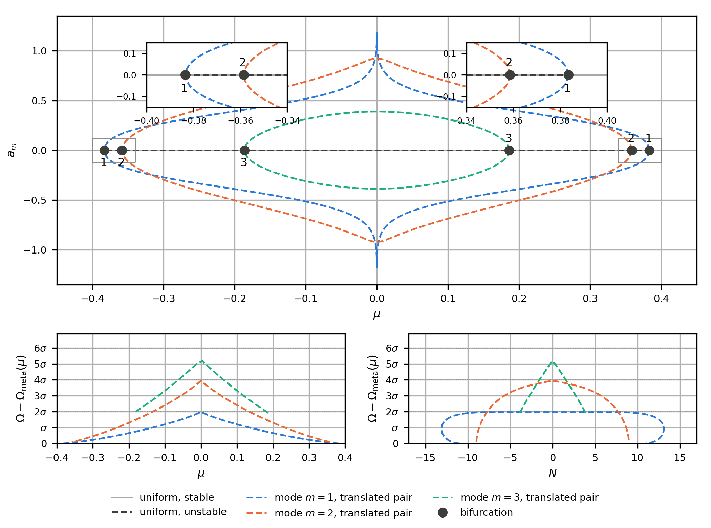
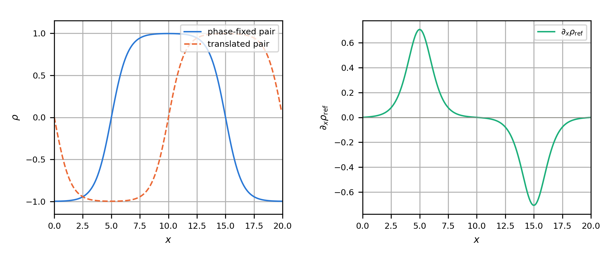

# Periodic continuation: stationary states of the square-gradient model

This document traces the stationary states of the one-dimensional
square-gradient (Cahn-Hilliard) model in a periodic box with pseudo-arclength
continuation. It is the periodic companion to
[`../canonical/`](../canonical/). The code follows the uniform branch through
its two folds, locates the modal bifurcations, steps onto phase-fixed
representatives of the periodic mode-$`m = 1, 2, 3`$ branches, resolves their
first three pitchforks at prescribed amplitude, and follows the mode-$`m = 1`$
interface-pair branch at fixed mass. It then holds $`\mu = 0`$ fixed and
continues in $`L/\sqrt\kappa`$, where the first six periodic modes soften at
successive thresholds. The 41 numerical checks at the end exercise the
discretisation, phase conditions, continuation identities and labelled
states.

There are no walls in this problem. Consequently, a translated non-uniform
profile is physically the same state, a phase-separated periodic state has at
least two interfaces, and there is neither a wall-pinned one-interface state
nor a wall-pinned finite-size-fold interpretation. The continuation systems
therefore include a phase condition to select one representative from each
translation orbit.

**Figure conventions.** Branches are solid where their displayed Hessian
index is zero and dashed where it is positive. The non-uniform
grand-canonical branches are dashed: they are unstable at fixed $`\mu`$. The
two signs drawn for a periodic modal amplitude are translated representatives,
not two physically distinct branches. Profile panels are labelled by the
letter of the marked state, with details inside the panel. Single plots are
one column ($`3.4 \times 3.0`$ in); multipanel plots are two columns
($`7.0 \times 3.0`$ or $`7.0 \times 5.2`$ in).

<p align="center">
  
</p>

---

## 1. The periodic model

### The equation and thermodynamic functionals

On a ring of circumference $`L`$, stationary states at chemical potential
$`\mu`$ satisfy

```math
-\kappa\,\rho''(x) + f_0'(\rho) - \mu = 0,
\qquad
\rho(0) = \rho(L), \qquad \rho'(0) = \rho'(L),
```

where

```math
f_0(\rho) = \tfrac14\left(\rho^2 - 1\right)^2,
\qquad
f_0'(\rho) = \rho^3 - \rho,
\qquad
f_0''(\rho) = 3\rho^2 - 1.
```

The critical points are those of the grand potential

```math
\Omega[\rho;\mu]
= \int_0^L \left[f_0(\rho) + \frac{\kappa}{2}\,\rho'^2\right] dx - \mu N,
\qquad
N = \int_0^L \rho\,dx.
```

At coexistence, $`\mu = 0`$, the uniform minima are $`\rho = \pm1`$ and
$`\rho = 0`$ is the uniform maximum. The spinodal of the local free-energy
density is $`|\rho| = 1/\sqrt3`$. As in the canonical example, $`\rho`$ is an
order parameter: $`\rho=-1`$ and $`\rho=+1`$ label the two coexisting phases,
not literal zero and unit number densities. A physical density can be
reconstructed as
$`\rho_{\rm phys}=\rho_c+\tfrac12\Delta\rho\,\rho`$. Thus $`N`$ measures the
order-parameter excess over an equal-phase mixture, rather than a particle
count.

The model is invariant under $`\rho\mapsto-\rho`$,
$`\mu\mapsto-\mu`$ and $`N\mapsto-N`$. It is also invariant under every
translation $`\rho(x)\mapsto\rho(x-\delta)`$. The latter symmetry is the
physical distinction that requires special treatment in a periodic
calculation.

### Periodic discretisation

The box is sampled at $`K=200`$ distinct nodes
$`x_i=ih`$, $`i=0,\ldots,K-1`$, with $`h=L/K`$. There is no duplicated endpoint
and every quadrature weight is one. With all subscripts understood modulo
$`K`$,

```math
(D_2y)_i = \frac{y_{i-1}-2y_i+y_{i+1}}{h^2},
\qquad
(D_xy)_i = \frac{y_{i+1}-y_{i-1}}{2h},
```

and the discrete residual is

```math
F_i(y,\mu) = -\kappa(D_2y)_i + y_i^3-y_i-\mu.
```

The code records

```math
N = h\sum_{i=0}^{K-1}y_i,
\qquad
\Omega
= h\sum_{i=0}^{K-1}\left[\frac{(y_i^2-1)^2}{4}-\mu y_i\right]
+ \frac{\kappa}{2h}\sum_{i=0}^{K-1}(y_{i+1}-y_i)^2.
```

The closing term from $`y_{K-1}`$ to $`y_0`$ is part of the gradient energy.
The functional and residual are therefore compatible exactly:

```math
\frac{\partial\Omega}{\partial y_i}=hF_i(y,\mu).
```

The Hessian

```math
H = -\kappa D_2+\operatorname{diag}(3y_i^2-1)
```

is symmetric in the usual Euclidean inner product. At fixed $`\mu`$, its
index is

```math
n_-=\#\{\text{negative eigenvalues of }H\}.
```

At fixed $`N`$, the constrained calculation removes the constant mass
direction and, for a non-uniform periodic profile, the translational tangent
$`\rho_x`$. The resulting constrained index is a local stability diagnostic,
not an interface count.

### Periodic eigenvalues and degeneracy

The eigenvalues of $`-D_2`$ are

```math
d_m=\frac{4}{h^2}\sin^2\!\left(\frac{\pi m}{K}\right),
\qquad m=0,\ldots,K-1.
```

For $`1\le m<K/2`$, the independent vectors

```math
\cos\frac{2\pi m x_i}{L},
\qquad
\sin\frac{2\pi m x_i}{L}
```

share the eigenvalue $`d_m`$. This cosine-sine degeneracy is the linear
signature of continuous translations: a shift rotates the two coefficients.
The constant mode $`m=0`$ is non-degenerate; for even $`K`$, the Nyquist mode
$`m=K/2`$ is also non-degenerate. The continuum limit is
$`d_m\to(2\pi m/L)^2`$ for fixed $`m`$.

---

## 2. Pseudo-arclength continuation and phase fixing

A branch is a curve $`s\mapsto(y(s),\mu(s))` on which $`F(y,\mu)=0`$.
Pseudo-arclength continuation differentiates this equation, normalises the
null vector of the extended Jacobian, predicts along that tangent, and applies
Newton's method to the residual plus an arclength hyperplane. Unlike
continuation directly in $`\mu`$, this bordered system remains regular at a
simple fold where $`\partial_yF`$ is singular. The library implementation
uses adaptive arclength steps, halves a failed step, and locates folds and
eigenvalue crossings by regula falsi on the step length.

For any stationary branch,

```math
\frac{d\Omega}{ds}
=\sum_i\frac{\partial\Omega}{\partial y_i}\dot y_i
 + \frac{\partial\Omega}{\partial\mu}\dot\mu
=h\sum_iF_i\dot y_i-N\dot\mu
=-N\dot\mu.
```

Hence $`d\Omega/d\mu=-N`$ where $`\dot\mu\ne0`$. The fixed-mass analogue is
$`dF_{\rm H}/dN=\mu`$ along a physical canonical branch, where
$`F_{\rm H}=\Omega+\mu N`$ is the Helmholtz functional.

### Fourier slice on grand-canonical modal branches

A non-uniform periodic solution has a neutral translation tangent. Near a
uniform bifurcation the reference-profile tangent vanishes, so a Fourier
slice is used instead. On the mode-$`m`$ branch, define

```math
a_m=\frac{2h}{L}\sum_i
\left(y_i-\frac{N}{L}\right)\cos\frac{2\pi m x_i}{L},
\qquad
b_m=\frac{2h}{L}\sum_i
\left(y_i-\frac{N}{L}\right)\sin\frac{2\pi m x_i}{L}.
```

The continued unknown is $`x=(y,\eta)`$, and the square phase-fixed residual
at prescribed $`\mu`$ is equivalently

```math
F(y,\mu)+\eta\sin(2\pi m x/L)=0,
\qquad
b_m=0.
```

The slice $`b_m=0`$ selects a cosine representative. The scalar $`\eta`$ is
a numerical Lagrange multiplier, or constraint force, that supplies the
missing equation in the translation direction. It has no thermodynamic
meaning and must be zero for a physical stationary state. The verification
checks this explicitly along every traced branch.

A translation by half of the mode wavelength changes $`a_m`$ to $`-a_m`$ while
leaving $`N`$, $`\Omega`$ and the physical profile orbit unchanged. The two
signs in the figures are consequently a phase-fixed representative and its
translated copy, not plus and minus physical branches.

### Bordered reference-profile condition at fixed mass

Away from a uniform state, a reference profile supplies a robust phase
condition. Let

```math
\tau_{\rm ref}=D_xy_{\rm ref},
\qquad
g(y)=h\sum_i(y_i-y_{{\rm ref},i})\tau_{{\rm ref},i}.
```

For prescribed mass $`N`$, the unknown is $`x=(y,\mu,\eta)`$ and the code
solves the three equations

```math
F(y,\mu)+\eta\tau_{\rm ref}=0,
\qquad
h\sum_i y_i-N=0,
\qquad
g(y)=0.
```

The last row selects the translate nearest the reference profile; the first
row is bordered in the corresponding tangent direction. A physical solution
satisfies both $`\eta=0`$ and $`g(y)=0`$. This gauge removes a numerical
singularity only. It does not pin an interface physically, and translating a
computed pair produces the same periodic state.



---

## 3. What a periodic branch contains

### Folds, bifurcations and indices

At a fold, $`\dot\mu=0`$, so the state component of the tangent lies in the
nullspace of $`H`$. A simple fold changes the fixed-$`\mu`$ index by one.
At a modal bifurcation an eigenvalue of $`H`$ crosses zero while the uniform
curve need not turn in $`\mu`$. The code labels each crossing by its periodic
mode number.

The index has a distinct role from thermodynamic preference. An index-zero
state is a local minimum in the relevant, unconstrained or constrained,
space. It need not be the globally preferred state at the specified
control variable. Conversely, the dashed modal curves are stationary
saddles at fixed $`\mu`; their energy gaps quantify an activation-like
cost relative to the metastable uniform state, but do not turn them into
minima.

### Uniform branch, folds and the S-curve

For a uniform state, $`\rho^3-\rho=\mu`$,
$`N=L\rho`$, and

```math
\Omega=L\left[f_0(\rho)-\mu\rho\right].
```

The uniform folds occur when $`f_0''(\rho)=0`:

```math
\rho_f=\pm\frac{1}{\sqrt3},
\qquad
\mu_f=\mp\frac{2}{3\sqrt3}\simeq\mp0.3849.
```

The uniform Hessian eigenvalues are

```math
\lambda_m^{\rm u}=\kappa d_m+3\rho^2-1.
```

The constant eigenvalue produces the two folds. Every negative periodic
wavenumber below the Nyquist frequency occurs as a cosine-sine pair and
therefore contributes two to the fixed-$`\mu`$ index. This is why periodic
uniform indices cannot be inferred by counting visible interfaces.

`s_curve` plots $`N`$ against $`\mu`$. The outer uniform arcs are locally stable
and solid; the middle arc is dashed. Between the two folds there are three
uniform stationary states at each $`\mu`$.

### The swallowtail

`swallowtail` plots $`\Omega`$ against $`\mu`$. The two stable uniform arcs
cross at coexistence, where $`\rho=\pm1` have equal grand potential. The
unstable middle uniform arc joins them at the folds and has cusps there. The
coloured periodic modal curves are separate dashed stationary branches.
Their profiles B, C and D are selected near their largest modal amplitude;
they contain two, four and six alternating transitions respectively for
$`m=1,2,3`$.

For the uniform middle and metastable states,

```math
\Omega_{\rm mid}-\Omega_{\rm meta}
=L\left(\omega_{\rm mid}-\omega_{\rm meta}\right),
\qquad
\omega=f_0(\rho)-\mu\rho.
```

At $`\mu=0`$, this uniform cost is $`L/4=5`$ for $`L=20`$. It is extensive
because the whole periodic box passes through a homogeneous unstable state.
This is different from the finite interface energy of a phase-separated
configuration.

---

## 4. Periodic modal branches

### Bifurcation condition and signed amplitude

Mode $`m`$ bifurcates from a uniform state when

```math
\kappa d_m=1-3\bar\rho^2.
```

The two signs of the cosine coefficient are related by translation through
$`L/(2m)`$. Plotting a signed $`a_m`$ therefore makes the pitchfork geometry
visible without treating the signs as distinct physical branches. Translation
invariance also explains why invariant quantities, including $`N`$ and
$`\Omega`$, are identical for the two signs.

The mode number is not the number of interfaces. A periodic mode-$`m`$
profile alternates between phases $`2m`$ times around the ring. At
coexistence, the mode-$`m`$ family therefore approaches a configuration of
$`2m`$ well-separated interfaces when the box and separations permit that
description.

### Exact meaning of `branches`

The top panel of `branches` plots the phase-fixed signed coefficient
$`a_m`$ against $`\mu`$ for modes $`m=1,2,3`$, together with the uniform axis
$`a_m=0`$. It also draws $`-a_m`$ as the translated copy. The numbered points
on the uniform axis are modal bifurcations, and the mirrored insets resolve
those nearest the uniform folds.

The lower panels plot

```math
\Omega-\Omega_{\rm meta}(\mu),
```

against $`\mu`$ and against $`N`$. Here
$`\Omega_{\rm meta}(\mu)`$ is the grand potential of the metastable uniform
state at the same chemical potential: for $`\mu>0`$ it is the negative-order
parameter uniform state, and for $`\mu<0`$ it is the positive-order-parameter
one. Thus the plotted quantity is the excess grand potential of the
stationary state above the metastable homogeneous reference, not its
absolute energy and not the difference between the two translated signs.

The common energy unit is the excess grand potential of one isolated
interface:

```math
\sigma
=\int_{-\infty}^{\infty}
\left[
\frac{\kappa}{2}\left(\frac{d\rho}{dx}\right)^2
+\frac{(\rho^2-1)^2}{4}
\right]dx
=\frac{2\sqrt{2\kappa}}{3}.
```

For $`\kappa=1`$, $`\sigma=2\sqrt2/3\simeq0.9428`$. The lower-panel ordinate
is labelled from $`0`$ through $`6\sigma`$. Its dotted guides are at
$`2\sigma`$, $`4\sigma`$ and $`6\sigma`$, the separated-interface limits for
modes $`m=1,2,3`$. Odd multiples of $`\sigma`$ remain labelled as common energy
units, but cannot represent a closed periodic phase-separated state because
an odd number of phase changes cannot return to the initial phase after one
circuit. The proximity of the mode-$`m=3`$ curve to the homogeneous unstable
state in `swallowtail` is consequently physical: six interfaces overlap
strongly in this finite periodic box.

All coloured curves in these panels are dashed because their fixed-$`\mu`$
Hessian index is positive. This statement concerns grand-canonical local
stability. The constrained fixed-$`N`$ index used later removes both mass and
translation directions where appropriate, and can differ.

### The first three pitchforks

`pitchfork_zoom` resolves the negative-density bifurcation of each of
$`m=1,2,3`$. The phase-fixed trace, its translated copy, and solutions found
at prescribed $`a_m`$ are shown in each panel. The local data are fitted to

```math
|a_m|=C|\mu-\mu_m|^\beta.
```

The current fits use
$`0.01\le|a_m|\le0.10`$ and give

| Mode | Fitted $`\beta`$ | Expected value |
|------|------------------|----------------|
| $`m=1`$ | $`0.4897408187`$ | $`1/2`$ |
| $`m=2`$ | $`0.5000433678`$ | $`1/2`$ |
| $`m=3`$ | $`0.4995623663`$ | $`1/2`$ |

The log-log insets show these same samples and fitted slopes. The finite
window accounts for the visible departure of the first fit from $`1/2`$;
the verification tolerance is $`0.02`$. Insets A and B show profiles
separated by half of the corresponding wavelength. They illustrate a
translation, not a symmetry-related pair of distinct periodic branches.

### Walking along the mode-$`m=1`$ branch

`walk` marks six states A to F along the phase-fixed mode-$`m=1`$ trace and
shows their profiles. Near a bifurcation the profile is approximately the
first cosine mode. Further along, it develops two diffuse transitions and
the regions between them approach the two bulk phases. At coexistence this
is an interface pair, not the single centred interface of the Neumann-wall
problem.

The trace and its translated copy are dashed because the branch is unstable
at fixed $`\mu`$. Translation of the pair is neutral physically; the Fourier
slice keeps the displayed representative from drifting around the ring.

---

## 5. The phase-fixed branch at fixed $`N`$

The same stationary profiles are critical points of the Helmholtz functional
at their own mass. The fixed-$`N`$ residual is the bordered system in
Section 2, rather than the wall-pinned residual of the Neumann example.
`canonical` plots $`\mu`$ against $`N`$. The pale thick curve is the
mode-$`m=1`$ branch traced in $`\mu`$ and re-plotted in these coordinates; the
thin phase-fixed curves are traced directly in $`N`$. Their agreement checks
that the two continuation descriptions select the same physical orbit.

The line style in this figure uses the constrained index. The mass direction
is excluded, and the translation tangent is also excluded for non-uniform
profiles. The latter exclusion is essential: translating an interface pair
does not create a new physical perturbation of the fixed-$`N`$ state. The
uniform profile has zero translation tangent, so only the constant mass
direction is removed there.

### Labelled states

The values below are the currently produced values for $`L=20`$, $`\kappa=1`$
and $`K=200`$:

| State | $`N`$ | $`\mu`$ | $`F_{\rm H}`$ | constrained $`n_-`$ | Interpretation |
|-------|------:|---------:|-------------:|--------------------:|----------------|
| A | 18 | $`-0.171000`$ | $`0.180500`$ | 0 | uniform local minimum |
| B | 12 | $`-0.384000`$ | $`2.048000`$ | 0 | uniform metastable local minimum |
| C | 12 | $`-0.330490`$ | $`2.072649`$ | 1 | interface-pair saddle |
| D | 12 | $`-0.033530`$ | $`1.842205`$ | 0 | phase-separated interface-pair minimum |
| E | 0 | $`0.000000`$ | $`1.885287`$ | 0 | coexistence interface pair |
| F | 5 | $`-0.234375`$ | $`4.394531`$ | 4 | uniform constrained saddle |

B, C and D have the same mass and display the local fixed-$`N`$ landscape:
the uniform metastable minimum, an index-one interface-pair saddle, and the
lower phase-separated minimum. The computed barrier between B and C is
$`F_{\rm H,C}-F_{\rm H,B}=0.024649`$ for this discretisation.

F has $`n_-=4` for a specifically periodic reason, not because it has four
interfaces. At $`\bar\rho=N/L=0.25`$, the non-zero uniform eigenvalues are

```math
\lambda_m^{\rm u}
=\kappa\frac{4}{h^2}\sin^2\!\left(\frac{\pi m}{K}\right)
+3\bar\rho^2-1.
```

The $`m=1`$ and $`m=2`$ values are negative, while the $`m=3`$ value is
positive. Each negative wavenumber has one cosine and one sine eigenvector,
so the constrained index is $`2+2=4`$. No translation direction is removed
for F because the translation tangent of a uniform profile is identically
zero. This example also demonstrates why neither the constrained index nor
the grand-canonical index should be identified with an interface number.

---

## 6. Nested periodic pitchforks at $`\mu=0`$

### Continuing in $`L/\sqrt\kappa`$

At $`\mu=0`$, the uniform state $`\rho=0`$ exists for every $`\kappa`$. The
continuation parameter is

```math
\lambda=\frac{L}{\sqrt\kappa},
\qquad
\kappa=\left(\frac{L}{\lambda}\right)^2,
```

with $`L`$ and $`K`$ held fixed. At $`\rho=0`$, the mode-$`m`$ eigenvalue is
$`\kappa d_m-1`$, so its exact discrete threshold is

```math
\lambda_m=L\sqrt{d_m}
=2K\sin\left(\frac{\pi m}{K}\right)
\xrightarrow{K\to\infty}2\pi m.
```

The factor $`2\pi`$, rather than the Neumann-wall threshold $`\pi m`$, is a
direct consequence of periodic wavelengths: the mode-$`m`$ pattern has
wavelength $`L/m`$ and contains a cosine-sine translation pair. The code
locates and continues modes $`m=1,\ldots,6`$ from their discrete thresholds
to $`\lambda=40`.

`nested_pitchforks` shows the zero-amplitude uniform state, one
Fourier-sliced representative of each branch, and its translated
negative-amplitude copy. The six terminal profiles A to F are one profile
per physical mode branch. As elsewhere in this example, the opposite signs
are translations and must not be counted twice.

### Number of periodic branches

The continuum number of non-zero periodic modes that have softened at a
given box size is

```math
\left\lfloor\frac{L}{2\pi\sqrt\kappa}\right\rfloor.
```

`branch_count` compares this staircase with the detected discrete
bifurcations. At the endpoint $`L/\sqrt\kappa=40`$, both give six branches.
The small offset of the discrete thresholds below $`2\pi m`$ is precisely the
finite-difference dispersion in $`d_m`; the verification checks the exact
discrete relation $`\kappa_m d_m=1`$ instead of treating the continuum limit
as an exact finite-grid value.

---

## 7. Verification

`check/main.cpp` executes the same workflow as the figure-producing example
and exits non-zero if a row fails. For the reference case
$`L=20`$, $`\kappa=1`$, $`K=200`$ and $`h=0.1`$, the current run reports
**41 / 41 checks passed**. The checks are grouped as follows:

1. **Periodic interface pair, four checks:** the maximum stationary residual,
   zero mass at coexistence, its excess Helmholtz energy against
   $`2\sigma`$, and its zero index after both mass and phase directions are
   removed.
2. **Translation, one check:** a grid translation leaves both mass and
   Helmholtz energy invariant.
3. **Grand-canonical modes, twelve checks:** for each of $`m=1,2,3`$, the
   Hessian eigenvalue at the bifurcation is zero, the physical residual is
   small, the Fourier sine coefficient is zero, and the numerical multiplier
   $`\eta`$ is zero.
4. **Pitchfork fits, three checks:** the fitted exponents in the stated
   amplitude window agree with $`1/2`$ to the prescribed tolerance.
5. **Nested pitchforks, seven checks:** each of the six thresholds satisfies
   $`\kappa_m d_m=1`$, and the branch count at the maximum continuation
   parameter equals $`\lfloor40/(2\pi)\rfloor=6`$.
6. **Canonical branches, eight checks:** for both signs of the fixed-mass
   continuation direction, $`dF_{\rm H}/dN=\mu`$ holds to the recorded
   quadrature accuracy, while $`\eta`$, the physical residual and the
   reference-profile phase condition remain small.
7. **Labelled fixed-mass states, six checks:** A through F have the
   constrained indices reported in Section 5.

The following representative rows are copied from the current check output;
they are not reconstructed from continuum formulae:

| Group | Quantity | Measured | Exact | Error | Tolerance |
|-------|----------|---------:|------:|------:|----------:|
| pair | $`\max|F(y,0)|`$ | $`2.08\times10^{-14}`$ | 0 | $`2.08\times10^{-14}`$ | $`10^{-9}`$ |
| pair | $`F_{\rm pair}-F_{\rm uniform}`$ | $`1.8852871596`$ | $`2\sigma=1.8856180832`$ | $`3.31\times10^{-4}`$ | $`2\times10^{-3}`$ |
| translation | max $`|\Delta N|,|\Delta F_{\rm H}|`$ | $`4.44\times10^{-16}`$ | 0 | $`4.44\times10^{-16}`$ | $`10^{-12}`$ |
| mode 1 | max $`|\eta|`$ | $`7.20\times10^{-15}`$ | 0 | $`7.20\times10^{-15}`$ | $`10^{-8}`$ |
| mode 2 | max $`|F(y,\mu)|`$ | $`3.82\times10^{-12}`$ | 0 | $`3.82\times10^{-12}`$ | $`2\times10^{-8}`$ |
| pitchfork | $`\beta`$, mode 1 | $`0.4897408187`$ | $`0.5`$ | $`1.03\times10^{-2}`$ | $`2\times10^{-2}`$ |
| nested | $`\kappa d_4`$ at threshold | $`1.0000000000`$ | 1 | $`3.33\times10^{-16}`$ | $`10^{-10}`$ |
| nested | branch count at $`\lambda=40`$ | 6 | 6 | 0 | exact |
| canonical | relative $`dF_{\rm H}/dN-\mu`$ | $`9.827108\times10^{-4}`$ | 0 | $`9.83\times10^{-4}`$ | $`2\times10^{-3}`$ |
| canonical | max phase-condition residual | $`1.66\times10^{-14}`$ | 0 | $`1.66\times10^{-14}`$ | $`10^{-8}`$ |
| fixed $`N`$ | index of C | 1 | 1 | 0 | exact |
| fixed $`N`$ | index of F | 4 | 4 | 0 | exact |

The interface-pair energy differs from $`2\sigma`$ by the expected
$`O(h^2)`$ finite-difference error. The exact-threshold tests deliberately
use the discrete eigenvalue $`d_m`; they test the numerical model actually
solved. The canonical thermodynamic-identity row is a finite-step difference
measure normalised by the largest observed $`|\Delta F_{\rm H}|`$, whereas
the stationary equations and phase constraints are checked directly.

---

## 8. Build and run

```bash
# Build and run the example: traces branches, prints 41 checks and writes figures
make run-local

# Run checks only: exits with status 1 if any check fails
make run-checks

# Run in Docker
make run
```

Figures use print fonts and 300 dpi PNG output at the sizes stated above.
Results are written to `exports/`:

```text
exports/
├── branch_m1.csv          # mu, N, Omega, a_m, eta, n_minus
├── branch_m2.csv
├── branch_m3.csv
├── canonical_plus.csv     # N, mu, F, a_1, eta, n_minus
├── canonical_minus.csv
├── s_curve.{png,pdf}
├── swallowtail.{png,pdf}
├── branches.{png,pdf}
├── pitchfork_zoom.{png,pdf}
├── walk.{png,pdf}
├── canonical.{png,pdf}
├── nested_pitchforks.{png,pdf}
├── branch_count.{png,pdf}
└── translation_gauge.{png,pdf}
```

## References

- Keller, H. B. "Numerical solution of bifurcation and nonlinear eigenvalue
  problems", in *Applications of Bifurcation Theory*, Academic Press (1977).
- Allgower, E. L., Georg, K. *Introduction to Numerical Continuation Methods*,
  SIAM Classics in Applied Mathematics **45** (2003).
- Cahn, J. W., Hilliard, J. E. "Free energy of a nonuniform system. I.
  Interfacial free energy", J. Chem. Phys. **28**, 258 (1958).
