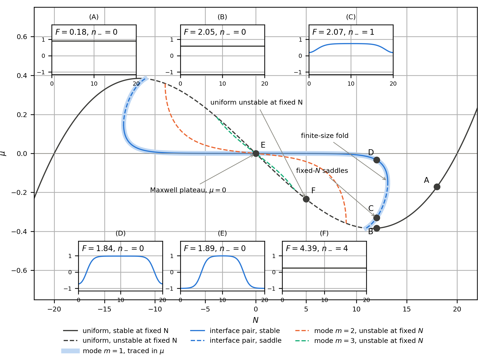

# Periodic continuation: stationary states of the square-gradient model

This example continues the fixed-mass stationary states of the one-dimensional
square-gradient model in a periodic box. It is the periodic companion to
[`../canonical/`](../canonical/): there are no walls to pin an interface, so
every non-uniform state belongs to a continuous family of translated copies.
The code fixes one representative of each family with a phase condition.

<p align="center">
  
</p>

## 1. Periodic model and discretisation

The stationary equation and mass are

```math
-\kappa\rho'' + \rho^3 - \rho - \mu = 0,
\qquad
N = \int_0^L \rho\,\mathrm{d}x,
\qquad
\rho(0) = \rho(L).
```

The `K = 200` nodes are the distinct periodic points
$`x_i = i h`$, $`i = 0,\ldots,K-1`$, with $`h=L/K`$. The cyclic stencil and
discrete grand potential are

```math
(D_2y)_i = \frac{y_{i-1}-2y_i+y_{i+1}}{h^2},
\qquad
\Omega = h\sum_i\left[\frac{(y_i^2-1)^2}{4}-\mu y_i\right]
+ \frac{\kappa}{2h}\sum_i(y_{i+1}-y_i)^2,
```

where all indices are taken modulo $`K`$. Unlike the Neumann example, there
is no duplicated endpoint and no half quadrature weights.

The periodic eigenvalues of $`-D_2`$ are

```math
d_m = \frac{4}{h^2}\sin^2\!\left(\frac{\pi m}{K}\right),
\qquad
m = 0,\ldots,K-1.
```

For $`1 \le m < K/2`$, the cosine and sine eigenvectors have the same
eigenvalue. This twofold degeneracy is the linear imprint of translations.

## 2. Phase fixing

If $`\rho(x)`$ is a non-uniform solution, so is
$`\rho(x-\delta)`$ for every shift $`\delta`$. The Hessian therefore has the
neutral translation tangent $`\partial_x\rho`$. A Newton solve at fixed mass
must remove that direction as well as the mass direction.

The canonical unknown is $`z=(y,\mu,\eta)`$, and the code solves

```math
\begin{pmatrix}
F(y,\mu) + \eta\,\tau_{\rm ref}\\
M(y)-N\\
h\sum_i (y_i-y_{{\rm ref},i})\tau_{{\rm ref},i}
\end{pmatrix}
= 0,
\qquad
\tau_{\rm ref} = D_x y_{\rm ref}.
```

The last row selects the translate closest to a reference profile. The scalar
multiplier $`\eta`$ only borders the numerical system: every physical
stationary state has $`\eta=0`$, which the verification checks.

At a uniform bifurcation the reference tangent vanishes, so the code instead
uses a Fourier slice. On the mode-$`m`$ branch it fixes

```math
b_m = \frac{2h}{L}\sum_i y_i\sin(2\pi m x_i/L) = 0,
\qquad
a_m = \frac{2h}{L}\sum_i y_i\cos(2\pi m x_i/L).
```

The two signs of $`a_m`$ differ by a translation through half a wavelength.
They are the same physical branch, so the figure shows one phase-fixed
representative rather than artificial plus and minus branches.


At coexistence the periodic phase-separated state has two interfaces. Its
excess Helmholtz free energy therefore tends to $`2\sigma`$, unlike the
single wall-pinned interface of the Neumann problem, whose excess is
$`\sigma`$.

The unit $`\sigma`$ is the excess grand potential of one isolated interface:

```math
\sigma
= \int_{-\infty}^{\infty}
\left[
\frac{\kappa}{2}\left(\frac{d\rho}{dx}\right)^2
+ \frac{(\rho^2-1)^2}{4}
\right] dx
= \frac{2\sqrt{2\kappa}}{3}.
```

For the parameters of this example, $`\kappa=1`$ and
$`\sigma=2\sqrt2/3\simeq0.9428`$. A periodic profile must return to its
starting phase after one circuit, so it has an even number of interfaces.
A well-separated mode-$`m`$ state has $`2m`$ interfaces and its excess tends
to $`2m\sigma`$.

## 3. Figures

The periodic example uses the same figure set and names as
[`../canonical/`](../canonical/), so corresponding continuation views can be
compared directly:

- [`s_curve`](exports/s_curve.png) gives the periodic uniform branch;
- [`swallowtail`](exports/swallowtail.png) gives $`\Omega`$ against $`\mu`$
  with representative profiles;
- [`branches`](exports/branches.png) gives the signed modal amplitudes and
  the excess grand potential against both $`\mu`$ and $`N`$;
- [`pitchfork_zoom`](exports/pitchfork_zoom.png) resolves the first three
  bifurcations with fixed-amplitude solves, a fitted power law and
  log-log exponent inset;
- [`walk`](exports/walk.png) follows the $`m=1`$ branch with profiles;
- [`canonical`](exports/canonical.png) gives $`\mu`$ against $`N`$ with the
  labelled fixed-mass states.
- [`nested_pitchforks`](exports/nested_pitchforks.png) continues the first six
  periodic modes at $`\mu=0`$ in $`L/\sqrt\kappa`$;
- [`branch_count`](exports/branch_count.png) compares the detected branches
  with $`\lfloor L/(2\pi\sqrt\kappa)\rfloor`$.

The two apparent arms in `branches`, `pitchfork_zoom` and `walk` are
translation-related representatives of one periodic branch. The code traces
one Fourier-sliced representative, then plots its translated copy with
$`a_m \mapsto -a_m`$. This displays the pitchfork geometry without
double-counting physically identical states.

The lower panels of `branches` plot
$`\Omega-\Omega_{\rm meta}(\mu)`$, where $`\Omega_{\rm meta}`$ is the
metastable homogeneous state at the same chemical potential. Their common
vertical scale is $`0,\sigma,2\sigma,\ldots,6\sigma`$. Dotted lines are drawn
at $`2\sigma`$, $`4\sigma`$ and $`6\sigma`$, the separated-interface limits
for modes $`m=1,2,3`$. The odd multiples are labelled as energy units but
have no periodic interface branch, because an odd number of interfaces cannot
close on the ring. All coloured curves there are dashed because the
non-uniform grand-canonical stationary states are unstable at fixed $`\mu`$.

All non-uniform grand-canonical arcs are dashed because they are unstable at
fixed $`\mu`$. In `canonical`, the Hessian index projects out both the mass
direction and the translation tangent. At $`N=12`$, B, C and D are the
uniform metastable minimum, the interface-pair saddle, and the
phase-separated minimum, respectively. E is the centred coexistence pair. A
is a uniform minimum and F is a uniform state with four unstable periodic
modes at fixed mass.

The periodic mode number is not the number of interfaces. A mode-$`m`$
cosine has $`2m`$ alternating transitions around the ring. Consequently the
mode-$`m=3`$ saddle near $`\mu=0`$ has six overlapping interfaces. Its
excess grand potential is therefore close to that of the homogeneous
unstable state, $`\Omega_{\rm uniform}=L/4=5`$, rather than being well
separated as the three-interface Neumann-wall branch is. This proximity in
`swallowtail` is a finite-periodic-box physical effect, not a plotting
coincidence.

### Nested periodic pitchforks

At $`\mu=0`$, the uniform state $`\rho=0`$ persists while
$`\lambda=L/\sqrt\kappa`$ varies, with
$`\kappa=(L/\lambda)^2`$. Its mode-$`m`$ eigenvalue is
$`\kappa d_m-1`$, so the discrete threshold is

```math
\kappa_m d_m = 1,
\qquad
\lambda_m = L\sqrt{d_m}
= 2K\sin\left(\frac{\pi m}{K}\right)
\xrightarrow{K\to\infty} 2\pi m.
```

The factor $`2\pi`$, rather than the Neumann value $`\pi`$, follows from the
periodic wavelength $`L/m`$: one periodic mode contains both a cosine and a
sine representative. `nested_pitchforks` traces modes $`m=1,\ldots,6`$ to
$`\lambda=40`$, displays both translation-related amplitude signs, and shows
one terminal profile for each mode. `branch_count` compares the six detected
branches with the continuum staircase
$`\lfloor L/(2\pi\sqrt\kappa)\rfloor`$.

The index $`n_-`$ counts negative constrained Hessian eigenvalues. It does
not count interfaces. For a uniform periodic state $`\rho=\bar\rho`$, the
fixed-mass eigenvalue of each non-zero wavenumber is

```math
\lambda_m
= \kappa\frac{4}{h^2}\sin^2\!\left(\frac{\pi m}{K}\right)
+ 3\bar\rho^2 - 1,
\qquad m = 1,\ldots,K-1.
```

Each $`m`$ below the Nyquist wavenumber has separate cosine and sine
eigenvectors. At F, $`\bar\rho=5/20=0.25`$, and
$`\lambda_1=-0.7138121`$ and $`\lambda_2=-0.4178457`$ are negative, while
$`\lambda_3=0.0751071`$ is positive. The two negative wavenumbers therefore
contribute two cosine-sine pairs, hence $`n_-=4`$. For a uniform profile the
translation tangent vanishes, so the fixed-mass projection removes only the
constant mode. The relation between interface count and index applies only
to particular non-uniform branch families, not to homogeneous states.



## 4. Verification

`check/main.cpp` repeats the traces and exits non-zero on failure. The rows
check:

- the periodic interface-pair residual, zero mass and excess $`2\sigma`$;
- invariance of mass and Helmholtz free energy under a grid translation;
- the zero Hessian eigenvalue at each mode-$`m`$ bifurcation;
- the physical residual, Fourier phase coefficient and multiplier
  $`\eta`$ along every grand-canonical branch;
- the fitted pitchfork exponents $`\beta`$ against the expected value
  $`1/2`$ on $`0.01\leq a_m\leq0.10`$;
- every nested threshold against the exact discrete condition
  $`\kappa_m d_m=1`$, and the branch count at the maximum
  $`L/\sqrt\kappa`$ against $`\lfloor L/(2\pi\sqrt\kappa)\rfloor`$;
- $`\mathrm{d}F/\mathrm{d}N=\mu`$, the reference-profile phase condition and
  $`\eta=0`$ along both canonical traces;
- the fixed-mass indices of the labelled states.

For $`L=20`$, $`\kappa=1`$ and $`h=0.1`$, the pair excess is
$`1.8852872`$, against $`2\sigma=1.8856181`$. The difference is the expected
$`O(h^2)`$ discretisation error.

## 5. Build and run

```bash
# Build and run the example: writes figures under exports/
make run-local

# Run checks only
make run-checks

# Run in Docker
make run
```

Outputs are written to `exports/`:

```text
exports/
├── branch_m1.csv          # mu, N, Omega, a_m, eta, n_minus
├── branch_m2.csv
├── branch_m3.csv
├── canonical_plus.csv     # N, mu, F, a_1, eta, n_minus
├── canonical_minus.csv
├── s_curve.{png,pdf}
├── swallowtail.{png,pdf}
├── branches.{png,pdf}
├── pitchfork_zoom.{png,pdf}
├── walk.{png,pdf}
├── canonical.{png,pdf}
├── nested_pitchforks.{png,pdf}
├── branch_count.{png,pdf}
└── translation_gauge.{png,pdf}
```
