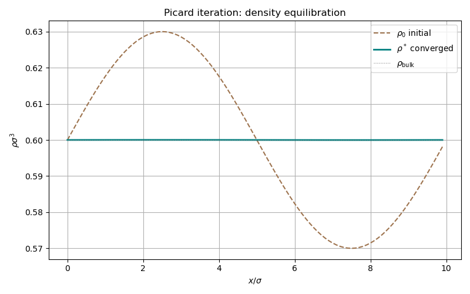

# Picard: self-consistent density equilibration

## Purpose

This doc demonstrates Picard (self-consistent field) iteration for finding
the equilibrium density profile that minimises the grand potential. Picard
iteration is the simplest density-functional minimizer: at each step, the
new density is obtained by exponentiating the current force field. It
complements the FIRE minimizer (used in the nucleation doc) and the DDFT
integrator (used in the dynamics and density docs).

## Mathematical background

### The Euler-Lagrange equation

At equilibrium, the density profile $\rho(\mathbf{r})$ satisfies:

$$
\frac{\delta\Omega}{\delta\rho(\mathbf{r})} = 0
$$

Expanding the grand potential $\Omega = F[\rho] - \mu N$ into ideal and
excess parts:

$$
\ln\rho(\mathbf{r}) + \frac{\delta F_{\mathrm{ex}}}{\delta\rho(\mathbf{r})} - \beta\mu = 0
$$

Rearranging gives the self-consistency relation:

$$
\rho(\mathbf{r}) = \exp\!\left(\beta\mu - \frac{\delta F_{\mathrm{ex}}}{\delta\rho(\mathbf{r})}\right)
$$

### Log-space Picard iteration

Direct substitution of the self-consistency relation is unstable. The
library uses a damped log-space update:

$$
\rho_{n+1}(\mathbf{r}) = \rho_n(\mathbf{r})\,\exp\!\left(-\alpha\,\frac{f_n(\mathbf{r})}{dV}\right)
$$

where $f_n = \delta\Omega/\delta\rho \times dV$ is the discrete force and
$\alpha \in (0, 1)$ is the mixing parameter. The log-space form ensures
$\rho > 0$ at all iterations without explicit projection. Small $\alpha$
(e.g. $0.005$) gives stable but slow convergence; larger values risk
oscillation.

### Convergence criterion

The iteration converges when the root-mean-square force drops below a
tolerance:

$$
\left(\frac{1}{N}\sum_i f_i^2\right)^{1/2} < \varepsilon
$$

For constrained problems (fixed mass), the force residual may plateau at a
nonzero value corresponding to the Lagrange multiplier. In that case,
convergence is detected when $|\Omega_{n} - \Omega_{n-1}| < \varepsilon$.

### Fixed-mass constraint

For finding critical nuclei, the `fixed_mass_constraint` function enforces:

$$
\int \bigl[\rho(\mathbf{r}) - \rho_{\mathrm{bg}}\bigr]\, dV = N_{\mathrm{target}}
$$

by rescaling the excess density $\rho - \rho_{\mathrm{bg}}$ after each
Picard step. This turns the saddle point of the unconstrained grand
potential into a constrained stationary point.

---

## Step-by-step code walkthrough

### Step 1: Define the hard-sphere system

The model is a pure hard-sphere fluid with no attractive interactions:

```cpp
double dx = 0.1;
double box_x = 10.0;
double box_yz = 2.0;
double temperature = 1.0;
double sigma = 1.0;
double rho_bulk = 0.6;

physics::Model model{
    .grid = make_grid(dx, {box_x, box_yz, box_yz}),
    .species = {Species{.name = "HS", .hard_sphere_diameter = sigma}},
    .interactions = {},
    .temperature = temperature,
};
```

The grid is $100 \times 20 \times 20$ ($\Delta x = 0.1\sigma$) in a rectangular
box of dimensions $10 \times 2 \times 2\,\sigma^3$. With `.interactions = {}`,
only the ideal gas and hard-sphere FMT contributions enter the free energy.

At the target density $\rho = 0.6\,\sigma^{-3}$, the packing fraction is
$\eta = \pi\rho\sigma^3/6 \approx 0.314$, well into the liquid regime of
the hard-sphere fluid.

### Step 2: Build the Functional object

The central API call builds all FFT convolution weights for White Bear II FMT:

```cpp
auto func = functionals::make_functional(functionals::fmt::WhiteBearII{}, model);
```

This creates a `Functional` object that owns `func.model`, `func.weights`
(inhomogeneous convolution weights), and `func.bulk_weights` (analytical
bulk weights). All subsequent operations go through `func`.

### Step 3: Bulk thermodynamics

The `Functional::bulk()` method creates a `BulkThermodynamics` object:

```cpp
auto eos = func.bulk();
double mu_bulk = eos.chemical_potential(arma::vec{rho_bulk}, 0);
double p_bulk = eos.pressure(arma::vec{rho_bulk});
```

This gives the chemical potential $\mu_{\mathrm{bulk}}$ and pressure
$P_{\mathrm{bulk}}$ at the target density. These serve as the reference
values for the grand potential identity
$\Omega_{\mathrm{eq}} / V = -P_{\mathrm{bulk}}$.

### Step 4: Construct the initial perturbation

The initial density is the uniform bulk value with a 5% sinusoidal
perturbation along the $x$-axis:

```cpp
arma::vec x_vals = arma::linspace(0.0, (nx - 1) * func.model.grid.dx, nx);
arma::vec profile_1d = rho_bulk * (1.0 + 0.05 * arma::sin(
    2.0 * arma::datum::pi * x_vals / func.model.grid.box_size[0]
));

arma::vec rho_init = arma::repelem(profile_1d, ny * nz, 1);
```

The 1D profile is replicated along $y$ and $z$ to fill the 3D grid. The
perturbation has a single wavelength equal to the box length, so it excites
the longest-wavelength mode.

### Step 5: Build the force callback

The `Functional::grand_potential_callback(mu)` method returns a callable
that evaluates the full DFT functional at a fixed chemical potential:

```cpp
auto force_fn = func.grand_potential_callback(mu_bulk);
```

This returns a `ForceCallback` (signature
`(const vector<vec>&) -> pair<double, vector<vec>>`) that internally builds
a `State`, evaluates the full functional, and returns $\Omega$ and the
functional derivatives $\delta\Omega/\delta\rho$. This is the callback
passed to the Picard solver.

### Step 6: Evaluate the initial state

Before iteration, the code evaluates the initial perturbed density:

```cpp
auto initial_result = func.evaluate(rho_init, mu_bulk);
```

This returns `{free_energy, grand_potential, forces}`. The grand potential
of the perturbed state is slightly higher than
$-P_{\mathrm{bulk}} \times V$, and the force field is nonzero (the
perturbation is out of equilibrium).

### Step 7: Picard iteration

The log-space Picard solver is configured and run:

```cpp
algorithms::picard::Picard picard_config{
    .mixing = 0.005,
    .min_density = 1e-30,
    .tolerance = 1e-8,
    .max_iterations = 5000,
    .log_interval = 500,
};

auto picard_result = picard_config.solve(
    {rho_init}, force_fn, func.model.grid.cell_volume()
);
```

At each iteration, the solver:
1. Evaluates the force callback to get $\Omega$ and forces
2. Updates the density via
   $\rho_{n+1} = \rho_n \exp(-\alpha \cdot f_n / dV)$
3. Clamps below `min_density` to prevent negative densities
4. Checks the RMS force residual against `tolerance`

The mixing parameter $\alpha = 0.005$ is deliberately small for robust
convergence. The cell volume $dV$ converts between the discrete force
$f_i = (\delta\Omega/\delta\rho_i) \cdot dV$ and the continuous functional
derivative.

### Step 8: Verify convergence

The code verifies two properties of the converged state:

**1. Uniform density.** The min/max variation of the final density should be
at machine precision:

```cpp
double rho_min = picard_result.densities[0].min();
double rho_max = picard_result.densities[0].max();
double rho_mean = arma::mean(picard_result.densities[0]);
```

The sinusoidal perturbation is a non-equilibrium excitation of a spatially
uniform system, so the equilibrium solution is $\rho(\mathbf{r}) = \mathrm{const}$.
Picard iteration must completely damp the perturbation.

**2. Grand potential identity.** At equilibrium, $\Omega / V = -P$:

```cpp
double volume = func.model.grid.cell_volume()
                * static_cast<double>(func.model.grid.total_points());
double omega_per_vol = picard_result.grand_potential / volume;
```

The relative error $|\Omega/V + P_{\mathrm{bulk}}| / P_{\mathrm{bulk}}$ should
be better than $10^{-6}$, confirming that the Picard solver returns a
genuine minimum of $\Omega$ that is thermodynamically consistent with
the equation of state.

---

## Build and run

```bash
make run-local
```

## Output

### Density equilibration

The initial sinusoidal perturbation relaxes to the uniform bulk density under
Picard iteration.


