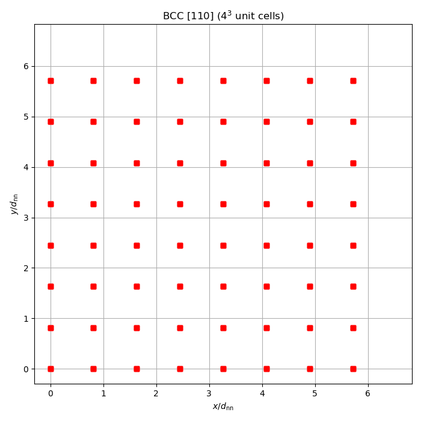
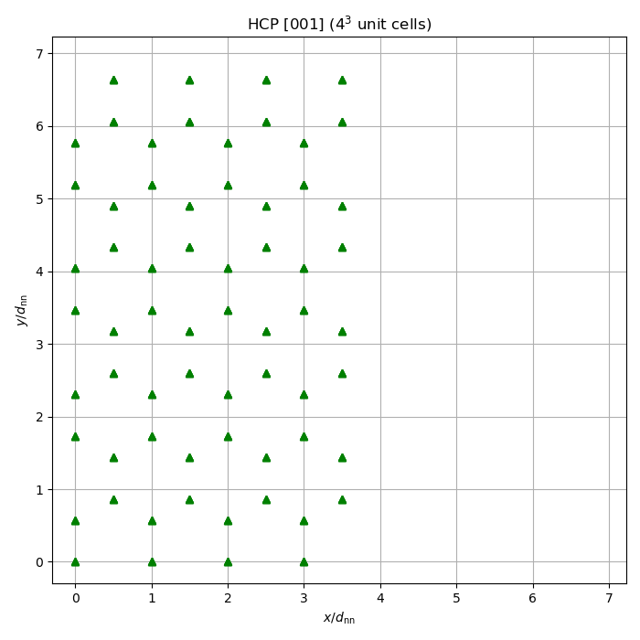

# Crystal: lattice generation

## Physical background

Crystalline phases in DFT are represented by density profiles with the
periodicity of a Bravais lattice. The library generates the atomic positions
of the three cubic/hexagonal lattices used in classical DFT studies of
freezing.

### Bravais lattices

**BCC (body-centred cubic)**: 2 atoms per conventional unit cell. Nearest-neighbour distance $d_{nn} = a\sqrt{3}/2$ where $a$ is the lattice parameter. The BCC phase is the stable crystal structure for many metals and appears in DFT freezing calculations.

**FCC (face-centred cubic)**: 4 atoms per conventional unit cell. Nearest-neighbour distance $d_{nn} = a/\sqrt{2}$. The FCC phase is the densest packing of equal spheres and the hard-sphere ground state above the freezing packing fraction $\eta_f \approx 0.494$.

**HCP (hexagonal close-packed)**: 2 atoms per primitive cell (or equivalently 4 per orthorhombic unit cell). The HCP structure has the same packing fraction as FCC ($\pi/(3\sqrt{2}) \approx 0.7405$) and differs only in the stacking sequence.

### Orientations

For each lattice the library generates unit cells in multiple orientations
(surface normals along [001], [010], [100], [110], [101], [011], and [111]).
The orientation determines the shape of the orthorhombic unit cell and the
number of atoms required to tile space periodically.

### Position scaling

The library stores positions in reduced (fractional) coordinates and provides
two scaling modes:

- **Uniform scaling**: a single nearest-neighbour distance $d_{nn}$ determines
  the physical box size.
- **Anisotropic scaling**: an arbitrary box $L_x \times L_y \times L_z$
  determines the physical coordinates.

### Export formats

Lattice data can be exported to:
- **XYZ**: standard molecular dynamics format (readable by VMD, OVITO).
- **CSV**: comma-separated format for analysis scripts.

## What the code does

1. Iterates over all structure/orientation combinations and prints the number
   of atoms and box dimensions for each unit cell.
2. Builds a $4^3$ replicated FCC [001] lattice (256 atoms).
3. Demonstrates uniform and anisotropic position scaling.
4. Exports the FCC lattice to XYZ and CSV formats.
5. Plots xy-projections of FCC, BCC, and HCP lattices.

## Cross-validation (`check/`)

Every lattice configuration is compared against Jim's `Crystal_Lattice.h` /
`Crystal_Lattice.cpp`:

| Check | Quantity | Configurations | Tolerance |
|-------|---------|---------------|-----------|
| Atom count | $N_{\mathrm{atoms}}$ per unit cell | BCC(7) + FCC(7) + HCP(3) = 17 | Exact |
| Dimensions | $L_x, L_y, L_z$ | All 17 configurations | $10^{-12}$ |
| Positions | All $(x,y,z)$ sorted by $(z,y,x)$ | All 17 configurations | $10^{-12}$ |
| Scaled positions | At $d_{nn} = 1.3$ | All 17 configurations | $10^{-12}$ |
| Tiled supercell | $2^3$ replication: $8N$ atoms, $(2L_x, 2L_y, 2L_z)$ | All 17 configurations | Exact (count); $10^{-12}$ (dims) |

## Build and run

```bash
make run        # Docker
make run-local  # local build
make run-checks # cross-validation against Jim's code
```

## Output

### FCC [001] xy-projection


### BCC [110] xy-projection



### HCP [001] xy-projection



### Data files

- `exports/fcc_4x4x4.xyz` — XYZ lattice file
- `exports/fcc_4x4x4.csv` — CSV lattice file
