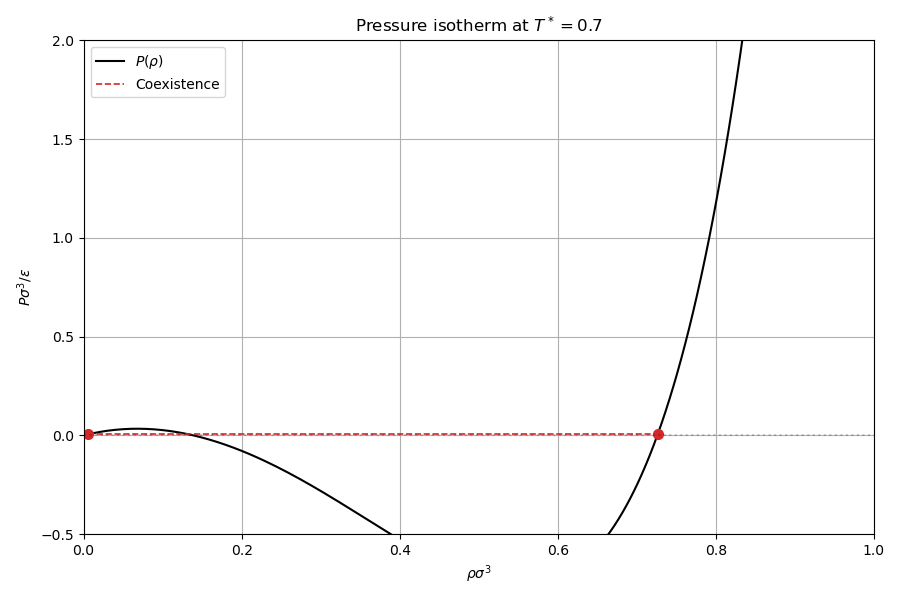
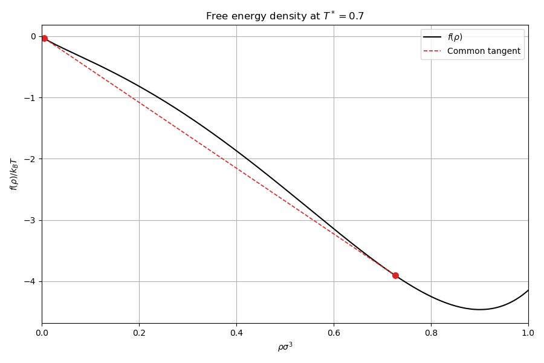
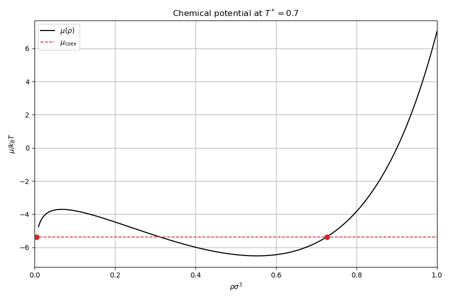
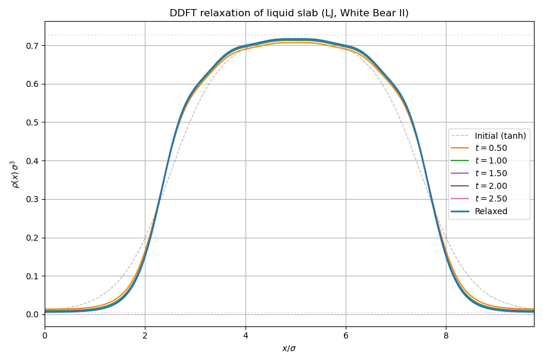

# Density: DFT functional evaluation and DDFT relaxation

## Physical background

This is the flagship example of the library. It demonstrates the complete
classical DFT workflow: defining a physical model, evaluating the full
inhomogeneous free energy functional via FFT convolutions, and relaxing an
initial density profile toward equilibrium via DDFT.

### The DFT free energy functional

The total Helmholtz free energy functional for a one-component fluid is:

$$
F[\rho] = F_{\mathrm{id}}[\rho] + F_{\mathrm{HS}}[\rho] + F_{\mathrm{mf}}[\rho]
$$

**Ideal gas**:

$$
F_{\mathrm{id}}[\rho] = k_BT \int \rho(\mathbf{r})\left[\ln\rho(\mathbf{r}) - 1\right] d\mathbf{r}
$$

**Hard-sphere (FMT)**:

$$
F_{\mathrm{HS}}[\rho] = k_BT \int \Phi\bigl(\{n_\alpha(\mathbf{r})\}\bigr)\, d\mathbf{r}
$$

where $\{n_\alpha\}$ are the FMT weighted densities obtained by convolving
$\rho$ with the weight functions (see the FMT example).

**Mean-field attraction**:

$$
F_{\mathrm{mf}}[\rho] = \frac{1}{2}\int\!\int \rho(\mathbf{r})\, w_{\mathrm{att}}(|\mathbf{r}-\mathbf{r}'|)\, \rho(\mathbf{r}')\, d\mathbf{r}\, d\mathbf{r}'
$$

On the periodic grid, all convolutions are computed via FFT:
$n_\alpha = \mathrm{IFFT}[\hat{\rho}\cdot\hat{w}_\alpha]$. This reduces the
cost from $O(N^2)$ to $O(N\log N)$ per functional evaluation.

### The grand potential

At fixed chemical potential $\mu$, the equilibrium density minimises the
grand potential:

$$
\Omega[\rho] = F[\rho] - \mu \int \rho(\mathbf{r})\, d\mathbf{r}
$$

The forces (functional derivatives) are:

$$
\frac{\delta\Omega}{\delta\rho(\mathbf{r})} = \frac{\delta F}{\delta\rho(\mathbf{r})} - \mu
$$

At equilibrium all forces vanish. A non-zero force drives the density toward
lower $\Omega$.

### Bulk-inhomogeneous consistency

A stringent test of the FFT convolution pipeline is that a uniform density
profile must reproduce bulk thermodynamics exactly:

$$
F[\rho = \mathrm{const}] = f_{\mathrm{bulk}}(\rho) \times V
$$

where $f_{\mathrm{bulk}}$ is the bulk free energy density from the
thermodynamics module. This identity verifies the entire chain: weight
generation, FFT convolution, FMT $\Phi$ evaluation, mean-field energy
accumulation, and force back-convolution.

### DDFT dynamics

The density evolves according to the DDFT equation of motion (conserved dynamics):

$$
\frac{\partial\rho}{\partial t} = D\,\nabla\cdot\left[\rho\,\nabla\frac{\delta\Omega}{\delta\rho}\right]
$$

where $D$ is the diffusion coefficient. The split-operator scheme separates
the ideal-gas (linear) part from the excess (nonlinear) part and propagates
the linear part exactly in Fourier space using the integrating factor
$\exp(\Lambda_k D\Delta t)$, where $\Lambda_k$ are the discrete Laplacian
eigenvalues.

### Liquid slab geometry

The initial condition is a planar liquid slab constructed as a symmetric
tanh profile:

$$
\rho(x) = \rho_v + \frac{\rho_l - \rho_v}{2}\left[\tanh\!\left(\frac{x - x_c + w}{\xi}\right) - \tanh\!\left(\frac{x - x_c - w}{\xi}\right)\right]
$$

where $\rho_v$ and $\rho_l$ are the coexisting vapor and liquid densities,
$x_c$ is the box centre, $w$ is the half-width, and $\xi$ is the interface
width. DDFT relaxation sharpens the interface toward the equilibrium DFT
solution.

---

## Step-by-step code walkthrough

### Step 1: Read configuration

All model parameters are read from `config.ini` via the library's
configuration parser:

```cpp
auto cfg = config::parse_config("config.ini", config::FileType::INI);
double dx = config::get<double>(cfg, "model.dx");
double temperature = config::get<double>(cfg, "model.temperature");
// ... sigma, epsilon, cutoff, slab parameters, DDFT parameters
```

This centralises all tunable parameters in a single file, keeping the C++
code free of magic numbers.

### Step 2: Define the Lennard-Jones system

The `physics::Model` struct declares the grid, species, interactions, and
temperature in one place:

```cpp
physics::Model model{
    .grid = make_grid(dx, {box_x, box_y, box_z}),
    .species = {Species{.name = "LJ", .hard_sphere_diameter = sigma}},
    .interactions = {{
        .species_i = 0,
        .species_j = 0,
        .potential = physics::potentials::make_lennard_jones(sigma, epsilon, cutoff),
        .split = physics::potentials::SplitScheme::WeeksChandlerAndersen,
    }},
    .temperature = temperature,
};
```

The default configuration uses a $40\times20\times20$ grid ($\Delta x = 0.25\sigma$)
at $T^* = 0.7$ with WCA splitting.

### Step 3: Build the Functional object

The central API call builds all FFT convolution weights (FMT + mean-field)
in one step:

```cpp
auto func = functionals::make_functional(functionals::fmt::WhiteBearII{}, model);
```

This creates a `Functional` object that owns:
- `func.model` — the physics model (grid, species, interactions)
- `func.weights` — the FFT convolution weights for the inhomogeneous functional
- `func.bulk_weights` — the analytical bulk weights for thermodynamics

All subsequent operations go through `func`.

### Step 4: Bulk thermodynamics and coexistence

The `Functional::bulk()` method creates a `BulkThermodynamics` object from the
pre-computed bulk weights:

```cpp
auto eos = func.bulk();
```

This provides `eos.pressure(rho)`, `eos.chemical_potential(rho, species)`,
and `eos.free_energy_density(rho)`. The code evaluates these on a 200-point
density grid to produce the $f(\rho)$, $\mu(\rho)$, and $P(\rho)$ curves.

Phase coexistence is found by scanning densities for equal-$P$ equal-$\mu$:

```cpp
auto coex = search_config.find_coexistence(eos);
double mu_coex = eos.chemical_potential(arma::vec{coex->rho_vapor}, 0);
```

### Step 5: Construct the liquid slab profile

A symmetric tanh profile creates a planar liquid slab centered in the box:

```cpp
arma::vec profile_1d = coex->rho_vapor
    + 0.5 * (coex->rho_liquid - coex->rho_vapor)
    * (arma::tanh((x_vals - center + width) / interface_width)
     - arma::tanh((x_vals - center - width) / interface_width));
arma::vec slab_rho = arma::repelem(profile_1d, ny * nz, 1);
```

The 1D profile is replicated along $y$ and $z$ to fill the 3D grid.

### Step 6: Build the force callback

The `Functional::grand_potential_callback(mu)` method returns a callable
that evaluates the full DFT functional at a given chemical potential:

```cpp
auto force_fn = func.grand_potential_callback(mu_coex);
```

This returns a `ForceCallback` (signature
`(const vector<vec>&) -> pair<double, vector<vec>>`) that internally:
1. Builds a `State` from the density profiles
2. Sets the chemical potential
3. Evaluates the full functional (ideal + FMT + mean-field)
4. Returns the grand potential $\Omega$ and the forces $\delta\Omega/\delta\rho$

This is the callback passed to all solvers and integrators.

### Step 7: Evaluate the initial functional

The `Functional::evaluate(rho, mu)` convenience method evaluates the functional
for a single density profile at a given chemical potential:

```cpp
auto initial_result = func.evaluate(slab_rho, mu_coex);
```

This returns a struct with `free_energy`, `grand_potential`, and `forces[0]`.

### Step 8: DDFT relaxation

The split-operator DDFT scheme relaxes the slab toward equilibrium. The
simulation is configured and run via:

```cpp
algorithms::dynamics::Simulation sim_config{
    .step = {.dt = dt, .diffusion_coefficient = D, .min_density = 1e-18},
    .n_steps = n_steps,
    .snapshot_interval = snapshot_interval,
    .log_interval = log_interval,
};

auto sim = sim_config.run({slab_rho}, func.model.grid, force_fn);
```

The integrator takes the initial density, the grid (for Fourier transforms),
and the force callback. It returns a `SimulationResult` containing:
- `sim.densities[0]` — the final density profile
- `sim.snapshots` — intermediate density snapshots
- `sim.energies` / `sim.times` — grand potential time series
- `sim.mass_initial` / `sim.mass_final` — for mass conservation check

The grand potential should decrease monotonically (second law), and mass
should be conserved to machine precision ($\sim 10^{-14}$ relative error).

### Step 9: Verify convergence

The code prints the final grand potential, initial and final mass, and the
relative mass error to confirm thermodynamic consistency:

```cpp
std::println(std::cout, "  Grand potential:  {:.6f}", sim.energies.back());
std::println(std::cout, "  Rel. error:       {:.6e}",
             std::abs(sim.mass_final - sim.mass_initial) / sim.mass_initial);
```

---

## Cross-validation (`check/`)

The check program validates the FFT convolution pipeline by requiring that
inhomogeneous DFT at uniform density reproduces bulk thermodynamics exactly.

| Step | Test | Quantity | Grid | Tolerance |
|------|------|---------|------|-----------|
| 1-4 | $F_{\mathrm{inhom}} = f_{\mathrm{bulk}} \times V$ | $F_{\mathrm{id}}, F_{\mathrm{HS}}, F_{\mathrm{mf}}, F_{\mathrm{total}}$ | $\rho = 0.1, 0.3, 0.5, 0.7$ | $10^{-6}$ relative |
| 5 | Zero force at equilibrium | $\max|\delta\Omega/\delta\rho|$ at $\rho = 0.4$, $\mu = \mu_{\mathrm{bulk}}$ | $12^3$ grid | $10^{-6}$ |
| 6 | $\Omega/V = -P_{\mathrm{coex}}$ | Grand potential at both coexistence densities | $\rho_v, \rho_l$ | $10^{-6}$ relative |

Steps 1-4 break down the free energy into $F_{\mathrm{id}}$, $F_{\mathrm{HS}}$,
and $F_{\mathrm{mf}}$ individually, so any discrepancy can be localised to a
specific contribution. Step 5 validates the entire derivative chain: FMT
back-convolution, mean-field force, and ideal gas force. Step 6 confirms
the grand potential identity at phase coexistence.

## Build and run

```bash
make run        # Docker
make run-local  # local build
make run-checks # cross-validation
```

## Output

### Pressure isotherm

The van der Waals loop in $P(\rho)$, with the Maxwell construction tie-line
connecting the coexisting phases.



### Free energy density

The double-well structure of $f(\rho)$ at sub-critical temperature, with the
common tangent construction.



### Chemical potential

$\mu(\rho)$ with the non-monotonic (unstable) region between the spinodal
densities.



### DDFT density evolution

The initial tanh slab profile relaxes toward the equilibrium DFT solution.



### Grand potential convergence

The grand potential $\Omega$ decreases monotonically during DDFT relaxation,
confirming the thermodynamic consistency of the dynamics.


