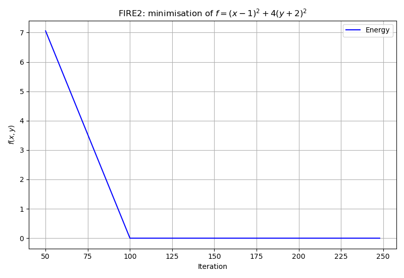
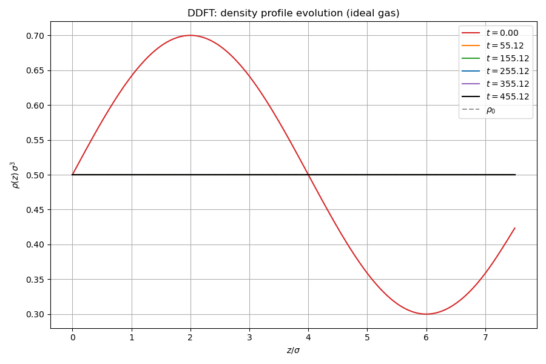

# Dynamics: minimisation and time evolution

## Physical background

This example demonstrates two algorithmic building blocks used throughout the
library: the FIRE2 minimiser for finding free energy minima, and the
split-operator DDFT scheme for time evolution.

### FIRE2 minimiser

The Fast Inertial Relaxation Engine (FIRE) is a molecular dynamics-inspired
optimisation algorithm. Starting from an initial configuration $\mathbf{x}_0$
with zero velocity, it integrates the equation of motion:

$$
m\ddot{\mathbf{x}} = -\nabla E(\mathbf{x})
$$

with an adaptive time step and a velocity mixing rule that biases the
direction of motion toward the force direction:

$$
\mathbf{v} \leftarrow (1 - \alpha)\mathbf{v} + \alpha\,\frac{|\mathbf{v}|}{|\mathbf{F}|}\,\mathbf{F}
$$

The mixing parameter $\alpha$ starts large (strong damping) and decays as the
system accumulates downhill power $P = \mathbf{F}\cdot\mathbf{v} > 0$. When
$P < 0$ (uphill motion), the time step is halved, velocity is zeroed, and
$\alpha$ is reset.

The FIRE2 variant uses additional criteria:
- $\Delta t$ increases only after $N_{\mathrm{delay}}$ consecutive positive-power steps.
- $\alpha$ decays multiplicatively: $\alpha \leftarrow f_\alpha \cdot \alpha$.
- Convergence is declared when the RMS force falls below tolerance.

The example minimises a 2D quadratic $f(x,y) = (x-1)^2 + 4(y+2)^2$ from
the initial guess $(5, 5)$.

### Split-operator DDFT

The DDFT equation of motion for a conserved density field is:

$$
\frac{\partial\rho}{\partial t} = D\,\nabla\cdot\left[\rho\,\nabla\frac{\delta F}{\delta\rho}\right]
$$

For an ideal gas, $\delta F/\delta\rho = k_BT\ln\rho$, and the equation
reduces to the diffusion equation:

$$
\frac{\partial\rho}{\partial t} = D\,\nabla^2\rho
$$

The split-operator scheme separates the ideal-gas (linear) term from the
excess (nonlinear) contribution. The ideal-gas propagator is applied exactly
in Fourier space:

$$
\hat{\rho}_k(t + \Delta t) = e^{\Lambda_k D\Delta t}\,\hat{\rho}_k(t)
$$

where $\Lambda_k = (2/\Delta x^2)(\cos k_i - 1)$ is the eigenvalue of the
discrete Laplacian at wavenumber $k$. The excess contribution is added via
a second-order integrating factor correction.

For the ideal gas test case, $\rho(\mathbf{r}, 0) = \rho_0 + A\sin(2\pi z/L)$.
The amplitude of the fundamental mode decays as:

$$
A(t) = A(0)\, e^{\Lambda_1 D t}
$$

This provides an exact analytical check: the numerical decay rate must match
$e^{\Lambda_1 D\Delta t}$ per step.

## What the code does

### FIRE2 minimiser

1. Minimises $f(x,y) = (x-1)^2 + 4(y+2)^2$ from $(5, 5)$ using both the
   one-shot `minimize()` API and the step-by-step `initialize()` + `step()` loop.
2. Logs the energy at every configurable interval for convergence plotting.

### Split-operator DDFT

1. Defines an ideal gas on a $16^3$ grid with a sinusoidal perturbation.
2. Runs the split-operator DDFT scheme and tracks density snapshots.
3. Verifies exponential variance decay and exact mass conservation.

## Cross-validation (`check/`)

| Step | Test | Analytical reference | Tolerance |
|------|------|---------------------|-----------|
| 1 | Propagator coefficients | $e^{\Lambda_k D\Delta t}$ at $k=0$ (= 1), $k=1$, Nyquist | $10^{-10}$ |
| 2 | Pure diffusion step | Amplitude decay $A(t)/A(0) = e^{\Lambda_1 D t}$; mass $= M_0$ | $10^{-4}$ (decay); $10^{-10}$ (mass) |
| 3 | Full DFT step | Mass conservation; $\Omega(t+\Delta t) \leq \Omega(t)$ | $10^{-6}$ (mass); monotone |

Step 2 uses an ideal gas with $\rho(\mathbf{r},0) = \rho_0 + A\cos(2\pi z/L)$
and verifies the analytical exponential decay rate. Step 3 uses a tanh slab
at $kT = 0.7$ for an LJ fluid and verifies that DDFT respects both mass
conservation and the second law (monotonic decrease of $\Omega$).

## Build and run

```bash
make run        # Docker
make run-local  # local build
make run-checks # cross-validation
```

## Output

### FIRE2 energy convergence

Energy decays rapidly from the initial guess $(5, 5)$ toward the minimum at
$(1, -2)$.



### DDFT density variance decay

The variance of the density field decays exponentially as the sinusoidal
perturbation relaxes to the uniform equilibrium.


### DDFT density profile evolution

Snapshots of the 1D density profile $\rho(z)$ at successive times.


