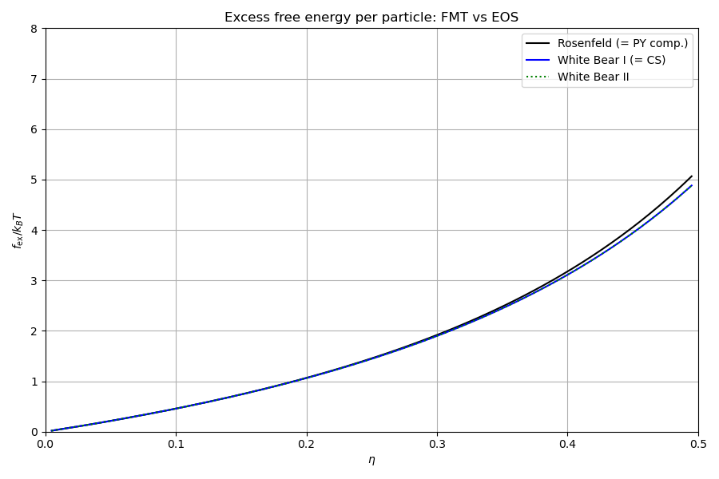
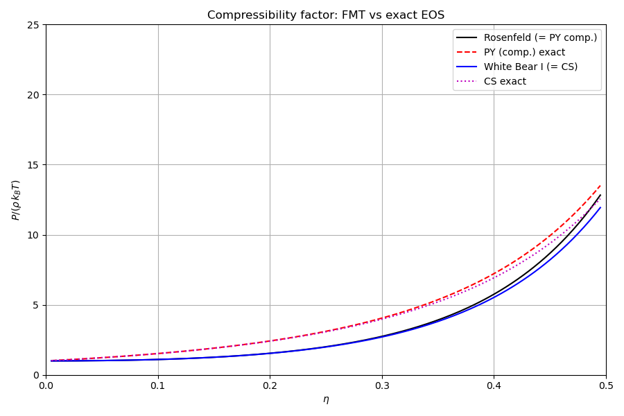
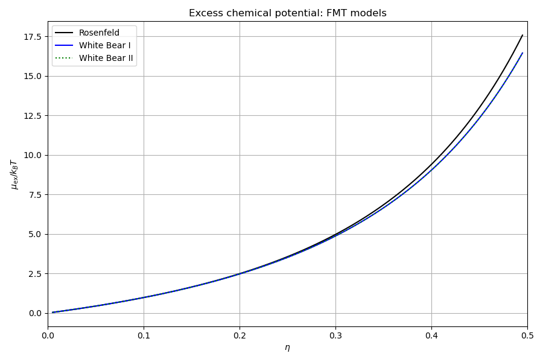

# Fundamental measure theory (FMT)

## Overview

Fundamental Measure Theory is the modern framework for the hard-sphere
contribution to the DFT free energy functional. FMT expresses the excess
free energy density $\Phi(\{n_\alpha\})$ as a function of weighted densities
(fundamental measures) obtained by convolving the density profile with
geometric weight functions of the hard sphere.

## Weighted densities

For a single-component hard-sphere fluid with diameter $d$ and density
profile $\rho(\mathbf{r})$, the four scalar and two vector weighted densities are:

$$
n_\alpha(\mathbf{r}) = \int \rho(\mathbf{r}') \, w_\alpha(\mathbf{r} - \mathbf{r}') \, d\mathbf{r}'
$$

The weight functions are:

| Measure | Weight $w_\alpha(r)$ | Geometric meaning |
|---------|---------------------|-------------------|
| $n_3$ (= $\eta$) | $\Theta(R - r)$ | Sphere volume |
| $n_2$ | $\delta(R - r)$ | Sphere surface area |
| $n_1$ | $\delta(R - r) / (4\pi R)$ | Mean radius |
| $n_0$ | $\delta(R - r) / (4\pi R^2)$ | Number count |
| $\mathbf{v}_2$ | $\delta(R - r)\, \hat{\mathbf{r}} / r$ | Surface normal |
| $\mathbf{v}_1$ | $\delta(R - r)\, \hat{\mathbf{r}} / (4\pi R\, r)$ | Scaled surface normal |

where $R = d/2$, $\Theta$ is the Heaviside function, and $\delta$ the Dirac delta.

White Bear models additionally require the tensor measure:

$$
T_{ij}(\mathbf{r}) = \int \rho(\mathbf{r}')\,\frac{\delta(R - |\mathbf{r}-\mathbf{r}'|)}{4\pi R^2}\,\frac{(r_i - r_i')(r_j - r_j')}{|\mathbf{r}-\mathbf{r}'|^2}\,d\mathbf{r}'
$$

with $\mathrm{Tr}(T) = n_2/(4\pi R^2)$ for isotropic fluids.

## Free energy density

The excess free energy density decomposes into three contributions:

$$
\Phi = -n_0\,f_1(\eta) + (n_1 n_2 - \mathbf{v}_0\cdot\mathbf{v}_1)\,f_2(\eta) + \Phi_3(\{n_\alpha\})\,f_3(\eta)
$$

**$\Phi_1$**: the 0D cavity limit, exact for zero-dimensional confinement:

$$
\Phi_1 = -n_0 \ln(1-\eta)
$$

**$\Phi_2$**: the one-body direct correlation function contribution:

$$
\Phi_2 = \frac{n_1 n_2 - \mathbf{v}_0\cdot\mathbf{v}_1}{1-\eta}
$$

**$\Phi_3$**: the three-body and higher-order correlations. This is the part
that distinguishes the models. $f_3(\eta)$ is model-dependent; $\Phi_3(\{n_\alpha\})$
depends on the scalar and vector (and optionally tensor) measures.

## FMT models

### Rosenfeld (1989)

The original FMT. Recovers the PY compressibility EOS in the bulk.

$$
f_1(\eta) = \ln(1-\eta), \quad f_2(\eta) = \frac{1}{1-\eta}, \quad f_3(\eta) = \frac{1}{(1-\eta)^2}
$$

$$
\Phi_3^{\mathrm{Ros}} = \frac{1}{24\pi}\left(n_2^3 - 3\,n_2\,\mathbf{v}_1\cdot\mathbf{v}_1\right)
$$

The functional derivatives are:

$$
\frac{\partial\Phi_3}{\partial n_2} = \frac{1}{8\pi}\left(n_2^2 - \mathbf{v}_1\cdot\mathbf{v}_1\right), \qquad
\frac{\partial\Phi_3}{\partial v_{1,k}} = -\frac{n_2}{4\pi}\,v_{1,k}
$$

### RSLT (Rosenfeld-Schmidt-Lowen-Tarazona)

Improved version that recovers the 0D crossover limit exactly. Uses the
anti-symmetry parameter $\xi = \mathbf{v}_1\cdot\mathbf{v}_1/n_2^2$ and
$q = 1 - \xi$:

$$
f_1, f_2: \text{same as Rosenfeld}; \qquad f_3(\eta) = \frac{1}{\eta(1-\eta)^2} + \frac{\ln(1-\eta)}{\eta^2}
$$

$$
\Phi_3^{\mathrm{RSLT}} = \frac{n_2^3}{36\pi}\left(1-\xi\right)^3
$$

$$
\frac{\partial\Phi_3}{\partial n_2} = \frac{3n_2^2}{36\pi}\,q^2(1+\xi), \qquad
\frac{\partial\Phi_3}{\partial v_{1,k}} = -\frac{n_2}{6\pi}\,q^2\,v_{1,k}
$$

### White Bear I

Uses $f_1$, $f_2$, $f_3$ chosen to reproduce the Carnahan-Starling EOS
in the bulk. Requires the tensor measure $T_{ij}$:

$$
f_3(\eta) = \frac{1}{\eta(1-\eta)^2} + \frac{\ln(1-\eta)}{\eta^2}
$$

$$
\Phi_3^{\mathrm{WBI}} = \frac{3}{24\pi}\left(n_2\,\mathrm{Tr}(T^2) - n_2\,\mathbf{v}_1\cdot\mathbf{v}_1 + \mathbf{v}_1\cdot T\cdot\mathbf{v}_1 - \mathrm{Tr}(T^3)\right)
$$

This is identical to $\mathrm{esFMT}(A=1, B=-1)$ and reduces to the Rosenfeld
$\Phi_3$ when $T_{ij} = (n_2/3)\delta_{ij}$ (isotropic limit).

### White Bear II

The most accurate model. Same tensor $\Phi_3$ as White Bear I, but with
modified $f_2$ that improves higher-order virial coefficients:

$$
f_2(\eta) = \frac{1}{3} + \frac{4}{3(1-\eta)} + \frac{2\ln(1-\eta)}{3\eta}
$$

$$
f_3(\eta) = -\frac{1-3\eta+\eta^2}{\eta(1-\eta)^2} - \frac{\ln(1-\eta)}{\eta^2}
$$

### esFMT (extended scaled FMT)

A two-parameter generalisation with parameters $A$ and $B$:

$$
\Phi_3^{\mathrm{es}} = \frac{A}{24\pi}\left(n_2^3 - 3n_2\,\mathbf{v}_1\!\cdot\!\mathbf{v}_1 + 3\,\mathbf{v}_1\!\cdot\!T\!\cdot\!\mathbf{v}_1 - \mathrm{Tr}(T^3)\right) + \frac{B}{24\pi}\left(n_2^3 - 3n_2\,\mathrm{Tr}(T^2) + 2\,\mathrm{Tr}(T^3)\right)
$$

Default $A=1, B=0$. Setting $A=1, B=-1$ recovers White Bear I/II tensor $\Phi_3$.

## Bulk limit and EOS correspondence

In the uniform (bulk) limit all weighted densities reduce to functions of the
packing fraction $\eta$ alone. The FMT excess free energy per particle is:

$$
f_{\mathrm{ex}}(\eta) = \frac{\Phi(\eta)}{\rho}
$$

| Model | Bulk EOS | Excess free energy $f_{\mathrm{ex}}$ |
|-------|----------|------|
| Rosenfeld | PYc | $-\ln(1-\eta) + 3\eta/(1-\eta) + 3\eta^2/[2(1-\eta)^2]$ |
| White Bear I/II | CS | $(4\eta - 3\eta^2)/(1-\eta)^2$ |

### Pressure from the Gibbs-Duhem relation

The compressibility factor is obtained from the excess chemical potential and
free energy per particle:

$$
\frac{P}{\rho k_BT} = 1 + \rho\left(\mu_{\mathrm{ex}} - f_{\mathrm{ex}}\right)
$$

---

## Step-by-step code walkthrough

### Step 1: Instantiate FMT models and reference EOS

Four FMT models and two reference hard-sphere equations of state are created:

```cpp
fmt::Rosenfeld ros{};
fmt::RSLT rslt{};
fmt::WhiteBearI wb1{};
fmt::WhiteBearII wb2{};

physics::hard_spheres::CarnahanStarling cs{};
physics::hard_spheres::PercusYevickCompressibility pyc{};
```

Each FMT model provides a `phi(measures)` method that evaluates $\Phi$ and
its derivatives from a set of weighted densities. The CS and PYc models serve
as the analytical reference.

### Step 2: Evaluate bulk excess free energy per particle

At each packing fraction, uniform weighted densities are constructed and
$\Phi(\{n_\alpha\})/\rho$ is evaluated:

```cpp
for (arma::uword i = 0; i < eta_arma.n_elem; ++i) {
    double eta = eta_arma(i);
    double rho = physics::hard_spheres::density_from_eta(eta);
    auto m = fmt::make_uniform_measures(rho, 1.0);
    m.products = m.inner_products();
    f_ros_a(i) = ros.phi(m) / rho;
    f_wb1_a(i) = wb1.phi(m) / rho;
    f_wb2_a(i) = wb2.phi(m) / rho;
}
```

The `make_uniform_measures(rho, sigma)` helper builds the uniform-density
weighted measure set (scalar $n_0, n_1, n_2, n_3$ and vector $\mathbf{v}_1,
\mathbf{v}_2$). The `.inner_products()` call pre-computes the products
$n_2 v_{2,k} v_{2,k}$ etc. needed by the tensor FMT models.

Rosenfeld and RSLT should match PYc, while White Bear I/II should match CS.

### Step 3: Compute the excess chemical potential

The bulk chemical potential is evaluated analytically from the FMT
$\Phi$ functions:

```cpp
mu_ros_a(i) = bulk::hard_sphere::excess_chemical_potential(ros, arma::vec{rho}, sp_list, 0);
mu_wb1_a(i) = bulk::hard_sphere::excess_chemical_potential(wb1, arma::vec{rho}, sp_list, 0);
mu_wb2_a(i) = bulk::hard_sphere::excess_chemical_potential(wb2, arma::vec{rho}, sp_list, 0);
```

The function takes the FMT model, the density vector, the species list, and
the species index. It computes the analytical derivative
$\mu_{\mathrm{ex}} = \partial(\rho\,f_{\mathrm{ex}})/\partial\rho$ at the
given density.

### Step 4: Derive the compressibility factor

The pressure is obtained from the Gibbs-Duhem relation:

```cpp
p_ros_a(i) = 1.0 + rho * (mu_ros_a(i) - f_ros_a(i));
```

This verifies that $P/(\rho k_BT) = 1 + \rho(\mu_{\mathrm{ex}} - f_{\mathrm{ex}})$
holds for each FMT model. The result is compared against the direct CS and PYc
pressure routines. Agreement to machine precision confirms the internal
consistency of the FMT implementation.

---

## Cross-validation (`check/`)

| Step | Category | Quantities | Grid | Tolerance |
|------|----------|-----------|------|-----------|
| 1 | Rosenfeld $f_i(\eta)$ | $f_1, f_2, f_3$ | 12 packing fractions | $10^{-10}$ |
| 2 | RSLT $f_i(\eta)$ | $f_1, f_2, f_3$ | 12 packing fractions | $10^{-10}$ |
| 3 | White Bear I $f_i(\eta)$ | $f_1, f_2, f_3$ | 12 packing fractions | $10^{-10}$ |
| 4 | White Bear II $f_i(\eta)$ | $f_1, f_2, f_3$ | 12 packing fractions | $10^{-10}$ |
| 5 | esFMT $f_i(\eta)$ | $f_1, f_2, f_3$ | 12 packing fractions | $10^{-10}$ |
| 6 | Bulk $f_{\mathrm{ex}}(\eta)$ | assembled $\Phi/\rho$ | 12 $\eta$ values, all models | $10^{-8}$ |
| 7 | Rosenfeld $\Phi_3$ | $\Phi_3$, $\partial\Phi_3/\partial n_2$, $\partial\Phi_3/\partial v_{1,k}$ | non-uniform measures | $10^{-10}$ |
| 8 | RSLT $\Phi_3$ | $\Phi_3$, $\partial\Phi_3/\partial n_2$, $\partial\Phi_3/\partial v_{1,k}$ | non-uniform measures | $10^{-10}$ |
| 9a | esFMT$(1,0)$ $\Phi_3$ | $\Phi_3$, $\partial\Phi_3/\partial n_2$, $\partial\Phi_3/\partial v_{1,k}$, $\partial\Phi_3/\partial T_{ij}$ | non-uniform measures | $10^{-10}$ |
| 9b | esFMT$(1,-1)$ $\Phi_3$ | $\Phi_3$, $\partial\Phi_3/\partial n_2$, $\partial\Phi_3/\partial T_{ij}$ | non-uniform measures | $10^{-10}$ |
| 10 | WBI vs esFMT$(1,-1)$ | $\Phi_3$, $\partial\Phi_3/\partial n_2$, $\partial\Phi_3/\partial T_{ij}$ | non-uniform measures | $10^{-10}$ |

All comparisons use the legacy `FMT.h` as reference.

## Build and run

```bash
make run        # Docker
make run-local  # local build
make run-checks # cross-validation against legacy code
```

## Output

### Excess free energy per particle



### Compressibility factor



### Excess chemical potential


