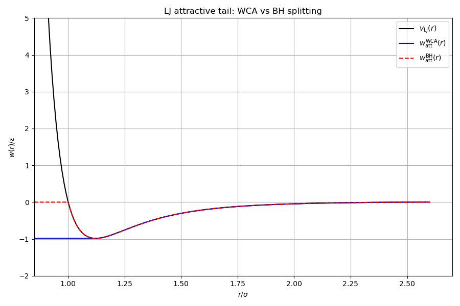
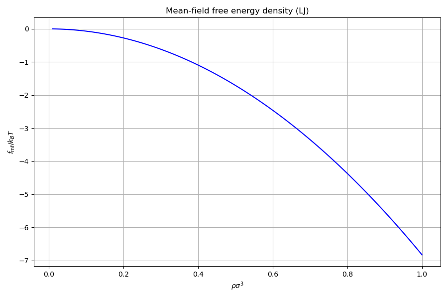
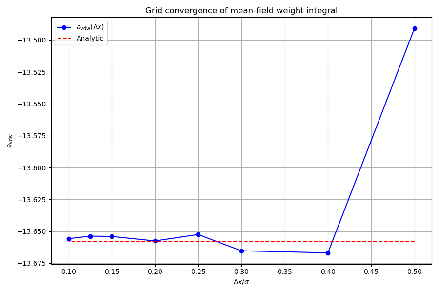

# Interaction: mean-field attraction

## Overview

In thermodynamic perturbation theory the attractive tail of the pair potential
is treated at the mean-field level. This example evaluates the mean-field
free energy, compares WCA and BH splitting schemes, and studies the
convergence of the discrete grid weights toward the continuum integral.

## The mean-field free energy functional

$$
F_{\mathrm{mf}}[\rho] = \frac{1}{2}\int\!\int \rho(\mathbf{r})\, w_{\mathrm{att}}(|\mathbf{r}-\mathbf{r}'|)\, \rho(\mathbf{r}')\, d\mathbf{r}\, d\mathbf{r}'
$$

where $w_{\mathrm{att}}(r) = v_{\mathrm{att}}(r)/(k_BT)$ is the attractive
tail of the pair potential divided by temperature.

## Perturbation splitting schemes

The decomposition $v(r) = v_{\mathrm{rep}}(r) + v_{\mathrm{att}}(r)$ is not unique.
Two standard choices are implemented:

### Weeks-Chandler-Andersen (WCA)

Splits at the potential minimum $r_{\min} = 2^{1/6}\sigma$:

$$
w_{\mathrm{att}}^{\mathrm{WCA}}(r) = \begin{cases}
v(r_{\min})/kT, & r < r_{\min} \\
v(r)/kT, & r_{\min} \leq r < r_c \\
0, & r \geq r_c
\end{cases}
$$

WCA is the natural choice for perturbation DFT because the reference system
(purely repulsive WCA potential) is well approximated by hard spheres.

### Barker-Henderson (BH)

Splits at the zero crossing $r_0 = \sigma$ where $v(r_0) = 0$:

$$
w_{\mathrm{att}}^{\mathrm{BH}}(r) = \begin{cases}
0, & r < r_0 \\
v(r)/kT, & r_0 \leq r < r_c \\
0, & r \geq r_c
\end{cases}
$$

## Van der Waals parameter

The spatially integrated weight defines the mean-field coupling constant:

$$
a_{\mathrm{vdw}} = \int_0^{r_c} w_{\mathrm{att}}(r)\, 4\pi r^2\, dr
$$

For the Lennard-Jones potential with WCA splitting at cutoff $r_c$, the
analytical integral is:

$$
a_{\mathrm{vdw}}^{\mathrm{WCA}} = \frac{4\pi}{kT}\left[\frac{4\varepsilon\sigma^{12}}{9}\left(r_{\min}^{-9} - r_c^{-9}\right) - \frac{4\varepsilon\sigma^6}{3}\left(r_{\min}^{-3} - r_c^{-3}\right) + \frac{v(r_{\min})}{3}\left(r_{\min}^3 - r_c^3\right) \right]
$$

where the first two terms come from integrating the LJ tail from $r_{\min}$
to $r_c$, and the third from integrating the constant $v(r_{\min})$ from $0$
to $r_{\min}$.

In the bulk (uniform density) limit the mean-field free energy simplifies to
$F_{\mathrm{mf}} = \tfrac{1}{2}a_{\mathrm{vdw}}\rho^2 V$, so all bulk
thermodynamics depend on $a_{\mathrm{vdw}}$ alone.

## Discrete weights and grid convergence

On a discrete grid with spacing $\Delta x$, the continuum convolution is
replaced by a discrete sum:

$$
F_{\mathrm{mf}} = \frac{1}{2}\sum_{i,j} \rho_i\, w_{ij}\, \rho_j\, (\Delta x)^6
$$

The weights $w_{ij}$ depend only on the displacement $(i-j)$ (translation
invariance). For each cell displacement $(i_x, i_y, i_z)$ the library
computes the weight by numerical quadrature.

### Quadrature schemes

The library supports three schemes of increasing accuracy:

**InterpolationZero**: point evaluation at the cell centre:

$$
w_{ijk} = w_{\mathrm{att}}\!\left(\sqrt{(i_x\Delta x)^2 + (i_y\Delta x)^2 + (i_z\Delta x)^2}\right)
$$

**InterpolationLinearF**: 8-point trilinear interpolation. Evaluates
$w_{\mathrm{att}}$ at the 8 corners of the cell and averages.

**InterpolationQuadraticF**: 27-point quadrature (Jim's QF scheme). For each
cell displacement, the weight function is evaluated at a $3\times3\times3$
sub-grid within the cell and combined with the quadrature coefficients. This
is the most accurate scheme and matches Jim's `Interaction.cpp` to $10^{-10}$.

### Grid convergence

The discrete $a_{\mathrm{vdw}} = \sum_{ijk} w_{ijk}\,(\Delta x)^3$ converges
toward the analytical value as $\Delta x \to 0$. At coarse grids
($\Delta x = 0.5\sigma$) the error can reach several percent; at
$\Delta x = 0.1\sigma$ it is below $10^{-4}$.

---

## Step-by-step code walkthrough

### Step 1: Define the LJ system

A standard LJ fluid with $\sigma = \varepsilon = 1$, cutoff $r_c = 2.5\sigma$
at $kT = 1$:

```cpp
physics::Model model{
    .grid = make_grid(0.1, {6.0, 6.0, 6.0}),
    .species = {Species{.name = "LJ", .hard_sphere_diameter = 1.0}},
    .interactions = {{
        .species_i = 0, .species_j = 0,
        .potential = physics::potentials::make_lennard_jones(1.0, 1.0, 2.5),
        .split = physics::potentials::SplitScheme::WeeksChandlerAndersen,
    }},
    .temperature = 1.0,
};
```

### Step 2: Evaluate the attractive tail

The full LJ potential and both WCA / BH attractive tails are sampled on a
fine radial grid:

```cpp
v_full_arma(i) = pot.energy(r_arma(i));
watt_wca_arma(i) = pot.attractive(r_arma(i), SplitScheme::WeeksChandlerAndersen);
watt_bh_arma(i) = pot.attractive(r_arma(i), SplitScheme::BarkerHenderson);
```

Under WCA splitting, $w_{\mathrm{att}}(r) = 0$ for $r < r_{\min}$ and
$w_{\mathrm{att}}(r) = v(r)$ for $r \geq r_{\min}$. Under BH splitting,
$w_{\mathrm{att}}(r) = v(r_{\min})$ (constant) for $r < r_{\min}$.

### Step 3: Compute the analytical vdW parameter

The continuum integral $a_{\mathrm{vdw}} = 2 \int_0^\infty w_{\mathrm{att}}(r)\, 4\pi r^2\, dr$
is evaluated numerically via adaptive quadrature:

```cpp
double a_vdw = 2.0 * pot.vdw_integral(model.temperature, split);
```

This is the reference value for the grid convergence study.

### Step 4: Build bulk weights and evaluate mean-field thermodynamics

Bulk weights are constructed from the FMT model and interactions:

```cpp
auto weights = functionals::make_bulk_weights(
    functionals::fmt::WhiteBearII{}, model.interactions, model.temperature
);
```

The mean-field free energy density $f_{\mathrm{mf}}(\rho) = \frac{1}{2} a_{\mathrm{vdw}} \rho^2$
and chemical potential $\mu_{\mathrm{mf}}(\rho) = a_{\mathrm{vdw}} \rho$ are
evaluated on a 100-point density grid:

```cpp
f_arma(i) = bulk::mean_field::free_energy_density(weights.mean_field, arma::vec{rho_arma(i)});
mu_arma(i) = bulk::mean_field::chemical_potential(weights.mean_field, arma::vec{rho_arma(i)}, 0);
```

### Step 5: Grid convergence of $a_{\mathrm{vdw}}$

At 8 grid spacings ($\Delta x = 0.5$ down to $0.1$), inhomogeneous mean-field
weights are built and the numerical $a_{\mathrm{vdw}}$ is compared against the
analytical value:

```cpp
for (auto dxi : dx_vals) {
    double L = std::ceil(std::max(5.0, 2.0 * 2.5 + 2.0 * dxi) / dxi) * dxi;
    auto grid = make_grid(dxi, {L, L, L});
    auto mf_weights = functionals::make_mean_field_weights(
        grid, model.interactions, model.temperature);
    a_conv[i] = mf_weights.interactions[0].a_vdw;
}
```

The box size is adjusted to ensure the cutoff sphere fits entirely within the
simulation cell. The relative error should converge as $O(\Delta x^2)$.

---

## Cross-validation (`check/`)

| Step | Category | Quantities | Grid | Tolerance |
|------|----------|-----------|------|-----------|
| 1 | Cell-by-cell QF weights | $w_{ijk}$ for all displacements within $r_c$ | $\Delta x = 0.4$ | $10^{-10}$ |
| 2 | Cell-by-cell QF weights | $w_{ijk}$ for all displacements within $r_c$ | $\Delta x = 0.2$ | $10^{-10}$ |
| 3 | Grid $a_{\mathrm{vdw}}$ | $\sum w_{ijk}\,(\Delta x)^3$ | $\Delta x = 0.5, 0.4, 0.3, 0.2, 0.1$ | $10^{-10}$ |
| 4 | Analytical $a_{\mathrm{vdw}}$ | Continuum integral (independent check) | N/A | reference |

All comparisons use Jim's `Interaction.cpp` (`generate_weight_QF`) as reference.

## Build and run

```bash
make run        # Docker
make run-local  # local build
make run-checks # cross-validation against Jim's code
```

## Output

### WCA vs BH splitting



### Mean-field free energy density



### Grid convergence of $a_{\mathrm{vdw}}$


