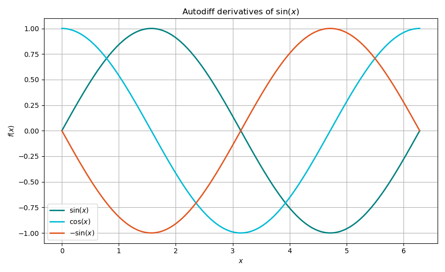
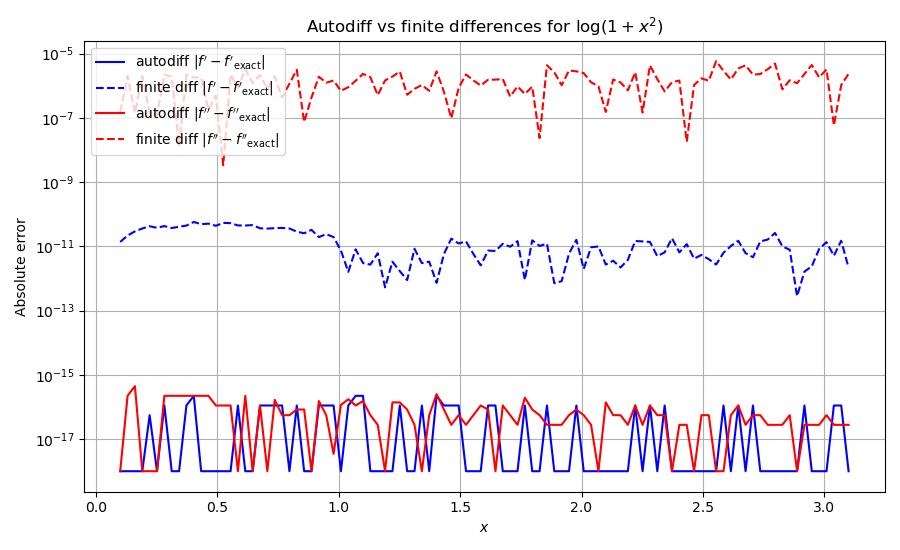

# Autodiff: automatic differentiation

## Purpose

This doc demonstrates the automatic differentiation (AD) adapter that
provides exact derivatives of scalar functions without manual derivation or
finite-difference approximation. The library uses AD internally to compute
derivatives of the FMT free energy density $\Phi(\{n_\alpha\})$ with respect
to the weighted densities, and derivatives of equations of state with respect
to density.

## Mathematical background

### Forward-mode automatic differentiation

Forward-mode AD propagates derivatives alongside function values by
replacing each real number $x$ with a dual number $x + \epsilon\,\dot{x}$,
where $\epsilon^2 = 0$. Applying a function $f$ to this dual number yields:

$$
f(x + \epsilon\,\dot{x}) = f(x) + \epsilon\,f'(x)\,\dot{x}
$$

so $f'(x)$ is extracted from the $\epsilon$-coefficient. Higher-order
derivatives use hyper-dual numbers: `dual2nd` carries $(f, f', f'')$ and
`dual3rd` carries $(f, f', f'', f''')$.

### Comparison with finite differences

The central finite difference approximation:

$$
f'(x) \approx \frac{f(x+h) - f(x-h)}{2h}
$$

introduces a truncation error of $O(h^2)$ and a round-off error of
$O(\varepsilon_{\mathrm{mach}}/h)$. The optimal step size
$h \sim \varepsilon_{\mathrm{mach}}^{1/3} \approx 10^{-5}$ gives at best
$\sim 10^{-10}$ accuracy.

Autodiff computes derivatives to machine precision ($\sim 10^{-16}$) with
no step size tuning, and no cancellation error.

### API

| Function | Returns | Dual type |
|----------|---------|-----------|
| `derivatives_up_to_1(f, x)` | $(f, f')$ | `dual` |
| `derivatives_up_to_2(f, x)` | $(f, f', f'')$ | `dual2nd` |
| `derivatives_up_to_3(f, x)` | $(f, f', f'', f''')$ | `dual3rd` |

The function `f` must be written in terms of autodiff-compatible operations
(the standard math functions are overloaded in the `autodiff::detail`
namespace).

---

## Step-by-step code walkthrough

### Step 1: First derivatives

The structured binding API computes $(f, f')$ in one call using `dual` types:

```cpp
auto [sv, sd] = derivatives_up_to_1(
    [](dual x) -> dual { return autodiff::detail::sin(x); },
    std::numbers::pi / 4.0
);
```

The lambda must use `autodiff::detail::sin` (not `std::sin`) to enable
automatic differentiation.

### Step 2: Second derivatives

The `derivatives_up_to_2` function returns $(f, f', f'')$ using `dual2nd`
types:

```cpp
auto [s2v, s2d, s2d2] = derivatives_up_to_2(
    [](dual2nd x) -> dual2nd { return autodiff::detail::sin(x); }, x0
);
```

This verifies $\sin''(x) = -\sin(x)$ and $\exp''(x) = \exp(x)$.

### Step 3: Third derivatives

The `derivatives_up_to_3` function returns $(f, f', f'', f''')$ using
`dual3rd` types. For the cubic $p(x) = x^3 - 2x^2 + 3x - 1$, the third
derivative is the constant $6$.

### Step 4: Autodiff vs finite differences

For $f(x) = \ln(1 + x^2)$, the autodiff and central finite difference
($h = 10^{-5}$) results are compared:

```cpp
auto [tv, td, td2] = derivatives_up_to_2(
    [](dual2nd x) -> dual2nd { return autodiff::detail::log(1.0 + x * x); }, xc
);
double fd1 = (std::log(1 + (xc+h)*(xc+h)) - std::log(1 + (xc-h)*(xc-h))) / (2*h);
```

Autodiff achieves $\sim 10^{-16}$ error (machine precision), while finite
differences are limited to $\sim 10^{-10}$ by truncation error.

## Build and run

```bash
make run-local
```

## Output

### Autodiff derivatives of $\sin(x)$

The function $\sin(x)$ and its first two derivatives computed via autodiff.



### Autodiff vs finite differences

Error comparison for $\log(1 + x^2)$: autodiff achieves machine precision
while central finite differences are limited by truncation error.


