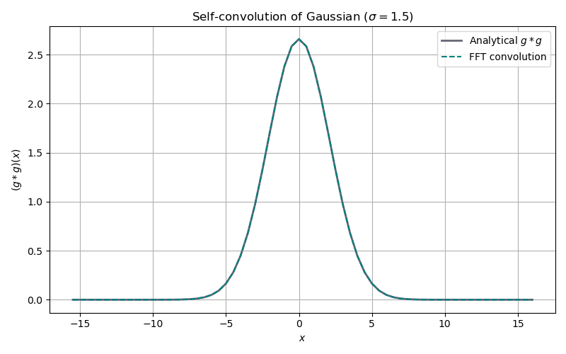

# Convolution: FFT-based cyclic convolution

## Purpose

This doc demonstrates the FFT convolution functions (`convolve` and
`back_convolve`) that implement all weighted-density and mean-field
integrals in the DFT library. Every FMT functional evaluation and every
mean-field interaction integral reduces to a Schur (element-wise) product
in Fourier space followed by an inverse transform.

## Mathematical background

### Cyclic convolution

For two periodic functions $f$ and $g$ sampled on an $N$-point grid, the
cyclic (circular) convolution is:

$$
(f \ast g)[n] = \sum_{m=0}^{N-1} f[m]\, g[n - m]
$$

where the index $n - m$ wraps around modulo $N$. By the convolution
theorem:

$$
\widehat{f \ast g}[k] = \hat{f}[k]\, \hat{g}[k]
$$

so the convolution can be computed as:

$$
f \ast g = \mathrm{IFFT}\bigl[\hat{f} \cdot \hat{g}\bigr]
$$

This reduces the cost from $O(N^2)$ to $O(N \log N)$.

### Forward convolution

The `convolve(weight_k, rho_k, shape)` function computes:

$$
n(\mathbf{r}) = \mathrm{IFFT}\bigl[\hat{w}(\mathbf{k})\, \hat{\rho}(\mathbf{k})\bigr]
$$

In DFT, this gives the weighted densities $n_\alpha = w_\alpha \ast \rho$
used by FMT, and the mean-field potential $\phi_{\mathrm{mf}} = w_{\mathrm{att}} \ast \rho$.

### Back-convolution (adjoint)

The `back_convolve(weight_k, derivative, shape)` function computes:

$$
\hat{b}(\mathbf{k}) = \hat{w}(\mathbf{k})\, \widehat{\frac{\partial\Phi}{\partial n_\alpha}}(\mathbf{k})
$$

This is needed for computing the functional derivative
$\delta F / \delta \rho$ by the chain rule through the weighted densities.
The key identity is the adjoint (transpose) property:

$$
\bigl\langle w \ast \rho,\, d \bigr\rangle = \bigl\langle \rho,\, w \ast d \bigr\rangle
$$

which ensures thermodynamic consistency of the force computation.

### Gaussian self-convolution

The convolution of two identical Gaussians
$g(x) = \exp\!\bigl(-x^2/(2\sigma^2)\bigr)$ is:

$$
(g \ast g)(x) = \sigma\sqrt{\pi}\;\exp\!\left(-\frac{x^2}{4\sigma^2}\right)
$$

i.e. a Gaussian with width $\sigma_{\mathrm{out}} = \sqrt{2}\,\sigma$ and
amplitude $\sigma\sqrt{\pi}$. This provides an analytical reference for
validating the numerical convolution.

---

## Step-by-step code walkthrough

### Step 1: Delta convolution ($\delta * f = f$)

A delta function $\delta(\mathbf{r})$ and a constant field $f = 3$ are placed
into two separate Fourier buffers, transformed, and convolved:

```cpp
auto plan_a = math::FourierTransform(shape);
auto plan_b = math::FourierTransform(shape);
auto real_a = plan_a.real();
std::fill(real_a.begin(), real_a.end(), 0.0);
real_a[0] = 1.0;          // delta at the origin
auto real_b = plan_b.real();
std::fill(real_b.begin(), real_b.end(), 3.0);   // constant

plan_a.forward();
plan_b.forward();
auto result = math::convolve(plan_a.fourier(), plan_b.fourier(), shape);
result /= static_cast<double>(N);
```

The result must be $3$ at every grid point. This verifies the fundamental
identity property of convolution.

### Step 2: Gaussian self-convolution

A Gaussian with width $\sigma = 1.5$ is convolved with itself on a 1D
periodic grid ($64$ points, $\Delta x = 0.5$). The analytical result is a
wider Gaussian with $\sigma_{\mathrm{out}} = \sigma\sqrt{2}$ and amplitude
$\sigma\sqrt{\pi}$:

```cpp
auto gg = math::convolve(g_k, g_k, shape_1d);
gg *= dx / static_cast<double>(N_1d);
```

The code compares the numerical result against the analytical formula at
every 4th grid point, printing the error. This demonstrates the
resolution-dependent accuracy of the FFT approach.

### Step 3: Adjoint symmetry ($\langle w*\rho, d \rangle = \langle \rho, \mathrm{IFFT}[\mathrm{back\_convolve}(w, d)] \rangle$)

Random fields $\rho$, $d$, and $w$ are generated, and the identity

$$
\langle w \ast \rho,\, d \rangle = \langle \rho,\, \mathcal{F}^{-1}[\hat{w}^* \cdot \hat{d}] \rangle
$$

is verified to machine precision. This adjoint property is the foundation
for correct back-convolution of forces in FMT:

```cpp
auto n = math::convolve(w_k_span, rho_k, shape);
double lhs = arma::dot(n, d_r);
auto bc = math::back_convolve(w_k_span, d_r, shape, true);
// ... IFFT bc and dot with rho_r ...
double rhs = arma::dot(rho_r, bc_r);
```

The relative error $|lhs - rhs| / |lhs|$ should be $< 10^{-14}$.

## Build and run

```bash
make run-local
```

## Output

### Gaussian self-convolution

FFT-based convolution of a Gaussian with itself closely matches the
analytical result $(\sigma\sqrt{\pi})\exp(-x^2 / 4\sigma^2)$.


