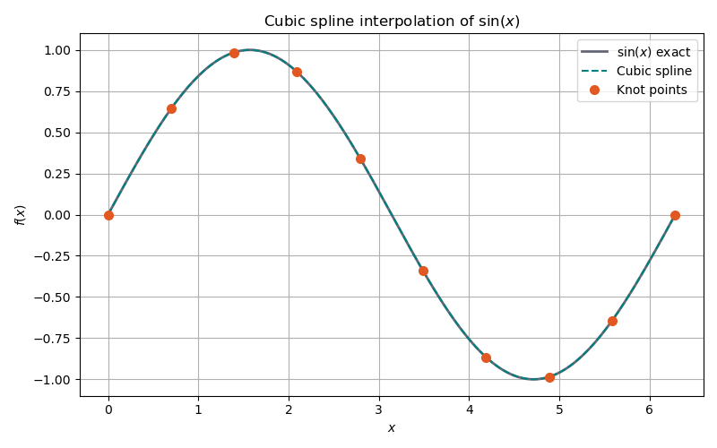
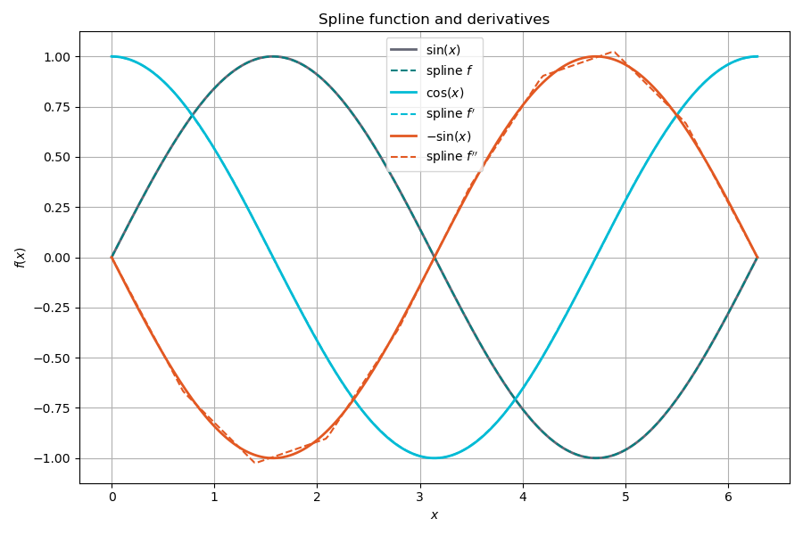

# Spline: cubic and bivariate interpolation

## Purpose

This example demonstrates the GSL-backed spline interpolation classes
(`CubicSpline` and `BivariateSpline`). These are used in the DFT library for
interpolating tabulated equations of state, potential functions, and any
other smooth functions that are expensive to evaluate at every grid point.

## Mathematical background

### Cubic spline interpolation (1D)

Given $n$ data points $(x_i, y_i)$, a cubic spline $S(x)$ is a piecewise
cubic polynomial that:

1. Passes through all data points: $S(x_i) = y_i$.
2. Has continuous first and second derivatives at every knot.
3. Satisfies boundary conditions (natural spline: $S''(x_1) = S''(x_n) = 0$).

On each interval $[x_i, x_{i+1}]$, the spline has the form:

$$
S(x) = a_i + b_i(x - x_i) + c_i(x - x_i)^2 + d_i(x - x_i)^3
$$

where the $4n$ coefficients $(a_i, b_i, c_i, d_i)$ are determined by the
interpolation conditions, continuity conditions, and boundary conditions.
This gives a tridiagonal system that is solved in $O(n)$ time.

### Derivatives and integrals

The spline representation gives exact (within the spline approximation)
derivatives and integrals:

$$
S'(x) = b_i + 2c_i(x - x_i) + 3d_i(x - x_i)^2
$$

$$
S''(x) = 2c_i + 6d_i(x - x_i)
$$

$$
\int_{x_j}^{x_k} S(x)\,dx = \sum_{i=j}^{k-1}\left[a_i h_i + \frac{b_i}{2}h_i^2 + \frac{c_i}{3}h_i^3 + \frac{d_i}{4}h_i^4\right]
$$

where $h_i = x_{i+1} - x_i$. The GSL implementation evaluates these in
$O(\log n)$ time using binary search to locate the interval.

### Bivariate spline interpolation (2D)

For a function $f(x, y)$ sampled on a rectangular grid
$(x_i, y_j) \to z_{ij}$, the bivariate spline constructs a surface
$S(x, y)$ that passes through all grid points. The GSL implementation uses
bicubic interpolation: a tensor product of 1D cubic splines along each axis.

Partial derivatives are available:

$$
\frac{\partial S}{\partial x},\quad \frac{\partial S}{\partial y},\quad \frac{\partial^2 S}{\partial x\,\partial y}
$$

## What the code does

### 1. CubicSpline: interpolating $\sin(x)$

Constructs a cubic spline from 10 knots uniformly spaced over $[0, 2\pi]$
and evaluates at 20 intermediate points:

```cpp
auto sin_spline = math::CubicSpline(x_knots, y_knots);
double value = sin_spline(x_eval);
```

The maximum interpolation error $\max|S(x) - \sin(x)|$ should be on the
order of $10^{-4}$ for 10 knots.

### 2. Derivatives at $x = \pi/4$

Compares the spline derivatives against exact values:

| Quantity | Spline | Exact |
|----------|--------|-------|
| $f(x)$ | $S(\pi/4)$ | $\sin(\pi/4) = \sqrt{2}/2$ |
| $f'(x)$ | $S'(\pi/4)$ | $\cos(\pi/4) = \sqrt{2}/2$ |
| $f''(x)$ | $S''(\pi/4)$ | $-\sin(\pi/4) = -\sqrt{2}/2$ |

### 3. Integration

Computes $\int_0^\pi S(x)\,dx$ and compares with the exact value:

$$
\int_0^\pi \sin(x)\,dx = [-\cos(x)]_0^\pi = 2
$$

### 4. BivariateSpline: interpolating $\sin(x)\cos(y)$

Constructs a bicubic spline from a $20 \times 20$ grid over $[0, 2\pi]^2$
and evaluates at four test points. The function $f(x,y) = \sin(x)\cos(y)$ is
smooth and separable, so the interpolation error should be very small
($\sim 10^{-6}$).

### 5. Partial derivatives at $(\pi/4, \pi/4)$

| Quantity | Spline | Exact |
|----------|--------|-------|
| $\partial f/\partial x$ | `deriv_x(π/4, π/4)` | $\cos(\pi/4)\cos(\pi/4) = 1/2$ |
| $\partial f/\partial y$ | `deriv_y(π/4, π/4)` | $-\sin(\pi/4)\sin(\pi/4) = -1/2$ |
| $\partial^2 f/\partial x\partial y$ | `deriv_xy(π/4, π/4)` | $-\cos(\pi/4)\sin(\pi/4) = -1/2$ |

## API design

Both classes are RAII wrappers around GSL spline objects. They take
`std::span<const double>` for the input data, so they work with `arma::vec`,
`std::vector`, or raw arrays without copies:

```cpp
auto spline_1d = math::CubicSpline(x_span, y_span);
auto spline_2d = math::BivariateSpline(x_span, y_span, z_span);
```

Evaluation uses `operator()` for natural syntax: `spline(x)` or
`surface(x, y)`.

## Build and run

```bash
make run-local
```

## Output

### Spline interpolation of $\sin(x)$

Cubic spline through 10 knots closely follows the exact function, with errors
on the order of $10^{-4}$.



### Spline derivatives

The spline function, first derivative, and second derivative compared with
the exact $\sin(x)$, $\cos(x)$, and $-\sin(x)$.


