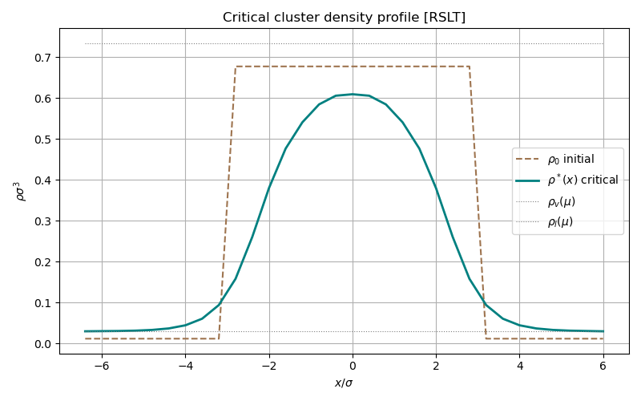
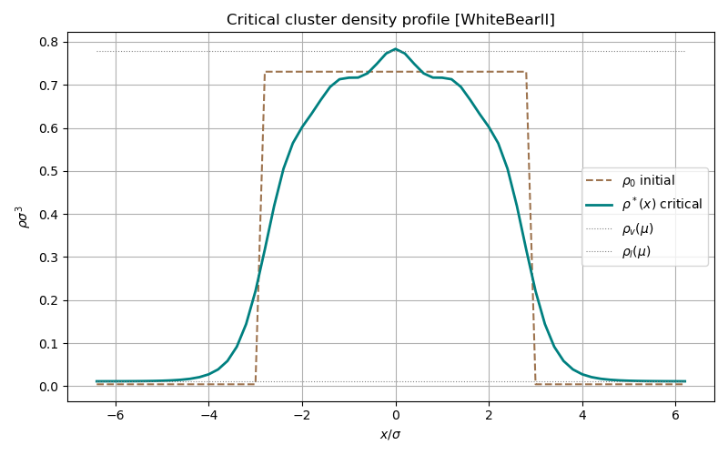
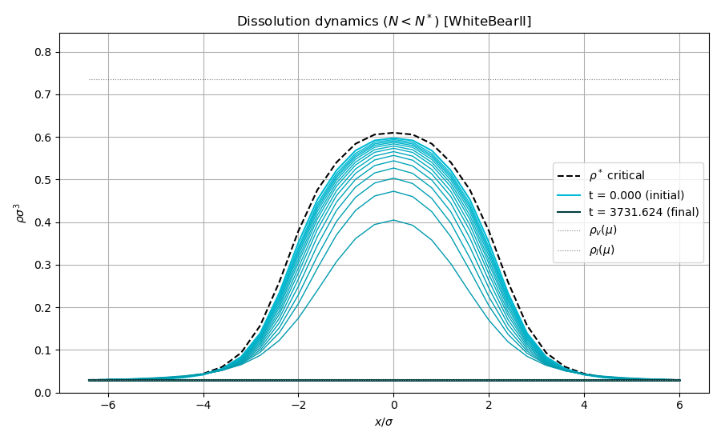
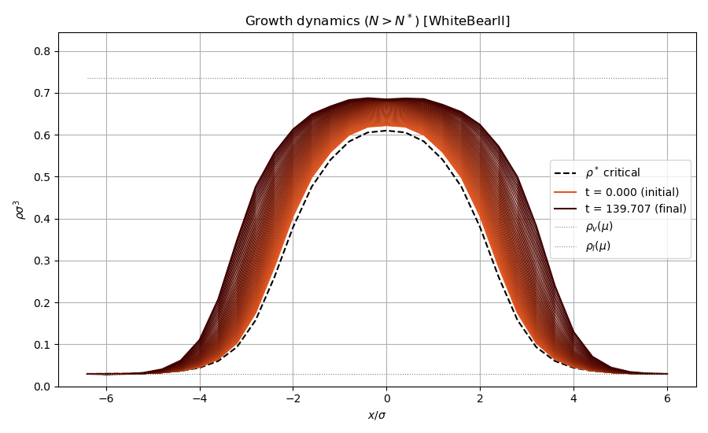
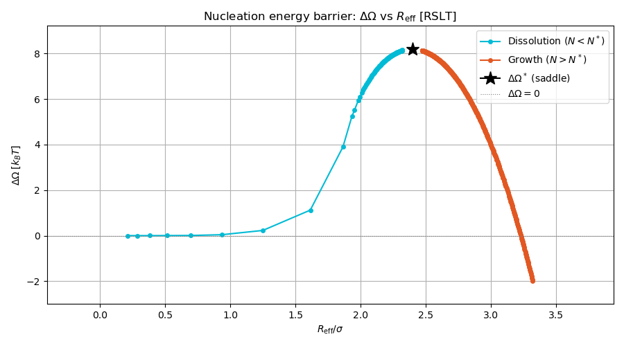
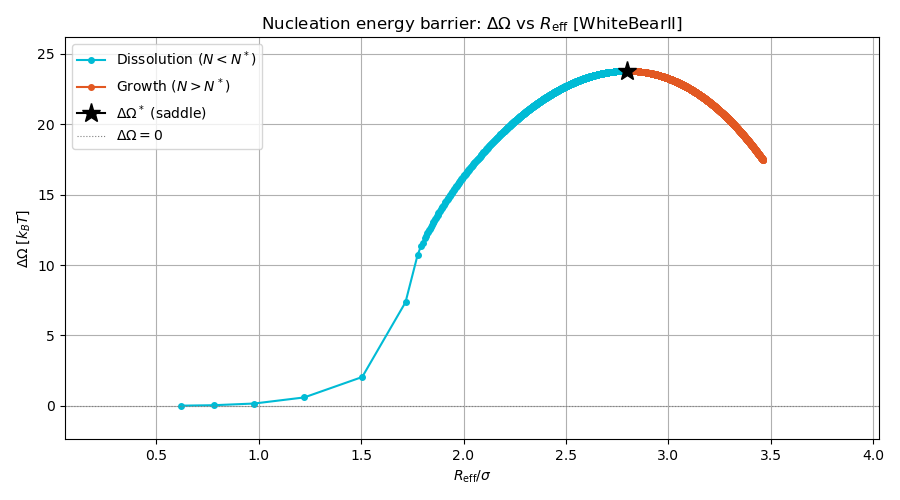
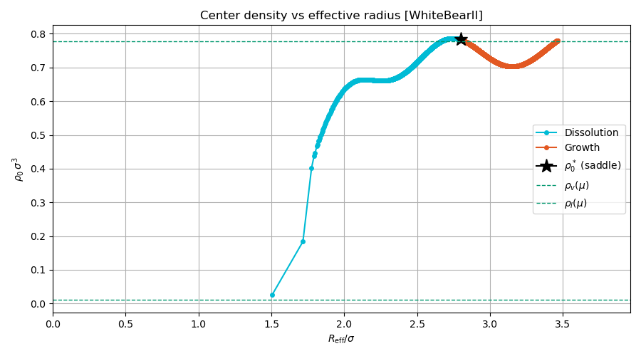

# Nucleation: critical droplet and barrier crossing

This document walks through the complete nucleation workflow within classical
density functional theory (DFT). The code in `main.cpp` performs three distinct
phases: (1) locating the critical cluster, (2) confirming it is a saddle point,
and (3) simulating the post-critical dynamics in both the dissolution and growth
directions. Each phase is described in full below, with the theoretical
motivation, the algorithmic strategy, and the corresponding library calls.

The program supports both **homogeneous nucleation** (HON, periodic box) and
**heterogeneous nucleation** (HEN, wall-attached droplets) from a single
executable; the scenario is selected by the TOML configuration file.

<p align="center">
  
</p>

---

## 1. Setting up the model

### Key library types

The library is built around a small number of value types that carry all
configuration for a DFT calculation:

| Type | Header | Role |
|------|--------|------|
| `Grid` | `dft/grid.hpp` | Spatial discretisation (box size, spacing, periodicity) |
| `Species` | `dft/types.hpp` | Per-species data (name, hard-sphere diameter) |
| `Interaction` | `dft/physics/interactions.hpp` | Pair potential, splitting scheme, convolution quadrature |
| `physics::Model` | `dft/physics/model.hpp` | Aggregate of `Grid` + species + interactions + temperature |
| `functionals::Functional` | `dft/functionals/functional.hpp` | Owns a `Model` and pre-computed convolution `Weights`; entry point for all evaluations |

A `Functional` is constructed from a `Model` and an FMT variant via
`make_functional`. It exposes:

- `evaluate(rho, mu)` / `evaluate(rho, mu, external_field)` returning
  `Result{free_energy, grand_potential, forces}`
- `bulk()` returning a `BulkThermodynamics` object (pressure, chemical
  potential, coexistence search)
- `grand_potential_callback(mu, ...)` returning a `ForceCallback` suitable
  for DDFT time integration

### The Lennard-Jones fluid

The intermolecular potential is the standard 12-6 Lennard-Jones form with a
sharp cutoff at $r_c$:

$$
v(r) = 4\varepsilon\left[\left(\frac{\sigma}{r}\right)^{12} - \left(\frac{\sigma}{r}\right)^{6}\right], \quad r \leq r_c
$$

The potential is split into repulsive and attractive parts via the
Weeks-Chandler-Andersen (WCA) scheme: the repulsive core defines the effective
hard-sphere diameter $d_{\mathrm{HS}}$ through the Barker-Henderson integral,

$$
d_{\mathrm{HS}} = \int_0^{r_{\min}} \left[1 - e^{-v(r)/k_BT}\right] dr
$$

and the attractive tail enters the mean-field functional as a weighted
integral $a_{\mathrm{vdw}} = \int w_{\mathrm{att}}(r)\,d^3r$.

In the library this is set up with a single declarative `Model` struct:

```cpp
physics::Model model{
    .grid = make_grid(dx, box_size, {true, true, !has_wall}),
    .species = {Species{
        .name = "LJ",
        .hard_sphere_diameter =
            potential.hard_sphere_diameter(kT, SplitScheme::WeeksChandlerAndersen),
    }},
    .interactions = {{
        .species_i = 0,
        .species_j = 0,
        .potential = make_lennard_jones(sigma, epsilon, rcut),
        .split = SplitScheme::WeeksChandlerAndersen,
        .weight_scheme = physics::WeightScheme::InterpolationQuadraticF,
    }},
    .temperature = kT,
};
```

The `InterpolationQuadraticF` weight scheme uses a 27-point interpolation
quadrature in Fourier space to evaluate the mean-field convolution
$\int w_{\mathrm{att}}(|\mathbf{r} - \mathbf{r}'|)\,\rho(\mathbf{r}')\,d^3r'$,
matching the legacy interaction implementation.

### Free energy functional

The Helmholtz free energy is decomposed into three contributions:

$$
F[\rho] = F_{\mathrm{id}}[\rho] + F_{\mathrm{HS}}[\rho] + F_{\mathrm{mf}}[\rho]
$$

- $F_{\mathrm{id}}$ (ideal gas):

$$
F_{\mathrm{id}} = k_BT \int \rho(\mathbf{r})\left[\ln(\Lambda^3 \rho) - 1\right] d\mathbf{r}
$$

- $F_{\mathrm{HS}}$ (hard-sphere excess): White Bear mark II fundamental measure theory

- $F_{\mathrm{mf}}$ (mean-field attractive):

$$
F_{\mathrm{mf}} = \frac{1}{2}\iint \rho(\mathbf{r})\,w_{\mathrm{att}}(|\mathbf{r}-\mathbf{r}'|)\,\rho(\mathbf{r}')\,d\mathbf{r}\,d\mathbf{r}'
$$

The FMT variant is selected at runtime from the TOML config file, and all
convolution weights (FMT + mean-field) are built in one call:

```cpp
auto func = functionals::make_functional(
    functionals::fmt::FMTModel::from_name(cfg.model.functional.name), model);
```

This creates a `Functional` object that owns the physics `Model`, the
inhomogeneous convolution weights (`func.weights`), and the analytical bulk
weights (`func.bulk_weights`). Every subsequent operation (evaluation,
coexistence search, force callbacks) goes through `func`.

### Bulk thermodynamics and coexistence

Liquid-vapor coexistence is found by equating chemical potentials and pressures
of the bulk EOS at a range of densities. The `BulkThermodynamics` object
returned by `func.bulk()` provides `pressure(rho)`,
`chemical_potential(rho, species)`, and `free_energy_density(rho)` from the
pre-computed analytical bulk weights. `PhaseSearch` wraps a Newton solver that
scans along the EOS and converges on the coexistence tie-line:

```cpp
auto eos = func.bulk();
auto coex = functionals::bulk::PhaseSearch{
    .rho_max = 1.0,
    .rho_scan_step = 0.005,
    .newton = {.max_iterations = 300, .tolerance = 1e-10},
}.find_coexistence(eos);
```

This returns the coexistence densities $\rho_v$ and $\rho_l$. The
supersaturation is defined as $S = \rho_{\mathrm{out}} / \rho_v$, where
$\rho_{\mathrm{out}}$ is the background (metastable vapor) density. The
chemical potential at this density,

$$
\mu_{\mathrm{out}} = \left.\frac{\partial f}{\partial \rho}\right|_{\rho=\rho_{\mathrm{out}}}
$$

sets the thermodynamic driving force for nucleation.

### Configuration

All model, solver, and dynamics parameters are specified in TOML configuration
files under `config/`. The scenario is selected at the command line:

```bash
doc_nucleation --config config/lj_hon.toml   # homogeneous nucleation
doc_nucleation --config config/lj_hen.toml   # heterogeneous (wall) nucleation
```

Three configurations are provided:

| File | Scenario | Notes |
|------|----------|-------|
| `config/lj_hon.toml` | LJ homogeneous nucleation | Periodic box, droplet seed |
| `config/lj_hen.toml` | LJ heterogeneous nucleation | LJ 9-3 wall, crystalline seed |
| `config/tWF_hon.toml` | Ten Wolde-Frenkel HON | Alternative potential |

The HON reference values used in this document are:

| Parameter | Symbol | Value |
|-----------|--------|-------|
| LJ well depth | $\varepsilon$ | 1.0 |
| LJ size | $\sigma$ | 1.0 |
| Cutoff radius | $r_c$ | 3.0$\sigma$ |
| Temperature | $T^* = k_BT/\varepsilon$ | 0.7 |
| Grid spacing | $\Delta x$ | 0.2$\sigma$ |
| Box size | $L^3$ | $12.8^3\sigma^3$ (64$^3$ grid) |
| FMT model | | WhiteBearII |
| Splitting | | WCA |
| Weight scheme | | InterpolationQuadraticF (27 point) |
| Initial droplet radius | $R_0$ | 3.0$\sigma$ |
| Supersaturation | $S = \rho_{\mathrm{out}}/\rho_v$ | 1.08 |

---

## 2. Phase 1: finding the critical cluster

### The problem

At fixed chemical potential $\mu$ and temperature $T$, the grand potential

$$
\Omega[\rho] = F[\rho] - \mu \int \rho(\mathbf{r})\,d\mathbf{r}
$$

is the thermodynamic potential that governs phase equilibria. The uniform
supersaturated vapor is a local minimum of $\Omega$. The critical nucleus is
a **saddle point**: it satisfies the Euler-Lagrange equation
$\delta\Omega/\delta\rho = 0$ but has exactly one unstable direction (one
negative eigenvalue of the Hessian $\delta^2\Omega/\delta\rho^2$).

Directly searching for a saddle point is difficult. The standard approach
(due to Lutsko) is to reformulate the problem as a **constrained minimum**:
minimize the Helmholtz free energy $F[\rho]$ at fixed total particle number
$N = \int \rho\,d\mathbf{r}$. If $N$ is chosen equal to the particle count
of the critical cluster, the constrained minimum of $F$ coincides with the
saddle point of $\Omega$, because at the minimum the Lagrange multiplier
$\lambda = \mu$.

### The alias parametrization

Physical densities must be non-negative: $\rho(\mathbf{r}) \geq 0$. To
enforce this without box constraints, the density is reparametrized as:

$$
\rho_i = \rho_{\min} + x_i^2
$$

where $x_i \in \mathbb{R}$ are unconstrained variables. This guarantees
$\rho_i \geq \rho_{\min}$ at every grid point. The minimum density
$\rho_{\min} = 10^{-99}$ matches the legacy `DMIN` parameter.

### The constrained force

The Lagrangian for fixed-mass minimization is:

$$
\mathcal{L}[\rho, \lambda] = F[\rho] - \lambda\left(\sum_i \rho_i \Delta V - N\right)
$$

The gradient with respect to the alias variables $x_i$ is:

$$
\frac{\partial\mathcal{L}}{\partial x_i} = 2x_i \left(\frac{\delta F}{\delta\rho_i}\Delta V - \lambda\,\Delta V\right)
$$

The Lagrange multiplier is determined self-consistently at each step:

$$
\lambda = \frac{\sum_i \left(\delta F/\delta\rho_i\right)\rho_i}{N}
$$

This ensures that the projected force conserves total mass.

### Boundary conditions

Homogeneous boundary conditions are applied: forces on all boundary (face)
grid points are replaced by their average. This prevents artificial gradients
at the periodic boundaries from biasing the spherical cluster.

### The FIRE2 minimizer

The constrained problem is solved with the Fast Inertial Relaxation Engine
(FIRE2). FIRE is a molecular-dynamics-inspired optimizer that combines
velocity Verlet integration with adaptive timestep control:

1. **Semi-implicit Euler**: update velocity $v \leftarrow v + \Delta t \cdot f$
2. **FIRE mixing**: $v \leftarrow (1 - \alpha)\,v + \alpha\,|v|/|f|\cdot f$
3. **Position update**: $x \leftarrow x + \Delta t \cdot v$
4. **Adaptive control**: if $P = v \cdot f > 0$ for more than $N_{\mathrm{delay}}$
   steps, increase $\Delta t$ and decrease $\alpha$. If $P < 0$ (uphill),
   backtrack the position by $x \leftarrow x - \frac{1}{2}\Delta t \cdot v$,
   zero the velocity, then reduce $\Delta t$ and reset $\alpha$.

The convergence criterion uses an energy-based monitor:

$$
\text{monitor} = \left|\frac{\bar{v}}{V}\right|, \quad
\bar{v} \leftarrow 0.9\,\bar{v} + 0.1\,\frac{|F^{(n)} - F^{(n-1)}|}{\Delta t}
$$

where $V = N_{\mathrm{grid}} \cdot \Delta V$ is the total volume.

### Initial condition

The initial density is a step function centered in the box:

$$
\rho_0(\mathbf{r}) = \begin{cases}
\rho_l & \text{if } |\mathbf{r} - \mathbf{r}_c| < R_0 \\
\rho_{\mathrm{out}} & \text{otherwise}
\end{cases}
$$

The target mass is $N = \sum_i \rho_{0,i}\,\Delta V$.

### Library call

```cpp
auto r = nucleation::radial_distances(func.model.grid);
arma::vec rho0 = nucleation::step_function(r, R0, rho_l, rho_out);
double target_mass = arma::accu(rho0) * func.model.grid.cell_volume();

auto cluster = algorithms::minimization::Minimizer{
    .fire = {.dt = 0.1, .dt_max = 1.0, .alpha_start = 0.01,
             .f_alpha = 0.99, .force_tolerance = 1e-8,
             .max_steps = 500000},
    .param = algorithms::minimization::Unbounded{.rho_min = 1e-99},
    .use_homogeneous_boundary = true,
    .log_interval = 1000,
}.fixed_mass(func.model, func.weights, rho0, mu_out, target_mass);
```

The `Minimizer` struct configures the FIRE2 engine (`fire`), the
parametrization scheme (`param`), and the boundary treatment. Three constrained
minimization modes are available: `.fixed_mass(...)` for HON,
`.fixed_excess_mass(...)` for HEN, and `.grand_potential(...)` for
unconstrained minimization (e.g. computing the wall background profile).

### Wall-attached clusters

With an external wall potential the background is not uniform, so constraining
the total mass is the wrong problem: the wall layering and the droplet excess
get mixed by every mass rescaling step. The wall workflow therefore separates
the two pieces:

1. Minimize the grand potential once at the final wall field to obtain the
   equilibrium wall background $
ho_{\mathrm{bg}}(\mathbf{r})$.
2. Build an attached seed on top of that background.
3. Minimize the Helmholtz free energy at fixed excess mass
   $N_{\mathrm{ex}} = \int (\rho - \rho_{\mathrm{bg}}) \, d\mathbf{r}$.

In code this uses `.fixed_excess_mass(...)` rather than `.fixed_mass(...)`:

```cpp
auto rho_background = background_solver.grand_potential(
    func.model, func.weights, background_guess, mu_out, wall_field
).densities[0];

auto cluster = algorithms::minimization::Minimizer{/* ... */}.fixed_excess_mass(
    func.model,
    func.weights,
    rho0,
    mu_out,
    rho_background,
    target_excess_mass,
    wall_field
);
```

This keeps the wall adsorption profile fixed in the constraint and removes the
need for the old multi-stage wall continuation.

### Effective radius and barrier height

After convergence, the effective droplet radius is computed from the excess
particle number:

$$
R_{\mathrm{eff}} = \left(\frac{3\,\Delta N}{4\pi\,\Delta\rho}\right)^{1/3}, \quad
\Delta N = \left(\sum_i \rho_i - N_{\mathrm{grid}}\,\rho_{\mathrm{bg}}\right)\Delta V, \quad
\Delta\rho = \rho_l - \rho_v
$$

The nucleation barrier height is:

$$
\Delta\Omega = \Omega[\rho^*] - \Omega[\rho_{\mathrm{bg}}]
$$

where $\rho^*$ is the critical cluster and $\rho_{\mathrm{bg}}$ is the uniform
background density measured from the boundary sites of the converged profile.

### Output

#### RSLT critical cluster


#### White Bear II critical cluster


Cross-sectional density profile ($x$-slice through the box center). The dashed
brown curve shows the initial step-function seed. The teal curve is the
converged critical cluster. The profile exhibits density layering near the
liquid-vapor interface: the core density overshoots the bulk metastable
liquid value and the interface region shows oscillatory packing structure.
This layering is a signature of the White Bear mark II FMT, which captures
short-range hard-sphere correlations more accurately than simpler
functionals. At the reduced temperature $T^* = 0.7$ the fluid is strongly
correlated, making this structure clearly visible in the density profile.

---

## 3. Phase 2: eigenvalue analysis

### The saddle point condition

A stationary point of $\Omega[\rho]$ is a **saddle** point if the Hessian

$$
\hat{H}_{ij} = \frac{\delta^2\Omega}{\delta\rho_i\,\delta\rho_j}
$$

has exactly one negative eigenvalue. This confirms that the critical cluster
found by constrained minimization is indeed the transition state for nucleation,
not a local minimum or a higher-order saddle.

### Hessian-vector product by finite differences

The full Hessian is an $N \times N$ matrix ($N = 64^3 = 262144$ grid points in
this example) and is never formed explicitly. Instead, the Hessian-vector
product is approximated by finite differences:

$$
\hat{H}\mathbf{v} \approx \frac{\nabla\Omega(\rho + \epsilon\,\mathbf{v}) - \nabla\Omega(\rho)}{\epsilon}
$$

with $\epsilon = 10^{-6}$. This requires one additional functional evaluation
per product.

### Rayleigh quotient minimization

The smallest eigenvalue is found by minimizing the Rayleigh quotient:

$$
R(\mathbf{v}) = \frac{\mathbf{v}^T \hat{H}\,\mathbf{v}}{|\mathbf{v}|^2}
$$

subject to $|\mathbf{v}| = 1$. The constraint is enforced by a penalty:

$$
f(\mathbf{v}) = R(\mathbf{v}) + \left(|\mathbf{v}|^2 - 1\right)^2
$$

and the gradient of $f$ is minimized using a second FIRE2 run. The
eigenvector at convergence points along the unstable direction of $\Omega$.

### Boundary treatment

Boundary grid points are fixed at zero in the eigenvector (Dirichlet
conditions) to prevent the eigenvalue search from picking up spurious modes at
the box faces:

```cpp
auto eig_force_fn = [&](const arma::vec& rho) -> std::pair<double, arma::vec> {
    auto result = func.evaluate(rho, mu_bg, wall_field);
    return {result.grand_potential, fixed_boundary(result.forces[0], eig_bdry)};
};

auto eig =
    algorithms::saddle_point::EigenvalueSolver{
        .tolerance = 1e-4,
        .max_iterations = 300,
        .hessian_eps = 1e-6,
        .log_interval = 20,
        .boundary_mask = eig_bdry,
    }
        .solve(eig_force_fn, rho_critical, eig_init);
```

The `EigenvalueSolver` struct configures the LOBPCG iteration. The
`boundary_mask` field ensures the eigenvector is projected to zero at masked
grid points (box faces and the wall depletion zone) at every iteration,
yielding a symmetric projected Hessian $P H P$. `.solve()` returns an
`EigenResult{eigenvalue, eigenvector, converged, iterations}`.

A negative eigenvalue ($\lambda_{\min} < 0$) confirms the saddle point.

---

## 4. Phase 3: DDFT dynamics

### The unstable direction

The eigenvector $\mathbf{e}$ associated with the negative eigenvalue points
along the unstable direction in density space. A small perturbation
$\rho^* \pm s\,\mathbf{e}$ pushes the system off the saddle point,
and DDFT dynamics reveal the two possible fates.

### Determining the eigenvector sign

The sign of the eigenvector is physically ambiguous (an eigenvector and its
negative are equally valid). To assign a definite meaning, we orient it so that
the **positive** perturbation increases the total particle count (growth
direction):

$$
\text{if}\; \sum_i e_i\,\Delta V < 0,\;\text{flip}\; \mathbf{e} \to -\mathbf{e}
$$

After this convention:

- $\rho^* + s\,\mathbf{e}$: the droplet **grows** toward the stable liquid
- $\rho^* - s\,\mathbf{e}$: the droplet **dissolves** back to the vapor

```cpp
arma::vec ev = algorithms::saddle_point::orient_eigenvector(
    eig.eigenvector, model.grid.cell_volume()
);
```

### The DDFT equation

The dynamics are governed by the deterministic DDFT equation:

$$
\frac{\partial\rho}{\partial t} = D\,\nabla\cdot\left[\rho\,\nabla\frac{\delta\Omega}{\delta\rho}\right]
$$

where $D$ is the diffusion coefficient. The time integration uses the
integrating-factor scheme with implicit fixed-point iteration and adaptive
timestep control (see the [dynamics](../dynamics/) document for the full
derivation).

### Running the simulations

For homogeneous nucleation (periodic box), boundary cells are pinned to the
background density via `reservoir_boundary`. For heterogeneous nucleation (wall),
the depletion zone near the wall contains extremely small densities where
$1/\rho \sim 10^{18}$. Three mechanisms keep the spectral DDFT scheme stable:

1. `grand_potential_callback(mu, wall_field, frozen_mask)` zeros forces at
   frozen grid points before they enter the Fourier RHS.
2. `frozen_boundary(mask, reference)` pins densities at masked points to their
   critical-cluster values after each fixed-point iteration.
3. `frozen_mask` in the `Simulation` struct zeros the finite-difference RHS at
   frozen points before the FFT, preventing spectral leakage.

```cpp
auto gc_force_fn = func.grand_potential_callback(mu_bg, wall_field, frozen_mask);

algorithms::dynamics::Simulation ddft{
    .step =
        {.dt = cfg.ddft.dt,
         .diffusion_coefficient = 1.0,
         .min_density = 1e-18,
         .dt_max = cfg.ddft.dt_max,
         .fp_tolerance = 1e-4,
         .fp_max_iterations = 100},
    .n_steps = cfg.ddft.n_steps,
    .snapshot_interval = cfg.ddft.snapshot_interval,
    .log_interval = cfg.ddft.log_interval,
    .energy_offset = omega_bg,
    .boundary = algorithms::dynamics::frozen_boundary(frozen_mask, rho_critical),
    .frozen_mask = frozen_mask,
};

arma::vec ev = algorithms::saddle_point::orient_eigenvector(
    eig.eigenvector, func.model.grid.cell_volume()
);

auto rho_grow = algorithms::saddle_point::eigenvector_perturbation(
    rho_critical, ev, perturb_scale, +1.0
);
auto sim_grow = ddft.run({rho_grow}, func.model.grid, gc_force_fn);

auto rho_shrink = algorithms::saddle_point::eigenvector_perturbation(
    rho_critical, ev, perturb_scale, -1.0
);
auto sim_shrink = ddft.run({rho_shrink}, func.model.grid, gc_force_fn);
```

The `Functional::grand_potential_callback` method returns a `ForceCallback`
(a callable `(vector<vec>) -> pair<double, vector<vec>>`) that internally
builds a `State`, evaluates the full functional, zeros forces at masked
points, and returns `{Omega, forces}`. The three-argument overload
`(mu, external_field, boundary_mask)` is essential for wall simulations
where force values at depletion-zone points would otherwise overflow.

The `Simulation` struct configures the integrating-factor time stepper.
`StepConfig` controls the adaptive timestep (`dt`, `dt_max`), fixed-point
iteration (`fp_tolerance`, `fp_max_iterations`), and density floor
(`min_density`). Two boundary factories are provided:
- `reservoir_boundary(mask, rho_bg)` pins boundary cells to a uniform density
- `frozen_boundary(mask, reference)` pins cells to per-point reference values

`.run(initial_densities, grid, force_callback)` returns a
`SimulationResult{densities, snapshots, energies, times}`.

### Tracking the pathway

At each snapshot, two scalar quantities characterize the state:

1. **Effective radius** $R_{\mathrm{eff}}$: computed from the excess particle
   number relative to the background density (see Phase 1).
2. **Central density** $\rho_0$: the density at the center of the box
   ($i_x = i_y = i_z = N/2$).

Together, the trajectory $(\rho_0,\, R_{\mathrm{eff}})$ traces the nucleation
pathway in a reduced two-dimensional representation.

### Output

#### Dissolution dynamics

The density profile shrinks and flattens as the subcritical droplet
evaporates. The intermediate profiles (faded curves) show the progressive
relaxation toward the uniform vapor.

##### RSLT

##### White Bear II


#### Growth dynamics

The density profile expands and steepens as the supercritical droplet grows
toward the stable liquid. The central density rises and the interface
sharpens.

##### RSLT

##### White Bear II


#### Nucleation energy barrier

The grand potential $\Omega$ as a function of $R_{\mathrm{eff}}$. The critical
cluster (star) sits at the top of the barrier. Dissolution (blue) and growth
(red) both descend from the saddle point, confirming that the critical cluster
is the transition state.

##### RSLT

##### White Bear II


#### Central density vs effective radius

An alternative view of the nucleation pathway.

##### RSLT

##### White Bear II


---

## 5. Cross-validation (`check/`)

The check program performs a systematic step-by-step comparison against the
original classicalDFT library (the `legacy/` adapter).

| Step | Category | Quantities | Reference | Tolerance |
|------|----------|-----------|-----------|-----------|
| 1 | LJ potential | $v(r)$, shift, $r_{\min}$, $V_{\min}$, $r_0$, $w_{\mathrm{att}}(r)$ | Legacy `Potential1.h` | $10^{-10}$ |
| 2 | Hard-sphere diameter | $d_{\mathrm{HS}}$ (BH integral) | Legacy `Species.h` | $10^{-10}$ |
| 3 | Analytical $a_{\mathrm{vdw}}$ | Continuum integral | Legacy `Species.h` | $10^{-6}$ |
| 4 | Grid $a_{\mathrm{vdw}}$ | 27-point QF quadrature | Legacy `Interaction.cpp` | $10^{-6}$ |
| 5 | Bulk thermo | $\mu(\rho_{\mathrm{out}})$, coexistence, $S$ | Legacy `EOS.h` | $10^{-6}$ |
| 6 | FIRE minimization | $\max|\rho_{\mathrm{ours}} - \rho_{\mathrm{ref}}|$ | Legacy FIRE2 | $10^{-12}$ |
| 6b | Barrier height | $\Delta\Omega$ relative difference | Legacy FIRE2 | $10\%$ |
| 7 | Eigenvalue | $\lambda_{\min}$ relative; $|\mathbf{e}\cdot\mathbf{e}_{\mathrm{ref}}|$ | Legacy eigensolver | $10\%$; $>0.9$ |
| 8+ | DDFT dynamics | $\max|\rho(t) - \rho_{\mathrm{ref}}(t)|$ per step | Legacy DDFT | $10^{-3}$ |

## 6. Build and run

```bash
# Homogeneous nucleation (default: config/lj_hon.toml)
make run-local

# Heterogeneous nucleation (wall-attached droplet)
make run-local CONFIG=config/lj_hen.toml

# Stop after critical-cluster preview (skip DDFT)
make run-preview-local

# Cross-validation against legacy code
make run-checks
```

Override the config file with `CONFIG=path/to/file.toml`. Results are saved to
`exports/<config_name>/` with subdirectories:

```
exports/<config>/
├── data/              # Armadillo binary densities (saved before plotting)
│   ├── rho_critical.arma
│   ├── rho_growth_final.arma
│   └── rho_dissolution_final.arma
├── initial/           # Initial condition plots
├── critical/          # Critical cluster cross-sections
├── dynamics/          # Energy barrier, profiles, rho_center
└── frames/            # Per-snapshot density section PDFs
    ├── growth/
    └── dissolution/
```
