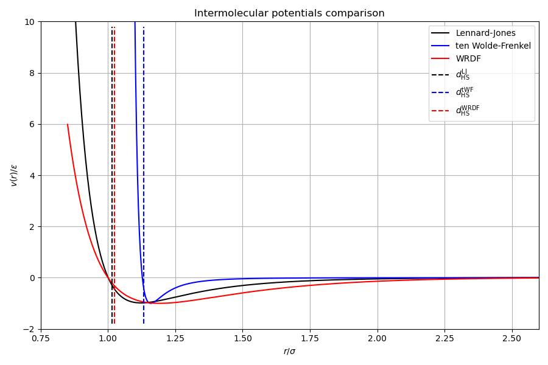
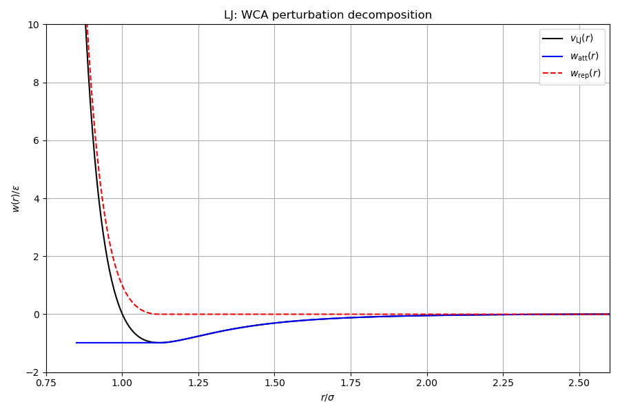
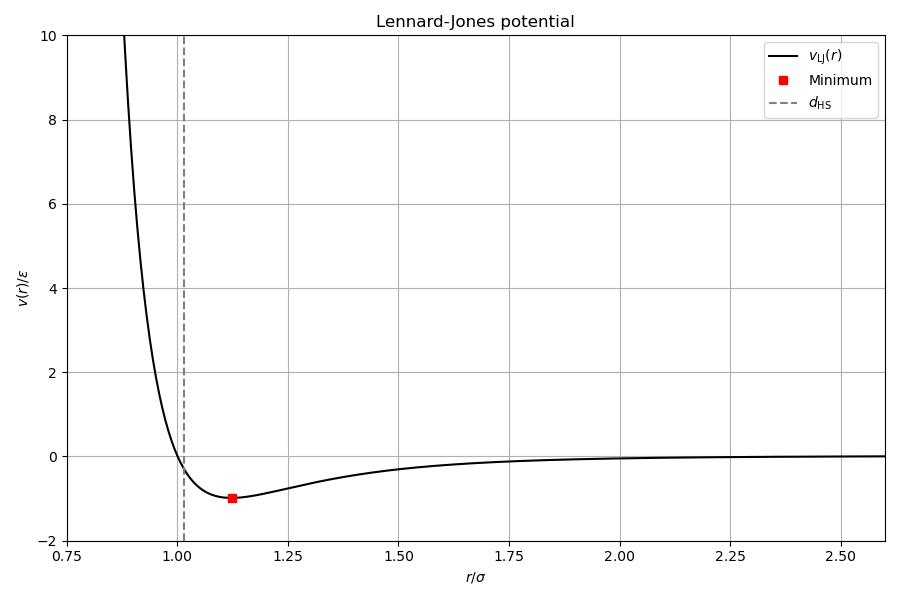

# Potentials

## Overview

This example evaluates the three pair interaction potentials provided by the
library, demonstrates the Weeks-Chandler-Andersen (WCA) perturbation theory
decomposition, and computes derived thermodynamic quantities: the
Barker-Henderson hard-sphere diameter and the van der Waals integral.

Every quantity is cross-validated against the original classicalDFT
(`Potential1.h`, `Potential.cpp`).

## Pair interaction potentials

Classical DFT treats the interaction between particles as a spherically
symmetric pair potential $v(r)$, where $r$ is the inter-particle distance.
A cutoff distance $r_c$ truncates the interaction for computational
efficiency. The shifted potential is

$$
v_{\text{shifted}}(r) = \begin{cases}
v(r) - v(r_c), & r < r_c \\
0, & r \geq r_c
\end{cases}
$$

### Lennard-Jones (LJ)

The standard 12-6 Lennard-Jones potential:

$$
v_{\mathrm{LJ}}(r) = 4\varepsilon\left[\left(\frac{\sigma}{r}\right)^{12} - \left(\frac{\sigma}{r}\right)^{6}\right]
$$

where $\sigma$ is the particle diameter and $\varepsilon$ is the well depth.

Properties computed analytically:

| Quantity | Expression | Description |
|---|---|---|
| $r_{\min}$ | $2^{1/6}\sigma$ | Location of the potential minimum |
| $v(r_{\min})$ | $-\varepsilon$ | Minimum energy (before shift) |
| Hard core | $0$ | No hard core for LJ |

The $r^2$-form is also provided for efficiency in 3D codes (avoids the
square root):

$$
v_{\mathrm{LJ}}(r^2) = 4\varepsilon\left[\left(\frac{\sigma^2}{r^2}\right)^{6} - \left(\frac{\sigma^2}{r^2}\right)^{3}\right]
$$

### Ten Wolde-Frenkel (tWF)

The tWF potential has a hard core at $r = \sigma$ and a modified
functional form controlled by a steepness parameter $\alpha$:

$$
v_{\mathrm{tWF}}(r) = \begin{cases}
+\infty, & r < \sigma \\[4pt]
\displaystyle\frac{4\varepsilon}{\alpha^2}\left[\frac{1}{(s^2 - 1)^6} - \frac{\alpha}{(s^2 - 1)^3}\right], & r \geq \sigma
\end{cases}
$$

where $s = r/\sigma$. The potential minimum is at

$$
r_{\min} = \sigma\sqrt{1 + \left(\frac{2}{\alpha}\right)^{1/3}}
$$

For $\alpha = 50$ (the standard value), this gives a steep well similar
to LJ but with an exact hard core boundary.

The $r^2$-form replaces $s = r/\sigma$ with $s^2 = r^2/\sigma^2$:

$$
v_{\mathrm{tWF}}(r^2) = \frac{4\varepsilon}{\alpha^2}\left[\frac{1}{(s^2 - 1)^6} - \frac{\alpha}{(s^2 - 1)^3}\right]
\quad\text{where}\quad s^2 = r^2/\sigma^2
$$

### Wang-Ramirez-Dobnikar-Frenkel (WHDF)

A smooth short-range potential that vanishes identically at $r = r_c$
(no shift needed):

$$
v_{\mathrm{WHDF}}(r) = \varepsilon_{\text{eff}}\left(\frac{\sigma^2}{r^2} - 1\right)\left(\frac{r_c^2}{r^2} - 1\right)^2
$$

where the rescaled strength is

$$
\varepsilon_{\text{eff}} = 2\varepsilon\left(\frac{r_c}{\sigma}\right)^2\left[\frac{2}{3}\left(\left(\frac{r_c}{\sigma}\right)^2 - 1\right)\right]^{-3}
$$

The minimum is at

$$
r_{\min} = r_c\left[\frac{1 + 2(r_c/\sigma)^2}{3}\right]^{-1/2}
$$

This potential has $v(r_c) = 0$ exactly, so no shift correction is applied. No hard core.

## Perturbation theory decomposition

Perturbation theory splits the pair potential into a repulsive reference
part and an attractive perturbation tail:

$$
v(r) = v_{\mathrm{rep}}(r) + w_{\mathrm{att}}(r)
$$

The library supports two splitting schemes. Both are used in the literature
and produce different reference systems.

### Weeks-Chandler-Andersen (WCA)

WCA splits at the potential minimum $r_{\min}$:

$$
v_{\mathrm{rep}}^{\mathrm{WCA}}(r) = \begin{cases}
v(r) - v(r_{\min}), & r < r_{\min} \\
0, & r \geq r_{\min}
\end{cases}
$$

$$
w_{\mathrm{att}}^{\mathrm{WCA}}(r) = \begin{cases}
v(r_{\min}), & r < r_{\min} \\
v(r), & r_{\min} \leq r < r_c \\
0, & r \geq r_c
\end{cases}
$$

The repulsive part is purely positive and defines the hard-sphere reference.
The attractive tail is bounded: $w_{\mathrm{att}}(r) \leq v(r_{\min})$ for all $r$.

### Barker-Henderson (BH)

BH splits at the zero-crossing $r_0$ where $v(r_0) = 0$:

$$
v_{\mathrm{rep}}^{\mathrm{BH}}(r) = \begin{cases}
v(r), & r < r_0 \\
0, & r \geq r_0
\end{cases}
$$

$$
w_{\mathrm{att}}^{\mathrm{BH}}(r) = \begin{cases}
0, & r < r_0 \\
v(r), & r_0 \leq r < r_c \\
0, & r \geq r_c
\end{cases}
$$

The BH attractive tail is zero inside $r_0$, unlike WCA which has a flat
plateau. For LJ, $r_0 = \sigma$ and $r_{\min} \approx 1.122\sigma$.

## Barker-Henderson hard-sphere diameter

The effective hard-sphere diameter maps the soft repulsive potential onto
a hard-sphere reference via

$$
d_{\mathrm{HS}}(T) = r_{\mathrm{hc}} + \int_{r_{\mathrm{hc}}}^{r_{\mathrm{split}}}\left[1 - \exp\left(-\frac{v_{\mathrm{rep}}(r)}{k_BT}\right)\right]dr
$$

where $r_{\mathrm{hc}}$ is the hard-core radius (0 for LJ, $\sigma$ for tWF)
and $r_{\mathrm{split}}$ is the splitting point ($r_{\min}$ for WCA, $r_0$ for BH).

The integrand approaches 1 where $v_{\mathrm{rep}} \gg k_BT$ (hard core
regime) and 0 where $v_{\mathrm{rep}} \to 0$ (soft shell).

Implementation: Gauss-Legendre quadrature via GSL (adaptive, $\varepsilon_{\mathrm{abs}} = 10^{-12}$).

Temperature dependence:
- At low $T$, $d_{\mathrm{HS}} \to r_{\min}$ (the core is effectively hard).
- At high $T$, $d_{\mathrm{HS}} < r_{\min}$ (thermal energy softens the core).
- For the hard-core tWF potential, $d_{\mathrm{HS}} \geq \sigma$ always.

## Van der Waals integral

The mean-field attraction parameter integrates the attractive tail over
all space:

$$
a_{\mathrm{vdw}} = \frac{1}{k_BT}\int_0^{\infty} w_{\mathrm{att}}(r)\, 4\pi r^2\, dr
$$

In the mean-field approximation:
- Excess free energy density: $f_{\mathrm{mf}}(\rho) = \frac{1}{2}a_{\mathrm{vdw}}\rho^2$
- Excess chemical potential: $\mu_{\mathrm{mf}}(\rho) = a_{\mathrm{vdw}}\rho$
- Excess pressure: $P_{\mathrm{mf}}(\rho) = \frac{1}{2}a_{\mathrm{vdw}}\rho^2 k_BT$

The integral is evaluated numerically by midpoint-rule quadrature
over the interval $[r_{\mathrm{att,min}}, r_c]$ with $10^6$ points for
the analytical (continuum) reference value.

On a discrete grid with spacing $\Delta x$, the attraction weights
$w_{ij}$ are precomputed via sub-cell quadrature, and
$a_{\mathrm{vdw,grid}} = \sum_{ij} w_{ij} (\Delta x)^3 / k_BT$.
This discrete sum converges to the continuum value as $\Delta x \to 0$.

---

## Key library types

| Type | Header | Role |
|------|--------|------|
| `physics::potentials::Potential` | `dft/physics/potentials.hpp` | Type-erased pair potential with `evaluate(r)`, `hard_sphere_diameter(kT, split)`, `name()` |
| `SplitScheme` | `dft/physics/potentials.hpp` | Enum: `WeeksChandlerAndersen`, `BarkerHenderson` |

Factory functions `make_lennard_jones(sigma, epsilon, rcut)`,
`make_ten_wolde_frenkel(...)`, and `make_wang_ramirez_dobnikar_frenkel(...)`
return `Potential` objects. The `Potential` interface provides `evaluate(r)`,
`attractive_weight(r, kT, split)`, and `hard_sphere_diameter(kT, split)` via
the Barker-Henderson integral.

---

## Step-by-step code walkthrough

### Step 1: Create potentials via factory functions

Three pair potentials are constructed using the library's factory functions:

```cpp
namespace pot = physics::potentials;
auto lj = pot::make_lennard_jones(1.0, 1.0, 2.5);
auto twf = pot::make_ten_wolde_frenkel(1.0, 1.0, -1.0);
auto wrdf = pot::make_wang_ramirez_dobnikar_frenkel(1.0, 1.0, 3.0);
```

Each factory returns a type-erased `Potential` object with methods `energy(r)`,
`attractive(r, split)`, `repulsive(r, split)`, `hard_sphere_diameter(kT, split)`,
and `vdw_integral(kT, split)`.

### Step 2: Evaluate potentials on a radial grid

All three potentials are sampled on 500 points from $r = 0.85\sigma$ to
$r = 2.6\sigma$:

```cpp
for (arma::uword i = 0; i < r_arma.n_elem; ++i) {
    v_lj_a(i) = pot::energy(plj, r_arma(i));
    v_twf_a(i) = pot::energy(ptwf, r_arma(i));
    v_wrdf_a(i) = pot::energy(pwrdf, r_arma(i));
}
```

### Step 3: WCA decomposition of the LJ potential

The LJ potential is split into its repulsive core and attractive tail under
WCA splitting:

```cpp
att_lj_a(i) = pot::attractive(plj, r_arma(i), pot::SplitScheme::WeeksChandlerAndersen);
rep_lj_a(i) = pot::repulsive(plj, r_arma(i), pot::SplitScheme::WeeksChandlerAndersen);
```

The identity $v(r) = v_0(r) + w_{\mathrm{att}}(r)$ is satisfied at every point.

### Step 4: Hard-sphere diameters

The Barker-Henderson integral is evaluated for each potential at $kT = 1$:

```cpp
double d_lj = plj.hard_sphere_diameter(kT, pot::SplitScheme::WeeksChandlerAndersen);
double d_twf = ptwf.hard_sphere_diameter(kT, pot::SplitScheme::WeeksChandlerAndersen);
double d_wrdf = pwrdf.hard_sphere_diameter(kT, pot::SplitScheme::WeeksChandlerAndersen);
```

The integration uses GSL adaptive quadrature (QAGS) to $\varepsilon_{\mathrm{abs}} = 10^{-12}$.

### Step 5: Van der Waals integral

The analytical vdW parameter $a_{\mathrm{vdw}} = 2\int w_{\mathrm{att}}(r)\,4\pi r^2\,dr$
is computed:

```cpp
double a_lj = plj.vdw_integral(kT, pot::SplitScheme::WeeksChandlerAndersen);
```

This value enters the mean-field free energy functional as
$F_{\mathrm{mf}} = \frac{1}{2}a_{\mathrm{vdw}}\int\rho^2\,d\mathbf{r}$
in the bulk limit and as the normalisation of the convolution kernel in the
inhomogeneous case.

---

## Cross-validation (`check/`)

The `check/main.cpp` program compares every computed quantity against the
original classicalDFT implementation (`Potential1.h`, `Potential.cpp`).

| Category | Quantities compared | Tolerance |
|---|---|---|
| Derived constants | shift, $r_{\min}$, $V_{\min}$, $r_0$, hard-core diameter | $10^{-10}$ |
| Raw potential $v(r)$ | 50 radial points for LJ, tWF, WHDF | $10^{-10}$ |
| $r^2$-form $v(r^2)$ | Same radial points, all three potentials | $10^{-10}$ |
| Repulsive part $v_0(r)$ | 50 radial points, WCA splitting | $10^{-10}$ |
| Attractive tail $w_{\mathrm{att}}(r)$ | 50 radial points, WCA and BH | $10^{-10}$ |
| HSD $d_{\mathrm{HS}}(T)$ | $kT = 0.5, 0.7, 1.0, 1.5, 2.0$, all potentials | $10^{-4}$ |
| VDW $a_{\mathrm{vdw}}(T)$ | $kT = 0.5, 0.7, 1.0, 1.5, 2.0$, WCA | $10^{-4}$ |

The HSD and VDW tolerances are $10^{-4}$ because our code uses GSL adaptive
quadrature while the legacy code uses midpoint-rule with $10^6$ points. Both
converge to the same value, but from different directions: the midpoint rule
has $O(h^2)$ truncation error while GSL QAGS achieves $\varepsilon_{\mathrm{abs}} = 10^{-12}$.

## Build and run

```bash
make run        # Docker
make run-local  # local build
make run-checks # cross-validation against legacy code
```

## Output

### Potentials comparison

All three potentials on the same axes: LJ, tWF, and WRDF.



### WCA perturbation decomposition

The LJ potential split into its WCA attractive and repulsive contributions.



### LJ potential with hard-sphere diameter

The LJ potential with the Barker-Henderson $d_\mathrm{HS}$ marked as a
vertical dashed line.


