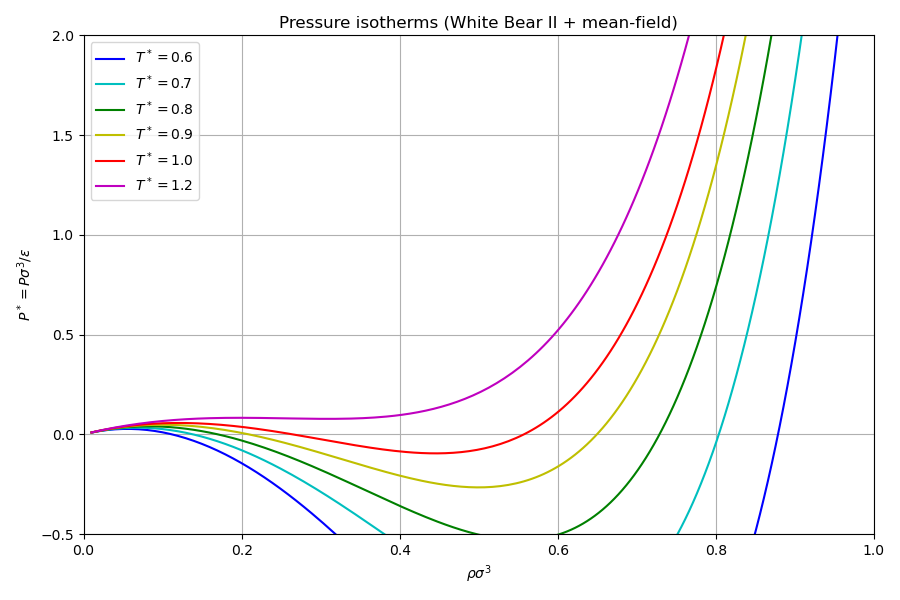
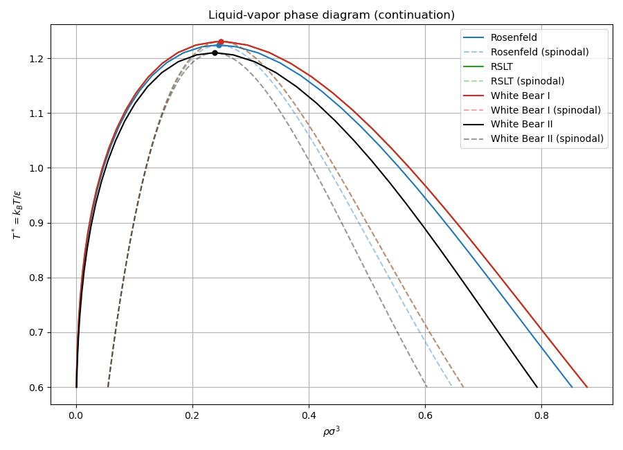
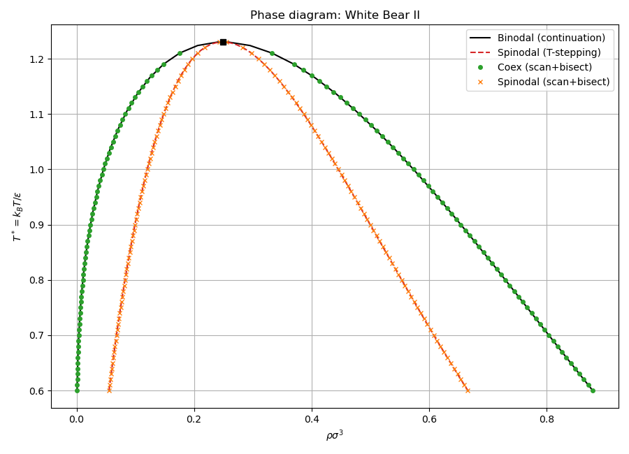

# Solver: phase diagram computation

## Physical background

A fluid with attractive interactions undergoes a first-order liquid-vapor
phase transition below a critical temperature $T_c$. The phase diagram is
the collection of coexistence (binodal) and mechanical instability (spinodal)
curves in the $(\rho, T)$ plane.

### Pressure and the van der Waals loop

The pressure of the mean-field DFT fluid is:

$$
P(\rho, T) = \rho k_BT\left[1 + \rho\,\phi_{\mathrm{ex}}'(\rho)\right]
$$

where $\phi_{\mathrm{ex}}(\rho) = f_{\mathrm{HS}}(\eta) + \tfrac{1}{2}a_{\mathrm{vdw}}\rho$
is the total excess free energy per particle (hard-sphere plus mean-field attraction).

Below $T_c$, the $P(\rho)$ isotherm displays a van der Waals loop with a
local maximum and minimum, signalling phase coexistence. Between the two
extrema lies the mechanically unstable region where $\partial P/\partial\rho < 0$.

### Spinodal

The spinodal curve marks the boundary of mechanical stability:

$$
\left.\frac{\partial P}{\partial \rho}\right|_{T} = 0
$$

The library finds the spinodal densities by scanning $\rho$ for sign changes
in $\partial P/\partial\rho$ and refining by bisection.

### Coexistence (binodal)

The coexistence (binodal) curve satisfies the equal-pressure and
equal-chemical-potential conditions simultaneously:

$$
P(\rho_v, T) = P(\rho_l, T), \qquad \mu(\rho_v, T) = \mu(\rho_l, T)
$$

where $\rho_v$ and $\rho_l$ are the vapor and liquid coexistence densities.
This is equivalent to the Maxwell equal-area construction on the van der
Waals loop. The library solves this system via Newton iteration with
bisection fallback.

### Pseudo-arclength continuation

To trace the full binodal curve including the critical point, the library
uses pseudo-arclength continuation. Starting from a low-temperature
coexistence point, the curve is parameterised by arclength $s$:

$$
\frac{d}{ds}\begin{pmatrix}\rho_v \\ \rho_l \\ T\end{pmatrix}
$$

with the tangent predictor and Newton corrector. This naturally handles the
turning point (pitchfork bifurcation) at $T_c$ where the binodal curve folds.

### Critical point

At the critical point, the spinodal and binodal curves meet. The critical
temperature $T_c$ and density $\rho_c$ satisfy:

$$
\frac{\partial P}{\partial\rho} = 0, \qquad \frac{\partial^2 P}{\partial\rho^2} = 0
$$

The continuation algorithm automatically identifies $T_c$ as the point where
$\rho_v \to \rho_l$.

---

## Step-by-step code walkthrough

### Step 1: Define the Lennard-Jones system

The model is declared as a single `physics::Model` struct with all physical
parameters:

```cpp
physics::Model model{
    .grid = make_grid(0.1, {6.0, 6.0, 6.0}),
    .species = {Species{.name = "LJ", .hard_sphere_diameter = 1.0}},
    .interactions = {{
        .species_i = 0,
        .species_j = 0,
        .potential = physics::potentials::make_lennard_jones(1.0, 1.0, 2.5),
        .split = physics::potentials::SplitScheme::WeeksChandlerAndersen,
    }},
    .temperature = 1.0,
};
```

The grid is $60^3$ ($\Delta x = 0.1\sigma$, $L = 6\sigma$). The single
species is a Lennard-Jones particle with $\sigma = 1$, $\varepsilon = 1$,
$r_c = 2.5\sigma$, split via WCA.

### Step 2: Configure the phase search

The `PhaseSearch` struct controls the single-temperature coexistence solver
(scan + bisection method):

```cpp
functionals::bulk::PhaseSearch config{
    .rho_max = 1.0,
    .rho_scan_step = 0.005,
    .newton = {.max_iterations = 300, .tolerance = 1e-10},
};
```

This scans the density range $[0, 1]$ in steps of $0.005$ looking for
$\partial P/\partial\rho = 0$ (spinodal) and then bisects to find equal-$P$
equal-$\mu$ (coexistence).

### Step 3: Build the temperature-dependent EoS factory

The `make_eos_factory` function creates a lambda that, given a temperature,
constructs a `BulkThermodynamics` object with the correct analytical
$a_{\mathrm{vdw}}$:

```cpp
auto wb2_eos_factory = functionals::bulk::make_eos_factory(
    functionals::fmt::WhiteBearII{}, model.species, model.interactions);
```

This factory is used both for the pressure isotherms (step 4) and the
continuation (step 6). Internally it calls `make_bulk_weights(fmt_model,
interactions, kT)` at each temperature, which computes the analytical
$a_{\mathrm{vdw}}(T)$ from the potential's attractive tail.

### Step 4: Pressure isotherms

At 6 temperatures ($T^* = 0.6, 0.7, 0.8, 0.9, 1.0, 1.2$), the code
evaluates $P(\rho)$ on a 200-point density grid:

```cpp
std::vector<double> isotherm_temps = {0.6, 0.7, 0.8, 0.9, 1.0, 1.2};
arma::vec rho_grid = arma::linspace(0.01, 1.0, 200);

for (std::size_t t = 0; t < isotherm_temps.size(); ++t) {
    double kT = isotherm_temps[t];
    auto eos = wb2_eos_factory(kT);
    for (arma::uword i = 0; i < rho_grid.n_elem; ++i) {
        p_vec[i] = eos.pressure(arma::vec{rho_grid(i)});
    }
}
```

Sub-critical isotherms ($T^* < T_c \approx 1.2$) exhibit the characteristic
van der Waals loop; above $T_c$ the pressure is monotonically increasing.

### Step 5: Define FMT model variants

Four FMT models are compared. Each is identified by a `(name, FMTModel)` pair:

```cpp
std::vector<std::pair<std::string, functionals::fmt::FMTModel>> fmt_models = {
    {"Rosenfeld", functionals::fmt::Rosenfeld{}},
    {"RSLT", functionals::fmt::RSLT{}},
    {"White Bear I", functionals::fmt::WhiteBearI{}},
    {"White Bear II", functionals::fmt::WhiteBearII{}},
};
```

The `FMTModel` wrapper class holds a `std::variant` internally, hiding the
polymorphic dispatch from the caller.

### Step 6: Trace binodal and spinodal via continuation

For each FMT model, the code builds a temperature-dependent EoS factory and
calls `PhaseDiagramBuilder::binodal()` (pseudo-arclength continuation) and
`PhaseDiagramBuilder::spinodal_curve()` (temperature stepping with bisection):

```cpp
functionals::bulk::PhaseDiagramBuilder pd_config{
    .start_temperature = 0.6,
    .search = config,
};

for (const auto& [name, fmt_model] : fmt_models) {
    auto eos_at = functionals::bulk::make_eos_factory(
        fmt_model, model.species, model.interactions);

    auto b = pd_config.binodal(eos_at);        // pseudo-arclength continuation
    auto s = pd_config.spinodal_curve(eos_at);  // T-stepping with bisection
}
```

**`binodal()`** internally calls `trace_coexistence()`, which parametrises the
curve by arc length and solves the system $R = (P_v - P_l, \mu_v - \mu_l) = 0$
using a tangent predictor and Newton corrector. It stops when the density gap
$|\rho_v - \rho_l|$ drops below `density_gap_tolerance` or the temperature
turns around (past $T_c$).

**`spinodal_curve()`** steps in temperature from `start_temperature` upward,
solving $\partial P/\partial\rho = 0$ by bisection at each $T$, with adaptive
step refinement as the gap closes near $T_c$.

### Step 7: Print coexistence tables

The White Bear II binodal and spinodal data are printed as formatted tables
of $T^*, \rho_v, \rho_l$ (binodal) and $T^*, \rho_{\mathrm{low}},
\rho_{\mathrm{high}}$ (spinodal).

### Step 8: Spline interpolation of phase boundaries

A `PhaseDiagram` object is assembled from the binodal and spinodal curves.
Its `interpolate(T)` method uses cubic spline interpolation to evaluate
phase boundaries at arbitrary temperatures:

```cpp
functionals::bulk::PhaseDiagram wb2_pd{
    .binodal = { .temperature = ..., .rho_vapor = ..., .rho_liquid = ... },
    .spinodal = { .temperature = ..., .rho_low = ..., .rho_high = ... },
    .critical_temperature = ...,
};

auto pb = wb2_pd.interpolate(T);
// pb.binodal_vapor, pb.binodal_liquid, pb.spinodal_low, pb.spinodal_high
```

This is useful for looking up coexistence densities at a working temperature
without rerunning the solver.

### Step 9: Cross-validate against the single-temperature method

The code computes single-temperature coexistence and spinodal points at
many temperatures ($\Delta T = 0.01$, from $T^* = 0.60$ up to $T_c + 0.02$)
using `PhaseSearch::find_coexistence()` and `PhaseSearch::find_spinodal()`:

```cpp
for (double kT = 0.60; kT <= Tc_wb2 + 0.02; kT += 0.01) {
    auto eos = wb2_eos_factory(kT);
    auto sp = config.find_spinodal(eos);      // single-T spinodal
    auto coex = config.find_coexistence(eos);  // single-T coexistence
}
```

These produce two data sets — coexistence points (green circles on the plot)
and spinodal points (orange crosses) — that should lie exactly on top of the
continuation curves at temperatures well below $T_c$. Near the critical point,
the single-temperature method fails because the density gap becomes too small
for bisection, while the continuation curves extend smoothly through $T_c$.

**Key insight**: the continuation method is more robust near $T_c$ because it
parametrises by arc length rather than temperature. The single-temperature
method fails when the spinodal gap collapses and the $\Delta P$ landscape
becomes flat.

---

## Cross-validation (`check/`)

| Step | Category | Method (ours) | Method (Jim's) | Grid | Tolerance |
|------|----------|--------------|----------------|------|-----------|
| 1-3 | Spinodal $\rho_{\mathrm{low}}, \rho_{\mathrm{high}}$ | Bisection on $\partial P/\partial\rho$ sign | Golden section on $P(\rho)$ extrema | $kT = 0.7, 0.8, 0.9$ | $10^{-6}$ |
| 4-6 | Coexistence $\rho_v, \rho_l$ | Newton on equal-$\mu$ | Bisection on $\Delta P$ | $kT = 0.7, 0.8, 0.9$ | $10^{-6}$ |
| 7 | Binodal curve | Pseudo-arclength continuation | Point-by-point findCoex | 3 interior temperatures | $10^{-4}$ |
| 7 | Critical point $T_c$ | Continuation endpoint | N/A | single | $T_c \in [1.0, 1.5]$ |
| 7 | Density gap at $T_c$ | $|\rho_v - \rho_l|$ at end | N/A | single | $< 0.05$ |

Both methods verify thermodynamic consistency: $|P_v - P_l| < 10^{-10}$ and
$|\mu_v - \mu_l| < 10^{-10}$ at every coexistence point.

## Build and run

```bash
make run        # Docker
make run-local  # local build
make run-checks # cross-validation against Jim's code
```

## Output

### Pressure isotherms

Six isotherms from $T^* = 0.6$ (deep sub-critical, large van der Waals loop)
to $T^* = 1.2$ (above critical, monotonic).



### Phase diagram (all FMT models)

Binodal (solid) and spinodal (dashed, transparent) curves for all four FMT
models, with critical points marked.



### Phase diagram (White Bear II)

Binodal (black solid) and spinodal (red dashed) from continuation, with
single-temperature coexistence points (green circles) and spinodal points
(orange crosses) overlaid. The continuation curves extend smoothly through
$T_c$ while the point-by-point method fails a few steps below the critical
temperature.


