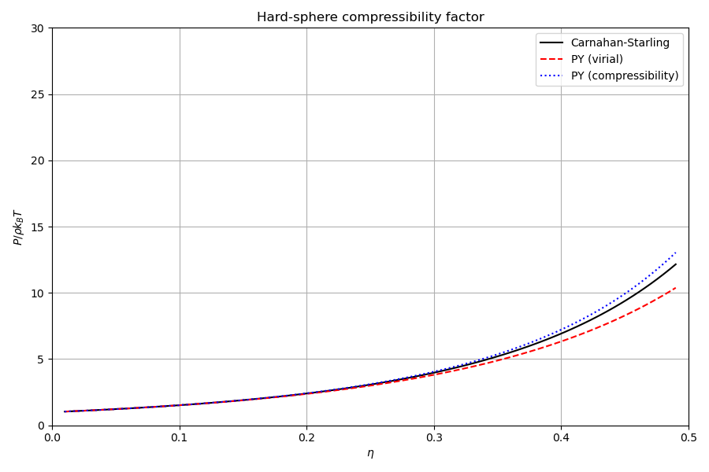
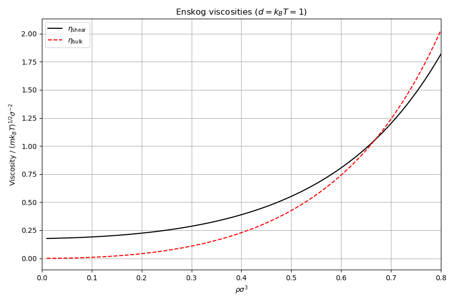

# Thermodynamics

## Overview

This example evaluates hard-sphere equations of state, Enskog transport
coefficients, and full Lennard-Jones equations of state (Johnson-Zollweg-Gubbins
and Mecke). All quantities are cross-validated against Jim Lutsko's
classicalDFT (`Enskog.h`, `EOS.h`).

## Hard-sphere equations of state

The packing fraction is $\eta = \pi\rho d^3/6$ where $\rho$ is the number
density and $d$ is the hard-sphere diameter.

### Percus-Yevick compressibility route (PYc)

The excess free energy per particle from the Ornstein-Zernike equation
closed with the PY approximation, integrated via the compressibility route:

$$
f_{\mathrm{ex}}^{\mathrm{PYc}}(\eta) = -\ln(1-\eta) + \frac{3\eta(2 - \eta)/2}{(1-\eta)^2}
$$

Derivatives with respect to density $\rho$ (where $d\eta/d\rho = \pi d^3/6$):

$$
\frac{df_{\mathrm{ex}}^{\mathrm{PYc}}}{d\rho} = \frac{\pi d^3}{6}\,\frac{4 - 2\eta + \eta^2}{(1-\eta)^3}
$$

$$
\frac{d^2 f_{\mathrm{ex}}^{\mathrm{PYc}}}{d\rho^2} = \left(\frac{\pi d^3}{6}\right)^2\frac{10 - 2\eta + \eta^2}{(1-\eta)^4}
$$

$$
\frac{d^3 f_{\mathrm{ex}}^{\mathrm{PYc}}}{d\rho^3} = \left(\frac{\pi d^3}{6}\right)^3\frac{38 - 4\eta + 2\eta^2}{(1-\eta)^5}
$$

The compressibility factor is

$$
Z^{\mathrm{PYc}} = \frac{1 + \eta + \eta^2}{(1-\eta)^3}
$$

and the chemical potential $\mu^{\mathrm{PYc}} = f^{\mathrm{PYc}} + Z^{\mathrm{PYc}}$
where $f^{\mathrm{PYc}} = \ln\rho - 1 + f_{\mathrm{ex}}^{\mathrm{PYc}}$.

### Percus-Yevick virial route (PYv)

The PY virial route gives a different compressibility factor:

$$
Z^{\mathrm{PYv}} = \frac{1 + 2\eta + 3\eta^2}{(1-\eta)^2}
$$

and excess free energy:

$$
f_{\mathrm{ex}}^{\mathrm{PYv}}(\eta) = 2\ln(1-\eta) + \frac{6\eta}{1-\eta}
$$

### Carnahan-Starling (CS)

The arithmetic mean of PYc and PYv compressibility factors:

$$
f_{\mathrm{ex}}^{\mathrm{CS}}(\eta) = \frac{4\eta - 3\eta^2}{(1-\eta)^2}
$$

$$
\frac{df_{\mathrm{ex}}^{\mathrm{CS}}}{d\rho} = \frac{\pi d^3}{6}\,\frac{4 - 2\eta}{(1-\eta)^3}
$$

$$
\frac{d^2 f_{\mathrm{ex}}^{\mathrm{CS}}}{d\rho^2} = \left(\frac{\pi d^3}{6}\right)^2\frac{10 - 4\eta}{(1-\eta)^4}
$$

$$
\frac{d^3 f_{\mathrm{ex}}^{\mathrm{CS}}}{d\rho^3} = \left(\frac{\pi d^3}{6}\right)^3\frac{36(3-\eta)}{(1-\eta)^5}
$$

$$
Z^{\mathrm{CS}} = \frac{1 + \eta + \eta^2 - \eta^3}{(1-\eta)^3}
$$

### Gibbs-Duhem consistency

For any thermodynamically consistent EOS, the identity

$$
\mu = f + \frac{P}{\rho k_BT}
$$

must hold. This is verified explicitly for CS at $\eta = 0.3$.

## Enskog transport coefficients

The Enskog theory gives transport properties of hard-sphere fluids from
the contact value of the pair correlation function:

$$
\chi(\eta) = \frac{1 - \eta/2}{(1-\eta)^3}
$$

The four transport coefficients implemented (from `Enskog.h`):

- **Shear viscosity** $\eta_s$: resistance to shear flow
- **Bulk viscosity** $\zeta$: resistance to compression/expansion
- **Thermal conductivity** $\lambda$: heat transport
- **Sound damping** $\Gamma$: acoustic wave attenuation

Each depends on $\rho$ and $\chi$ through closed-form expressions from
kinetic theory (Chapman-Enskog expansion to first order).

## Lennard-Jones equations of state

### Johnson-Zollweg-Gubbins (JZG)

A modified Benedict-Webb-Rubin EOS with 32 fitted coefficients.
The excess free energy per particle divided by $k_BT$:

$$
\phi_{\mathrm{ex}}^{\mathrm{JZG}}(\rho, T) = \sum_{i=1}^{8} \frac{a_i(T)}{i}\rho^i + \sum_{i=1}^{6} b_i(T)\,G_i(\rho) + \Delta a \cdot \rho
$$

where the temperature-dependent coefficients $a_i(T)$ are polynomials in
$1/T$ and $\sqrt{T}$, and $G_i(\rho)$ are Gaussian density integrals:

$$
G_1(\rho) = \frac{1 - e^{-\gamma\rho^2}}{2\gamma}, \quad
G_{i+1}(\rho) = -\frac{e^{-\gamma\rho^2}\rho^{2i} - 2i\,G_i(\rho)}{2\gamma}
$$

with $\gamma = 3$. The long-range correction is $\Delta a = -(32\pi/9)(r_c^{-9} - 1.5\,r_c^{-3})$.

The first and second derivatives are:

$$
\phi_{\mathrm{ex}}'(\rho) = \sum_{i=1}^{8} a_i(T)\,\rho^{i-1} + e^{-\gamma\rho^2}\sum_{i=1}^{6} b_i(T)\,\rho^{2i-1} + \Delta a
$$

$$
\phi_{\mathrm{ex}}''(\rho) = \sum_{i=2}^{8} a_i(T)(i-1)\rho^{i-2} + e^{-\gamma\rho^2}\sum_{i=1}^{6} b_i(T)\left[(2i-1)\rho^{2i-2} - 2\gamma\rho^{2i}\right]
$$

The 32 coefficients $x_1, \ldots, x_{32}$ define the $a_i(T)$ and $b_i(T)$
functions. These are the values from Johnson, Zollweg, and Gubbins,
Mol. Phys. 78, 591 (1993). The code implements them verbatim from Jim's `EOS.h`.

### Mecke

An alternative LJ EOS parameterisation using reduced variables
$\rho^* = \rho/\rho_c$ and $T^* = T/T_c$ with $\rho_c = 0.3107$
and $T_c = 1.328$.

$$
\phi_{\mathrm{ex}}^{\mathrm{Mecke}} = f_{\mathrm{HS}}(\rho^*, T^*) + \sum_{i=0}^{31} c_i\,(T^*)^{m_i}\,(\rho^*)^{n_i}\,\exp\bigl[p_i\,(\rho^*)^{q_i}\bigr] + \Delta a\,\rho/k_BT
$$

where $f_{\mathrm{HS}}$ is a mapping of $\rho^*$ and $T^*$ to an effective
hard-sphere packing fraction, and $c_i, m_i, n_i, p_i, q_i$ are tabulated
constants from Mecke et al., Int. J. Thermophys. 17, 391 (1996).

## What the code does

1. Evaluates $Z(\eta)$ for CS, PYv, and PYc at 30 packing fractions ($\eta = 0.05$ to $0.49$).
2. Verifies Gibbs-Duhem consistency $\mu - f - P/(\rho kT) = 0$ for CS at $\eta = 0.3$.
3. Evaluates Enskog transport coefficients at 8 densities ($\rho = 0.1$ to $0.8$).
4. Evaluates pressure isotherms at $kT = 1.5$ for ideal gas, PY, JZG, and Mecke.

## Cross-validation (`check/`)

| Category | Quantities | Grid | Tolerance |
|---|---|---|---|
| PYc derivatives | $f_{\mathrm{ex}}, f', f'', f'''$ | 9 densities | $10^{-10}$ |
| CS derivatives | $f_{\mathrm{ex}}, f', f'', f'''$ | 9 densities | $10^{-10}$ |
| PYc bulk | $P/(\rho kT), \mu/kT$ | 9 densities | $10^{-10}$ |
| JZG coefficients | $a_i(T)$, $b_i(T)$, $G_i(\rho)$ | 4 temperatures, 5 densities | $10^{-10}$ |
| JZG thermodynamics | $\phi_{\mathrm{ex}}, \phi', \phi''$ | 4 temperatures, 5 densities | $10^{-10}$ |
| Mecke thermodynamics | $\phi_{\mathrm{ex}}, \phi'$ | 4 temperatures, 5 densities | $10^{-7}$ |
| Bulk $\mu$ and $P$ | Full JZG model | All temp/density combinations | $10^{-10}$ |

## Build and run

```bash
make run        # Docker
make run-local  # local build
make run-checks # cross-validation against Jim's code
```

## Output

### Hard-sphere compressibility factor

CS, PY-virial, and PY-compressibility routes plotted against packing fraction.



### Enskog viscosities

Shear and bulk viscosity as a function of density.


