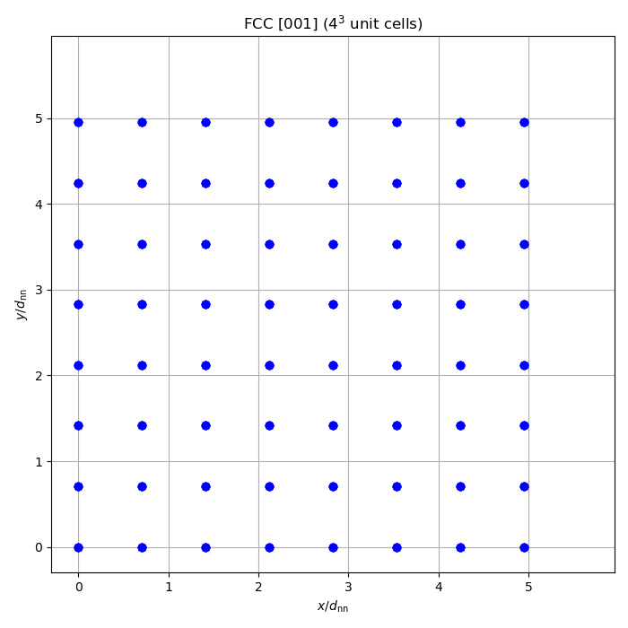
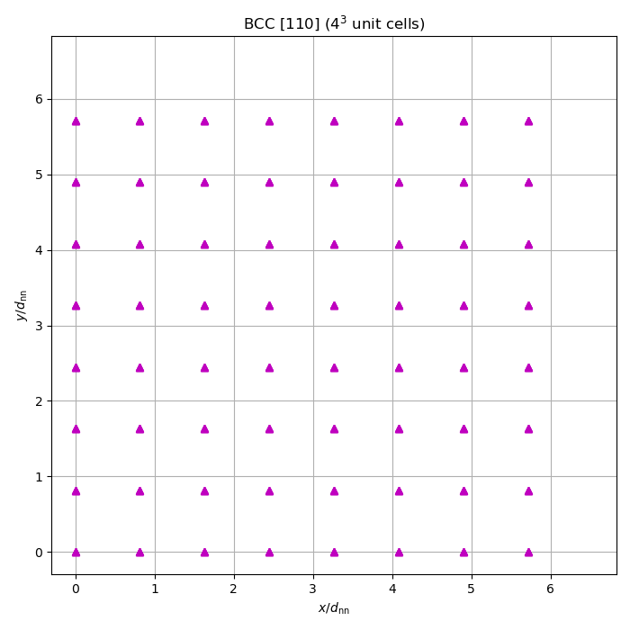
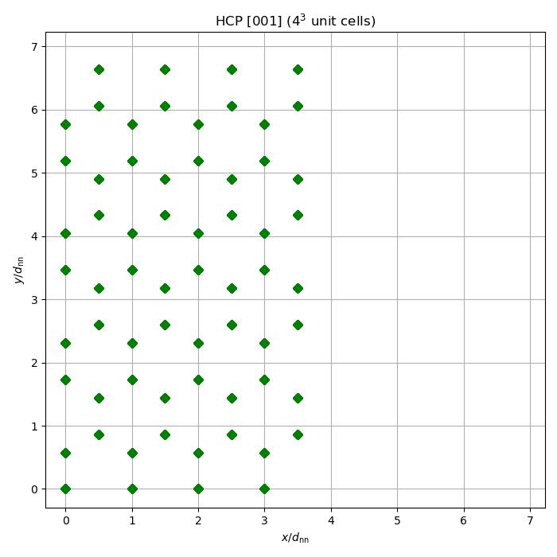

# Crystal: lattice generation and export

Builds crystal lattices (BCC, FCC, HCP) with various orientations, scales
positions to physical coordinates, and exports to XYZ and CSV formats.

## What this example does

1. **Unit cell survey**: iterates over all structure/orientation combinations
   (BCC, FCC, HCP with [001], [010], [100], [110], [111]) and prints the number
   of atoms and box dimensions for a single unit cell.

2. **Replication**: builds a $4^3$ replicated FCC [001] lattice (256 atoms)
   and prints its dimensions.

3. **Position scaling**: demonstrates uniform scaling (nearest-neighbour
   distance $d_{nn} = 3.5$) and anisotropic scaling (box $10 \times 10 \times 10$)
   of a $2^3$ BCC lattice.

4. **Export**: writes the replicated FCC lattice to XYZ and CSV formats.

5. **Plots**: produces xy-projection scatter plots of FCC, BCC, and HCP lattices.

## Key API functions used

| Function | Purpose |
|----------|---------|
| `build_lattice()` | create a (replicated) lattice |
| `scaled_positions()` | scale to physical coordinates |
| `export_lattice()` | write to XYZ or CSV |

## Build and run

```bash
make run
```

## Output

### FCC [001] xy-projection



### BCC [110] xy-projection



### HCP [001] xy-projection



### Data files

- `exports/fcc_4x4x4.xyz` — XYZ lattice file
- `exports/fcc_4x4x4.csv` — CSV lattice file
