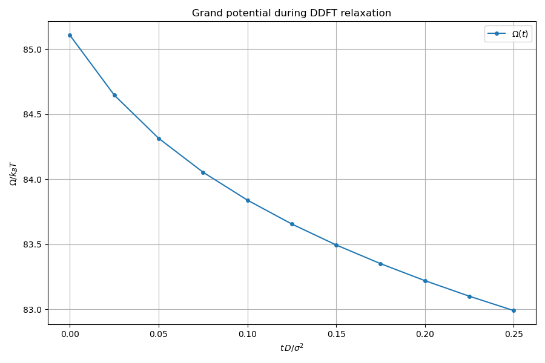

# Density: DFT + DDFT liquid slab relaxation

The flagship example of the library. Demonstrates the complete classical DFT
workflow from model definition through bulk thermodynamics to DDFT relaxation
of an inhomogeneous density profile toward equilibrium.

## What this example does

1. **Model definition**: a Lennard-Jones fluid at $T^* = 0.7$ on a $40 \times 20 \times 20$
   periodic grid ($\Delta x = 0.25\sigma$), with WCA perturbation splitting and
   White Bear II FMT.

2. **Bulk thermodynamics**: evaluates the free energy density $f(\rho)$,
   chemical potential $\mu(\rho)$, and pressure $P(\rho)$ on a 200-point
   density grid using the bulk weights API.

3. **Coexistence**: finds the liquid-vapor coexistence densities
   $\rho_v$ and $\rho_l$ at the working temperature via the Newton-based
   solver in `find_coexistence()`.

4. **Liquid slab initial profile**: constructs a planar liquid slab
   profile using symmetric `tanh` interfaces. Evaluates the full DFT
   functional (free energy, grand potential, forces) at this initial state.

5. **DDFT relaxation**: runs 500 split-operator DDFT steps with the full
   DFT functional as the force function. The grand potential $\Omega$
   monotonically decreases as the profile relaxes toward the equilibrium
   planar interface. Mass is exactly conserved.

## Key API functions used

| Function | Purpose |
|----------|---------|
| `make_grid()` | create periodic DFT grid |
| `init::from_profile()` | state from arbitrary $\rho(r)$ |
| `functionals::make_bulk_weights()` | bulk (homogeneous) weight set |
| `functionals::make_weights()` | full FFT weight arrays |
| `functionals::total()` | evaluate free energy + grand potential + forces |
| `functionals::bulk::find_coexistence()` | liquid-vapor coexistence |
| `algorithms::ddft::split_operator_step()` | single DDFT time step |
| `algorithms::ddft::compute_k_squared()` | wavevector grid |
| `algorithms::ddft::diffusion_propagator()` | ideal diffusion kernel |

## Build and run

```bash
make run-local
```

## Output

### Pressure isotherm

The van der Waals loop in $P(\rho)$ is clearly visible, with the Maxwell
construction tie-line connecting the coexisting vapor and liquid densities.


### Free energy density

The double-well structure of $f(\rho)$ at sub-critical temperature.
The common tangent construction marks the coexisting phases.


### Chemical potential

$\mu(\rho)$ shows the non-monotonic (unstable) region between the spinodal
densities. The equal chemical potential condition defines coexistence.


### DDFT density evolution

The initial tanh slab profile (dashed) relaxes toward the equilibrium
density profile through DDFT dynamics. Intermediate snapshots show the
interface sharpening as the profile approaches the true DFT solution.


### Grand potential convergence

The grand potential $\Omega$ decreases monotonically during DDFT relaxation,
confirming the thermodynamic consistency of the dynamics.


