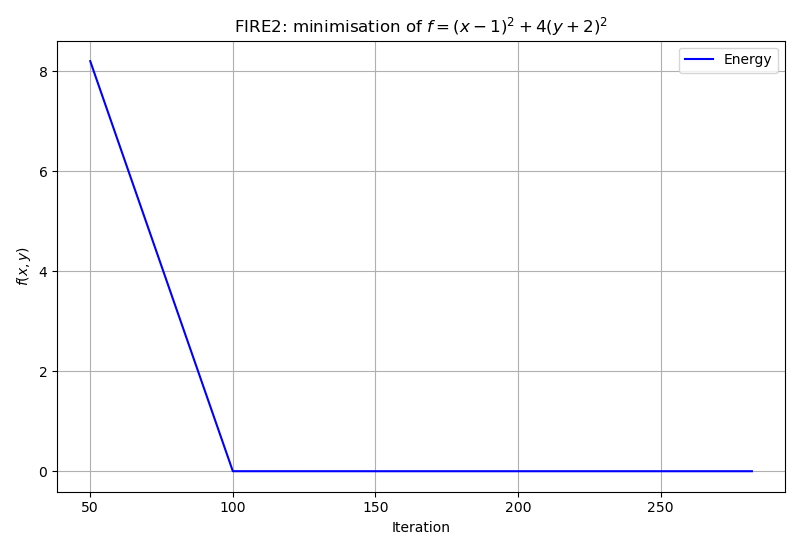
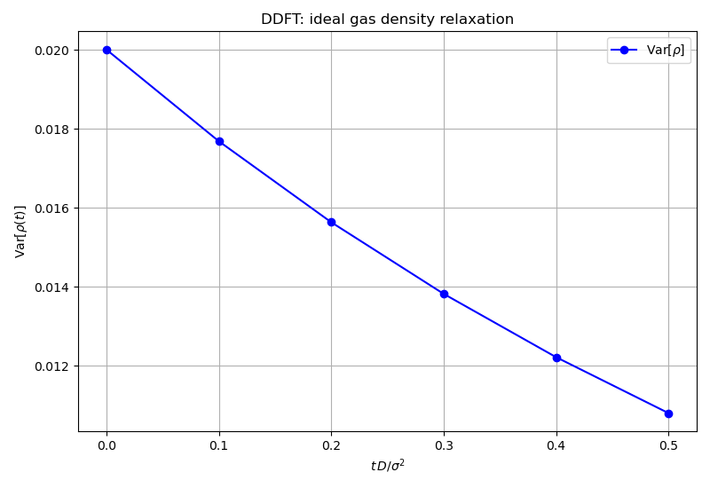
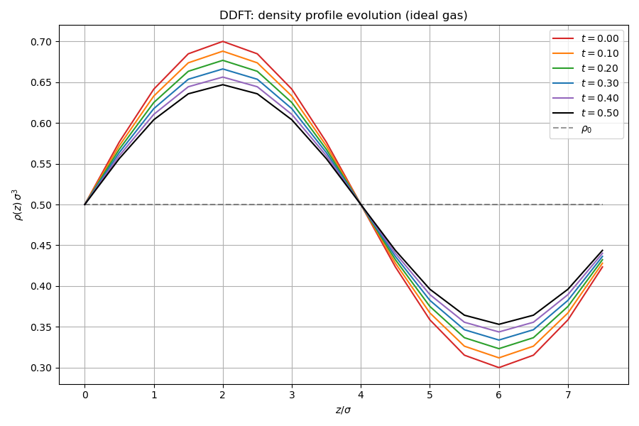

# Dynamics: minimisation and time evolution

Demonstrates two algorithm modules for density optimisation and dynamic
evolution.

## What this example does

### FIRE2 minimiser

Minimises a 2D quadratic $f(x,y) = (x-1)^2 + 4(y+2)^2$ using the FIRE2
algorithm from `algorithms::fire`. Shows both the one-shot `minimize()` API
and the step-by-step `initialize()` + `step()` loop for convergence logging.

### Split-operator DDFT

Evolves a sinusoidal density perturbation
$\rho(z) = \rho_0 + A \sin(2\pi z / L)$ in an ideal gas toward equilibrium
($\rho = \rho_0$ everywhere) using the split-operator DDFT scheme from
`algorithms::ddft`. The density variance decays exponentially with the
diffusion rate, and mass is conserved to machine precision.

## Key API functions used

| Function | Purpose |
|----------|---------|
| `algorithms::fire::minimize()` | one-shot FIRE2 minimisation |
| `algorithms::fire::initialize()` | set up FIRE2 state for step-by-step iteration |
| `algorithms::fire::step()` | single FIRE2 iteration |
| `algorithms::ddft::compute_k_squared()` | FFT wave-vector magnitudes |
| `algorithms::ddft::diffusion_propagator()` | exact diffusion kernel in Fourier space |
| `algorithms::ddft::split_operator_step()` | one DDFT time step |
| `init::from_profile()` | state from arbitrary density profile |

## Build and run

```bash
make run
```

## Output

### FIRE2 energy convergence

Energy decays rapidly from the initial guess $(5, 5)$ toward the minimum at
$(1, -2)$.



### DDFT density variance decay

The variance of the density field decays exponentially as the sinusoidal
perturbation relaxes to the uniform equilibrium.



### DDFT density profile evolution

Snapshots of the 1D density profile $\rho(z)$ at successive times, showing
the sinusoidal perturbation flattening toward the equilibrium density
$\rho_0 = 0.5$.


