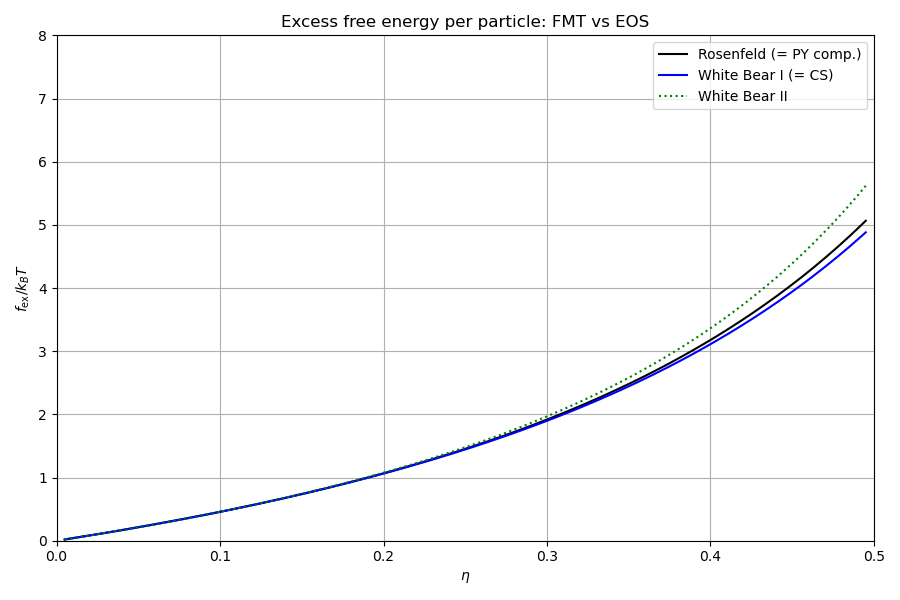
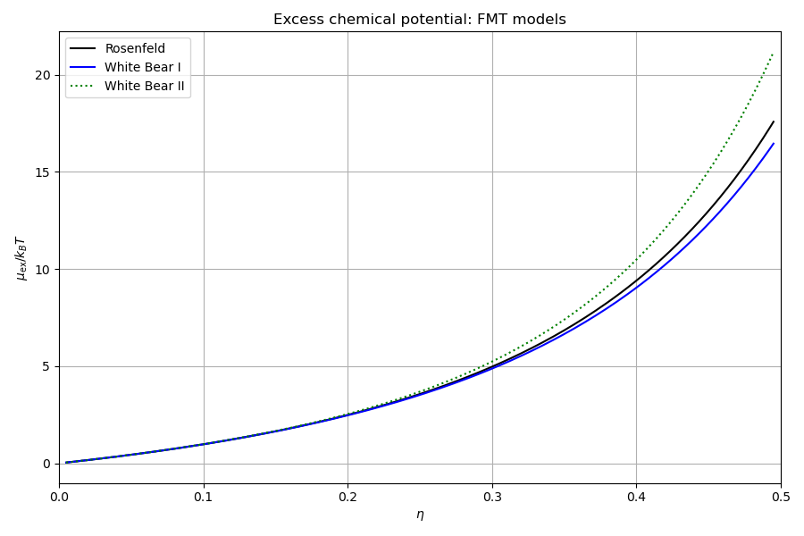

# FMT: fundamental measure theory comparison

Compares the four Fundamental Measure Theory models against exact hard-sphere
equations of state.

## What this example does

1. **Excess free energy**: evaluates $f_\mathrm{ex}(\eta)$ for Rosenfeld, RSLT,
   White Bear I, and White Bear II by computing FMT weighted densities at bulk
   (uniform) packing fraction and calling `phi()` directly.

2. **Excess chemical potential**: evaluates $\mu_\mathrm{ex}(\eta)$ for all
   models via `hard_sphere_excess_chemical_potential()`.

3. **Gibbs-Duhem consistency**: computes the pressure via
   $P/(\rho k_BT) = 1 + \rho(\mu_\mathrm{ex} - f_\mathrm{ex})$ and compares
   against the exact CS and PY(compressibility) results. Rosenfeld reproduces
   PY exactly; White Bear I reproduces CS exactly; White Bear II lies close
   to CS.

## Key API functions used

| Function | Purpose |
|----------|---------|
| `functionals::fmt::make_uniform_measures()` | bulk FMT measures |
| `functionals::fmt::inner_products()` | FMT inner products |
| `functionals::fmt::phi()` | free energy density from measures |
| `functionals::bulk::hard_sphere_excess_chemical_potential()` | excess $\mu$ |

## Build and run

```bash
make run
```

## Output

### Excess free energy per particle



### Compressibility factor


### Excess chemical potential


