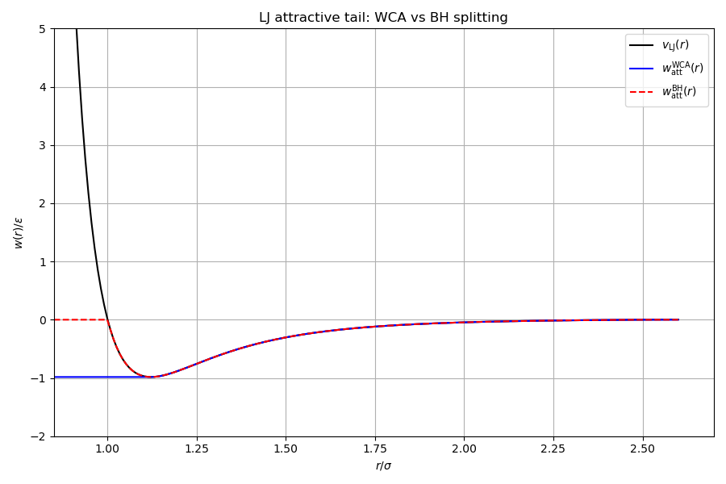
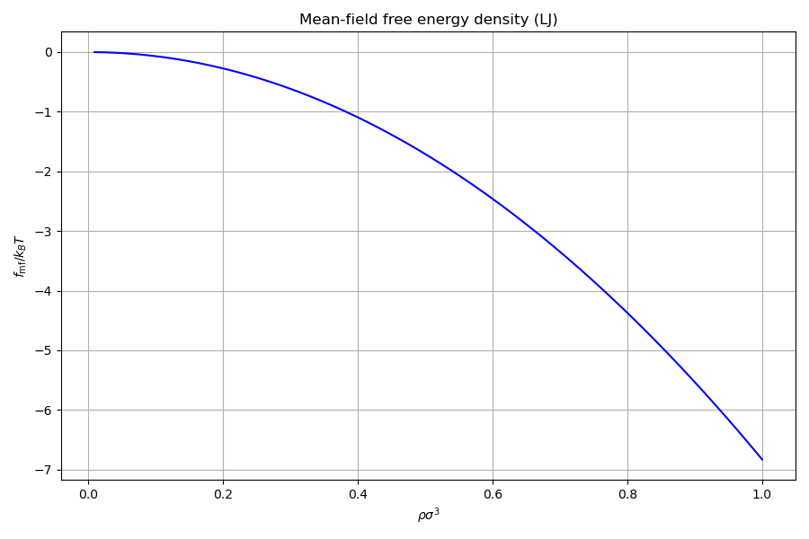
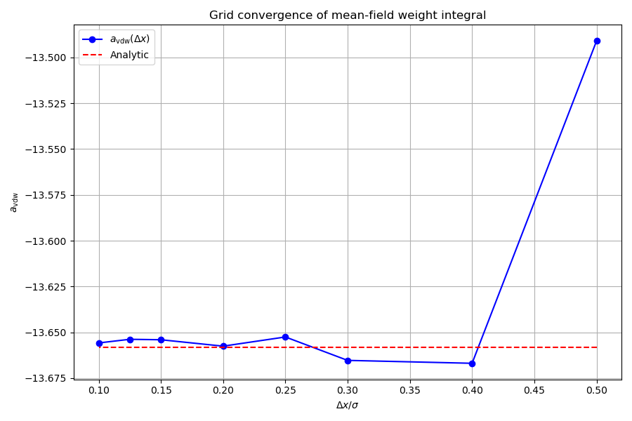

# Interaction: mean-field framework

Demonstrates the mean-field interaction module: perturbation splitting,
analytical van der Waals parameter, bulk thermodynamics, and grid convergence.

## What this example does

1. **WCA vs BH splitting**: evaluates the attractive tail of the LJ potential
   under both the Weeks-Chandler-Andersen and Barker-Henderson splitting
   schemes, showing how the decomposition differs.

2. **Van der Waals parameter**: computes $a_\mathrm{vdw}$ analytically from the
   attractive integral $\int w_\mathrm{att}(r) \, 4\pi r^2 \, dr$.

3. **Bulk thermodynamics**: evaluates the mean-field free energy density
   $f_\mathrm{mf}(\rho)$ and chemical potential $\mu_\mathrm{mf}(\rho)$ using
   `make_bulk_weights()` with White Bear II.

4. **Grid convergence**: builds mean-field weights at decreasing grid spacings
   $\Delta x$ and tracks how the numerical $a_\mathrm{vdw}$ converges to the
   analytical value.

## Key API functions used

| Function | Purpose |
|----------|---------|
| `physics::potentials::attractive()` / `repulsive()` | perturbation splitting |
| `physics::potentials::vdw_integral()` | analytical $a_\mathrm{vdw}$ |
| `functionals::make_bulk_weights()` | bulk weights for thermodynamics |
| `functionals::make_mean_field_weights()` | grid-based interaction weights |
| `functionals::bulk::mean_field_free_energy_density()` | $f_\mathrm{mf}$ |
| `functionals::bulk::mean_field_chemical_potential()` | $\mu_\mathrm{mf}$ |

## Build and run

```bash
make run
```

## Output

### WCA vs BH splitting



### Mean-field free energy density



### Grid convergence of $a_\mathrm{vdw}$


