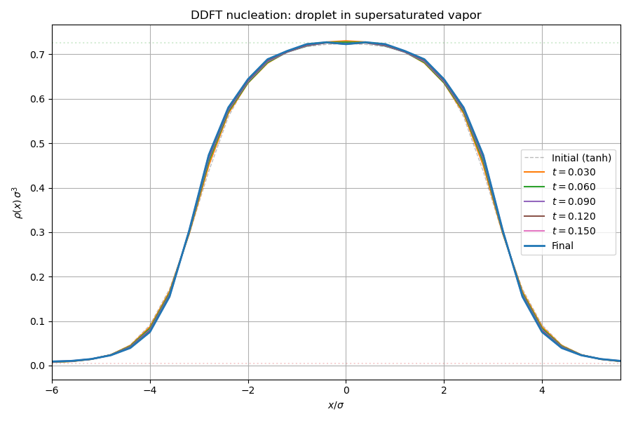
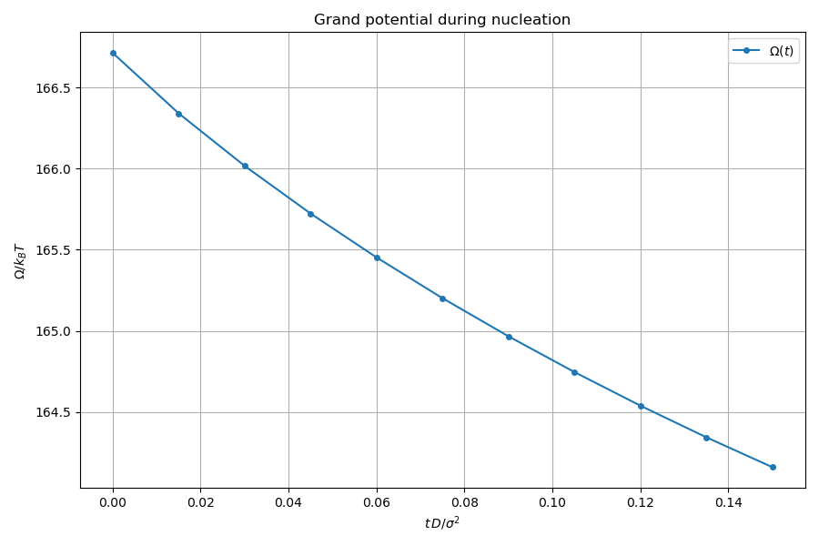

# Nucleation: droplet in supersaturated vapor

Demonstrates DDFT-driven nucleation dynamics. A liquid droplet seed is placed
in a supersaturated vapor ($\mu > \mu_\mathrm{coex}$), and the DDFT
split-operator scheme evolves the density profile while conserving mass.

## What this example does

1. **Model definition**: a Lennard-Jones fluid at $T^* = 0.7$ on a $30^3$
   periodic grid ($\Delta x = 0.4\sigma$), with WCA perturbation splitting and
   White Bear II FMT.

2. **Coexistence**: determines the liquid-vapor coexistence at the working
   temperature.

3. **Supersaturation**: sets the chemical potential to
   $\mu = \mu_\mathrm{coex} + \Delta\mu$ with $\Delta\mu = 0.1\,k_BT$.
   At this chemical potential, the liquid is thermodynamically stable and
   the vapor is metastable.

4. **Droplet seed**: constructs a spherical tanh droplet of radius
   $R = 3\sigma$ centred in the box, embedded in the metastable vapor.

5. **DDFT relaxation**: 300 split-operator steps ($\Delta t = 5 \times 10^{-4}$).
   The grand potential $\Omega$ decreases monotonically as the droplet
   interface sharpens. Mass is exactly conserved.

## Key API functions used

| Function | Purpose |
|----------|---------|
| `make_grid()` | create periodic DFT grid |
| `init::from_profile()` | state from arbitrary $\rho(r)$ |
| `functionals::make_weights()` | full FFT weight arrays |
| `functionals::total()` | evaluate free energy + grand potential + forces |
| `functionals::bulk::find_coexistence()` | liquid-vapor coexistence |
| `algorithms::ddft::split_operator_step()` | single DDFT time step |

## Build and run

```bash
make run-local
```

## Output

### Droplet evolution

Cross-sectional density profile through the droplet centre. The initial tanh
seed (dashed) evolves toward an equilibrium droplet shape as the interface
sharpens under the DDFT dynamics.



### Grand potential

The grand potential $\Omega$ decreases monotonically during relaxation,
confirming that the droplet is above the critical size and the dynamics
drive the system toward the liquid-phase minimum.


