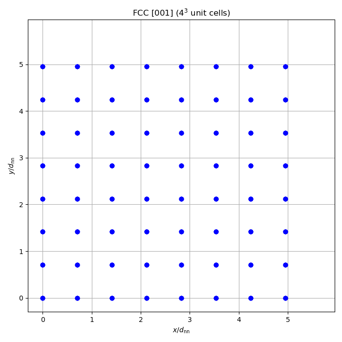
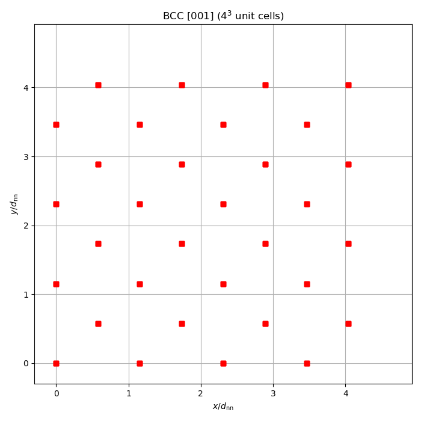
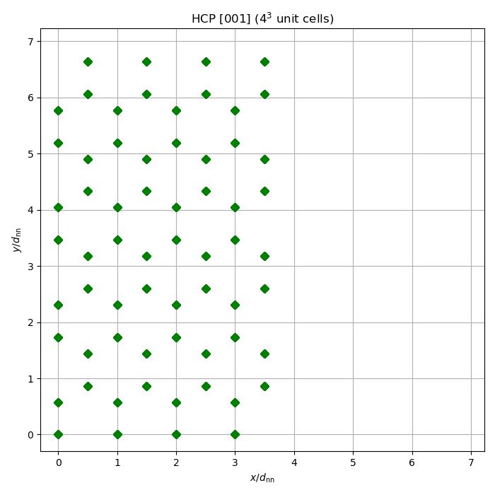

# Crystal lattice

## Overview

The `dft_core::physics::crystal` namespace generates crystal lattices with
configurable structure, Miller-index orientation, and replication.

| Class / enum | Role |
|--------------|------|
| `Lattice` | Crystal lattice generator (positions, scaling, export) |
| `Structure` | BCC, FCC, HCP |
| `Orientation` | Miller-index plane orthogonal to z-axis |
| `ExportFormat` | Output format for `Lattice::export` (XYZ, CSV) |

## Usage

```cpp
#include <classicaldft>
using namespace dft_core::physics::crystal;

// Build an FCC lattice with [001] orientation, 4x4x4 unit cells
auto fcc = Lattice(Structure::FCC, Orientation::_001, {4, 4, 4});

// Atom count and box dimensions
std::cout << fcc.size() << " atoms\n";
std::cout << fcc.dimensions() << "\n";

// Scale to physical nearest-neighbor distance
arma::mat pos = fcc.positions(3.405);  // Argon in Angstrom

// Anisotropic box mapping
arma::mat mapped = fcc.positions(arma::rowvec3{10.0, 12.0, 14.0});

// Export to file
fcc.export_to("lattice.xyz", ExportFormat::XYZ);
fcc.export_to("lattice.csv", ExportFormat::CSV);
```

## Running

```bash
make run        # builds and runs inside Docker
make run-local  # builds and runs locally
```

## Plots

When built with `DFT_USE_MATPLOTLIB=ON` (default), plots are saved to `exports/`:

| File | Content |
|------|---------|
| `fcc_001.png` | FCC [001] projection ($4^3$ unit cells) |
| `fcc_110.png` | FCC [110] projection |
| `fcc_111.png` | FCC [111] projection |
| `bcc_001.png` | BCC [001] projection |
| `bcc_110.png` | BCC [110] projection |
| `bcc_111.png` | BCC [111] projection |
| `hcp_001.png` | HCP [001] projection |
| `hcp_010.png` | HCP [010] projection |
| `hcp_100.png` | HCP [100] projection |




