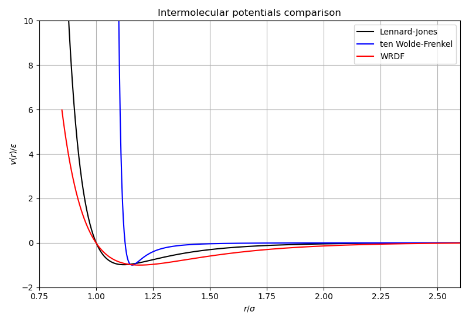
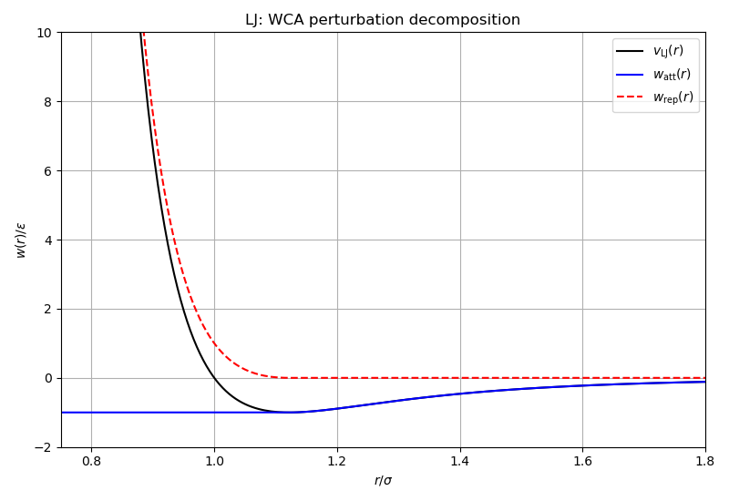
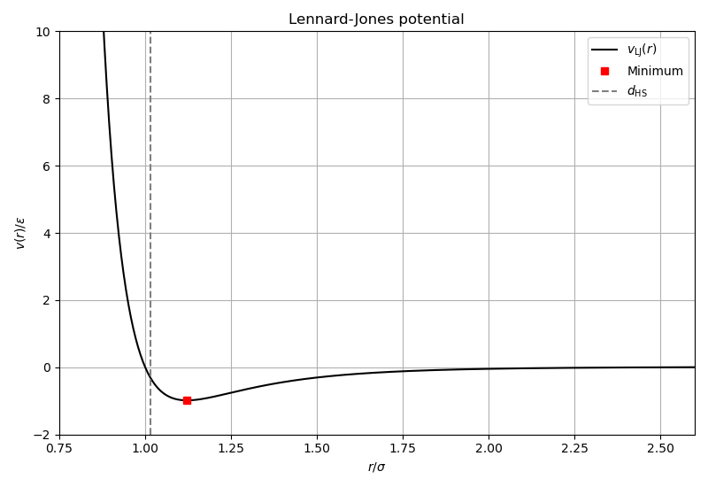

# Potentials: pair interactions

Evaluates and compares the three variant-based pair potentials provided by
the library.

## What this example does

1. **Potential evaluation**: constructs Lennard-Jones, ten Wolde-Frenkel, and
   WRDF potentials via factories, and evaluates $v(r)$ on a fine radial grid.

2. **WCA decomposition**: splits the LJ potential into attractive and repulsive
   parts using the Weeks-Chandler-Andersen scheme, showing both components.

3. **Hard-sphere diameters**: computes the Barker-Henderson effective
   hard-sphere diameter $d_\mathrm{HS}$ for each potential at $kT = 1$.

4. **Van der Waals integral**: evaluates the mean-field $a_\mathrm{vdw}$
   parameter for the LJ potential.

## Key API functions used

| Function | Purpose |
|----------|---------|
| `physics::potentials::make_lennard_jones()` | LJ factory |
| `physics::potentials::make_ten_wolde_frenkel()` | tWF factory |
| `physics::potentials::make_wang_ramirez_dobnikar_frenkel()` | WRDF factory |
| `physics::potentials::energy()` | evaluate $v(r)$ |
| `physics::potentials::attractive()` / `repulsive()` | perturbation splitting |
| `physics::potentials::hard_sphere_diameter()` | Barker-Henderson $d_\mathrm{HS}$ |
| `physics::potentials::vdw_integral()` | van der Waals parameter |

## Build and run

```bash
make run
```

## Output

### Potentials comparison

All three potentials on the same axes: LJ, tWF, and WRDF.



### WCA perturbation decomposition

The LJ potential split into its WCA attractive and repulsive contributions.



### LJ potential with hard-sphere diameter

The LJ potential with the Barker-Henderson $d_\mathrm{HS}$ marked as a
vertical dashed line.


