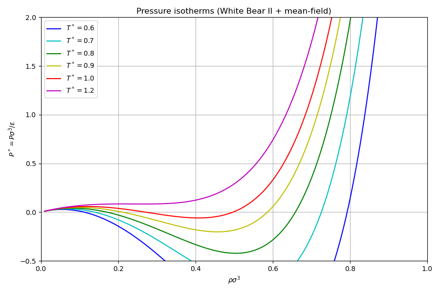
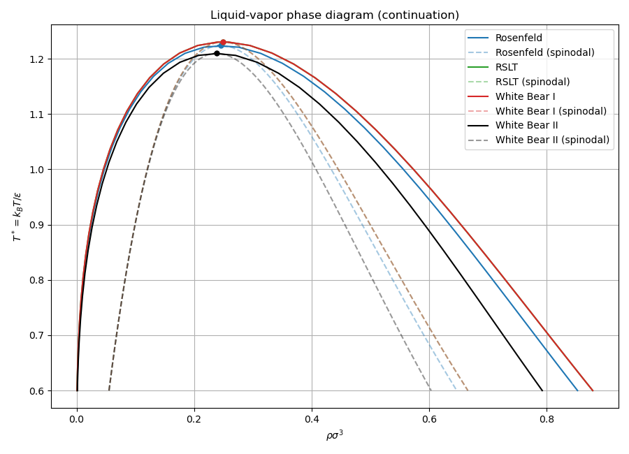
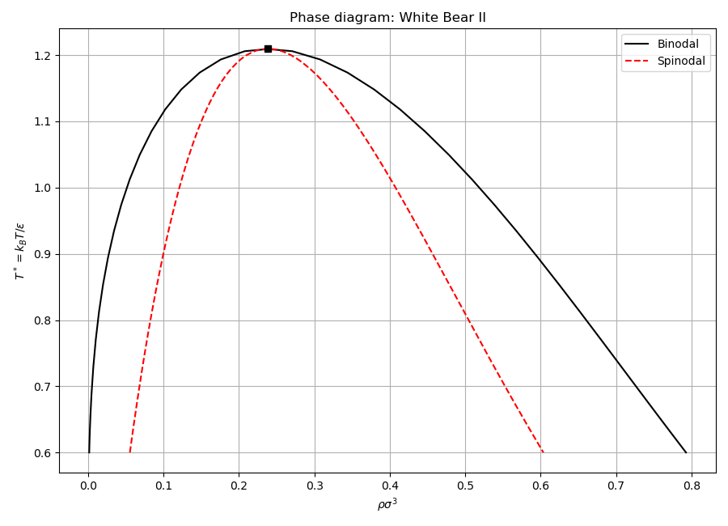

# Solver: phase diagram computation

Computes the full Lennard-Jones fluid phase diagram within the mean-field DFT
framework, comparing all four FMT hard-sphere models.

## What this example does

1. **System definition**: LJ fluid ($\sigma = 1$, $\epsilon = 1$, $r_c = 2.5$)
   with WCA splitting, using a temperature-dependent `WeightFactory` for bulk
   thermodynamics.

2. **Pressure isotherms**: evaluates $P^*(\rho)$ at six temperatures
   ($T^* = 0.6$ to $1.2$) using White Bear II, showing the van der Waals loop
   below the critical temperature.

3. **Binodal curves**: traces the coexistence curve for all four FMT models
   (Rosenfeld, RSLT, White Bear I, White Bear II) using pseudo-arclength
   continuation via `binodal()`. Continuation naturally handles the critical
   point pitchfork bifurcation.

4. **Spinodal curves**: computes the spinodal for each model using bisection-based
   root finding on $\partial P / \partial \rho = 0$ via `spinodal()`.

5. **Spline interpolation**: demonstrates `interpolate()` on the phase diagram
   to evaluate boundaries at arbitrary temperatures.

## Key API functions used

| Function | Purpose |
|----------|---------|
| `functionals::make_bulk_weights()` | temperature-dependent bulk weights |
| `functionals::bulk::pressure()` | pressure isotherm |
| `functionals::bulk::binodal()` | continuation-based coexistence curve |
| `functionals::bulk::spinodal()` | spinodal curve |
| `functionals::bulk::interpolate()` | spline interpolation of phase boundaries |

## Build and run

```bash
make run
```

## Output

### Pressure isotherms

Six isotherms from $T^* = 0.6$ (deep sub-critical, large van der Waals loop)
to $T^* = 1.2$ (above critical, monotonic).



### Phase diagram (all FMT models)

Binodal (solid) and spinodal (dashed, transparent) curves for all four FMT
models, with critical points marked. The metastable region lies between the
binodal and spinodal boundaries.



### Phase diagram (White Bear II)

Binodal and spinodal for White Bear II alone, showing the two-phase region
bounded by the coexistence dome and the mechanical instability region bounded
by the spinodal.


