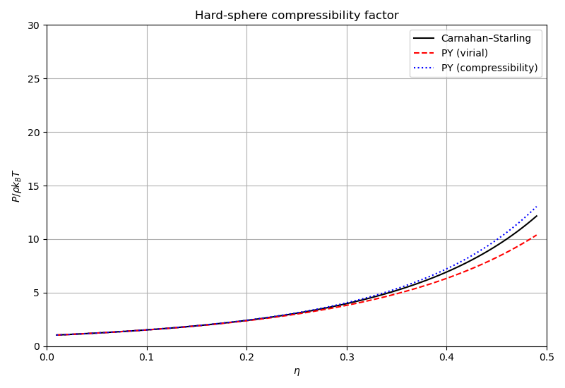

# Thermodynamics: equations of state and transport

Demonstrates the hard-sphere thermodynamics and equation of state modules.

## What this example does

1. **Hard-sphere compressibility factor**: compares Carnahan-Starling (CS) with
   Percus-Yevick virial (PYv) and compressibility (PYc) routes for
   $P / (\rho k_BT)$ across the packing fraction range $\eta = 0.05$ to $0.49$.

2. **Thermodynamic consistency**: verifies the Gibbs-Duhem relation
   $\mu - f - P/(rho \cdot kT) = 0$ for CS at $\eta = 0.3$.

3. **Enskog transport**: evaluates the shear viscosity, bulk viscosity,
   thermal conductivity, and sound damping coefficients from Enskog theory.

4. **Full equations of state**: compares ideal gas, Percus-Yevick, LJ-JZG,
   and LJ-Mecke EOS models at $kT = 1.5$.

## Key API functions used

| Function | Purpose |
|----------|---------|
| `physics::hard_spheres::pressure()` | compressibility factor |
| `physics::hard_spheres::chemical_potential()` | excess chemical potential |
| `physics::hard_spheres::free_energy()` | excess free energy |
| `physics::hard_spheres::transport::*` | Enskog transport coefficients |
| `physics::eos::pressure()` | EOS pressure |

## Build and run

```bash
make run
```

## Output

### Hard-sphere compressibility factor

CS, PY-virial, and PY-compressibility routes plotted against packing fraction.



### Enskog viscosities

Shear and bulk viscosity as a function of density.


